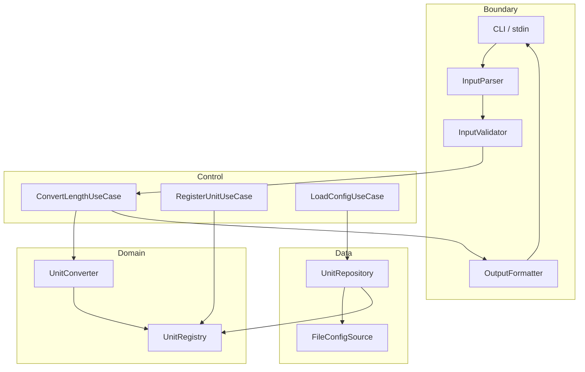
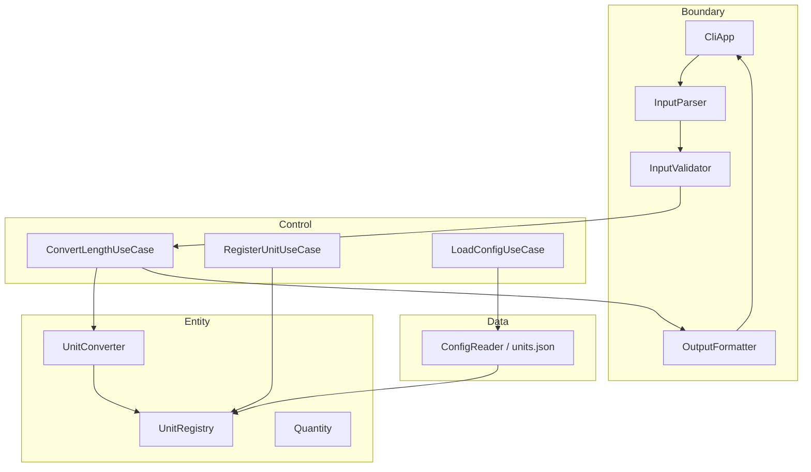

# Unit conversion problem definition
_Exported on 5/20/2026 at 16:51:30 GMT+9 from Cursor (3.4.20)_

---

**User**

당신은 문제 정의 전문가입니다.
워크스페이스: c:\DEV\unit_converter_Cpp
⚠️ 코드 작성·클래스 설계·알고리즘·빌드 스크립트는 하지 마십시오.

STEP 1 — Observation
1) 지금 우리가 해결하려는 "상황"을 한 문단으로 관찰 관점에서 서술하라.
2) 왜 길이(meter/feet/yard) 변환 문제를 다루는가?
3) OCP/SRP, 입력 검증, 설정 외부화, 동적 단위 등록, 출력 포맷과 연결해
   이 문제가 어떤 학습 맥락에서 등장하는가?

STEP 2 — Why #1: 정확한 변환 결과가 왜 중요한가?
STEP 3 — Why #2: 수동 계산이 아닌 프로그램(+테스트)인 이유?
STEP 4 — Why #3: 계약을 먼저 고정하려는 이유?

STEP 5 — 문제 정의
1) 표면 문제 1~2문장
2) 개선된 정의 3~7문장
3) 핵심 Invariant 5개 이내 (측정·검증 가능한 문장)
4) 훈련하려는 사고 능력 3개

출력: 구조화된 Markdown만. 코드·파일 경로 금지.

---

**Cursor**

학습 맥락과 문제 상황을 파악하기 위해 워크스페이스와 관련 문서를 살펴봅니다.


# 문제 정의: 길이 단위 변환기 (C++ 실습)

---

## STEP 1 — Observation

### 1) 상황 관찰

한 줄 입력으로 길이 단위와 수치를 받아, 정해진 환산 비율로 다른 단위 값을 나열해 출력하는 콘솔 프로그램을 다루고 있다. 출발점은 동작은 하지만 단위마다 분기가 늘고, 비율이 코드에 박혀 있으며, 검증·확장·출력 방식 변경이 어려운 형태다. 실습 목표는 “변환기 하나를 완성”하는 것을 넘어, 단위 추가·설정 변경·출력 형식 변경이 와도 핵심 로직을 자주 건드리지 않게 구조를 바꾸고, 그 구조를 테스트로 고정하는 것이다.

### 2) 왜 길이(meter / feet / yard) 변환인가?

- **도메인이 단순하고 직관적**이라 설계 원칙(OCP, SRP)과 리팩터링에 집중할 수 있다.
- **기준 단위(meter) 중심 환산**이라 “모든 단위를 한 축으로 정규화한 뒤 다시 변환”이라는 일반 패턴을 작은 규모로 연습할 수 있다.
- **비율이 명시된 결정론적 계산**이라 “맞는지/틀린지”를 숫자와 테스트로 바로 판단할 수 있다.
- **단위가 3개에서 늘어나는 시나리오**가 자연스러워, 확장성 요구(동적 등록, 설정 외부화)를 과장 없이 연습할 수 있다.

### 3) 학습 맥락에서의 등장

| 연결 축 | 이 문제에서의 역할 |
|--------|-------------------|
| **OCP / SRP** | 단위·비율·출력 형식이 늘어도 “변환 규칙 추가”와 “표현 방식 변경”이 한 덩어리 if-else에 쌓이지 않게 분리 |
| **입력 검증** | 잘못된 형식·음수·미등록 단위가 **조용히 틀린 결과**를 내지 않도록, 실패를 명시적으로 계약화 |
| **설정 외부화** | 비율 변경이 재컴파일이 아닌 **데이터 갱신**으로 가능해야 한다는 요구를 설계로 반영 |
| **동적 단위 등록** | 런타임에 단위 체계가 커질 때도, 코드 수정 범위를 최소화하는 확장 모델 연습 |
| **출력 포맷** | 같은 변환 결과를 **소비자(사람/다른 프로그램)**에 맞게 여러 표현으로보내는 관심사 분리 |

약 6시간 분량의 생성형 AI 활용 실습으로, “요구 분석 → 구조 개선 → 테스트 → 확장 기능 → 회고” 흐름 속에서 **설계·계약·검증**을 한 묶음으로 익히는 맥락이다.

---

## STEP 2 — Why #1: 정확한 변환 결과가 왜 중요한가?

길이 변환은 **사용자가 눈으로 검증하기 어렵다**. 2.5 meter가 8.2 feet인지 8.2021 feet인지, 반올림·표기 차이만으로도 “그럴듯해 보이는 오답”이 통과할 수 있다. 한 번의 오차는 모든 단위 출력에 전파되고, feet↔yard처럼 간접 환산을 거치면 **누적 오차**가 생긴다.

실무·학습 모두에서 변환기는 **신뢰 가능한 계산기**다. 잘못된 수치는 설계 품질 논의 이전에 **도메인 신뢰**를 깨고, 이후에 붙이는 JSON 출력·동적 단위 등록도 의미를 잃는다. 따라서 “대략 맞음”이 아니라 **정의된 비율과 허용 가능한 수치 규칙(반올림, 표시 자릿수)**에 맞는지가 1차 성공 기준이다.

---

## STEP 3 — Why #2: 수동 계산이 아닌 프로그램(+테스트)인 이유?

수동 계산은 **느리고, 반복 불가하며, 회귀를 잡지 못한다**. 단위가 늘거나 비율이 설정에서 바뀔 때마다 사람이 다시 곱셈·나눗셈을 검산하는 것은 확장 요구와 맞지 않는다.

프로그램은 **동일 규칙을 무한히, 동일하게** 적용한다. 테스트는 그 규칙이 **의도한 계약**을 지키는지 자동으로 증명하는 장치다. 특히 입력 검증(음수, 형식 오류, 없는 단위)은 “한 번 실행해 보면 되지”로는 놓치기 쉬운데, 테스트는 **실패해야 하는 경우**까지 고정한다.

이 실습에서 테스트는 부가물이 아니라, 리팩터링(OCP/SRP 적용)을 **안전하게 진행하기 위한 안전망**이다. 구조를 바꿔도 변환 결과와 오류 처리가 유지되는지 확인하지 않으면, 설계 개선이 오히려 **조용한 기능 퇴화**를 낳는다.

---

## STEP 4 — Why #3: 계약을 먼저 고정하려는 이유?

“변환기”라는 말만으로는 **입력 형식, 실패 조건, 출력 의미, 비율 출처, 반올림 규칙**이 사람마다 다르게 해석된다. 계약을 늦게 정하면 구현은 진행되지만, 팀·미래의 나·AI가 서로 다른 프로그램을 만들고, 테스트도 서로 다른 기대를 검증하게 된다.

계약을 먼저 고정하면 다음이 분리된다.

- **무엇을 해야 하는가**(기능) vs **어떻게 짜는가**(구조)
- **성공 시 무엇이 나와야 하는가** vs **실패 시 어떻게 반응해야 하는가**
- **코어 변환** vs **입력 파싱** vs **출력 포맷** vs **설정 로딩**

OCP/SRP, 설정 외부화, 동적 등록, 출력 포맷은 모두 **계약이 흔들리면 설계 논쟁으로 번지는** 주제다. 계약이 있으면 “이 인터페이스 뒤에 전략을 추가한다”는 식으로 **변경 지점**이 명확해지고, 테스트는 그 계약의 실행 가능한 명세가 된다.

---

## STEP 5 — 문제 정의

### 1) 표면 문제 (1~2문장)

사용자가 `단위:숫자` 형태로 길이를 입력하면, meter·feet·yard 기준으로 환산한 값을 출력하는 콘솔 변환기를 만든다. 단위가 늘어나도 기존 로직을 최소만 수정하고, 변환 정확성과 입력 오류 처리를 테스트로 보장한다.

### 2) 개선된 정의 (3~7문장)

길이 변환 도메인에서, **입력 파싱·검증·기준 단위 정규화·다단위 변환·결과 표현**을 서로 다른 책임으로 분리한 프로그램을 설계·구현한다. 모든 단위는 공통 기준(예: meter)으로 정규화한 뒤 목표 단위로 환산하며, 환산 비율은 코드 하드코딩이 아닌 **외부 설정**에서 읽을 수 있어야 한다. 런타임에 `1 새단위 = k meter` 형태로 단위를 등록하면, 재배포 없이 변환 대상에 포함되어야 한다. 입력은 정해진 형식만 허용하고, 음수·잘못된 숫자·미지 단위는 **명확한 오류**로 처리하며 잘못된 변환 결과를 출력하지 않는다. 동일한 변환 결과를 사람이 읽기 쉬운 줄 단위, 표, JSON, CSV 등 **선택 가능한 포맷**으로보낼 수 있어야 한다. 품질 목표는 단위·비율·출력 방식이 추가될 때 **기존 모듈의 수정 범위를 최소화(OCP)**하고, 각 클래스는 **하나의 변경 이유(SRP)**만 갖도록 하는 것이다. 성공은 “실행된다”가 아니라, **정의된 비율·경계 입력·확장 시나리오**에 대한 자동 테스트 통과로 판단한다.

### 3) 핵심 Invariant (측정·검증 가능, 5개 이내)

1. **기준 환산 일관성**: 임의의 등록 단위 `u`와 양 `v`에 대해, `u`→meter→`u` 왕복 변환 시 `v`와 수치적으로 일치한다(정의된 허용 오차 이내).
2. **삼각 일관성**: meter, feet, yard 간 변환은 문서화된 비율(`1 m = 3.28084 ft`, `1 m = 1.09361 yd`)을 만족하며, meter 경유 feet↔yard 간접 환산과 직접 비율 환산이 동일 규칙 하에서 모순되지 않는다.
3. **입력 거부**: 형식이 `단위:숫자`가 아니거나, 숫자가 아니거나, 음수이거나, 등록되지 않은 단위이면 **비정상 종료 또는 명시적 오류 메시지**만 반환하고, 임의의 변환 결과를 출력하지 않는다.
4. **확장 불변성**: 설정 파일에 단위·비율을 추가하거나 런타임 등록으로 단위를 추가한 뒤, 기존 단위에 대한 변환 테스트는 **이전과 동일하게 통과**한다.
5. **표현 분리**: 동일한 내부 변환 결과에 대해 출력 포맷만 바꿨을 때 **수치 결과 집합은 동일**하고, 포맷에 따른 직렬화 규칙(JSON 필드, CSV 열 등)만 달라진다.

### 4) 훈련하려는 사고 능력 (3개)

1. **관심사 분리 사고**: “변환”, “입력”, “설정”, “출력”을 한 흐름에 묶지 않고, 변경 빈도와 실패 모드에 따라 경계를 나누는 능력.
2. **계약·불변식 우선 사고**: 구현 전에 성공/실패 조건과 수치 규칙을 문장으로 고정하고, 테스트를 계약의 실행 가능한 명세로 쓰는 능력.
3. **확장 비용 예측**: 새 단위·새 비율·새 출력 형식이 들어올 때 **어느 모듈이 왜 바뀌어야 하는지**를 OCP/SRP 관점에서 예측하고, 변경 범위를 의도적으로 최소화하는 능력.

---

*본 문서는 문제 정의 전용이며, 구현·설계·빌드 지침은 포함하지 않는다.*

---

**User**

unit_converter_Cpp 프로젝트를 "고객 인터뷰" 관점에서 준비한다.
제품이 아니라 학습자/사용자의 행동을 드러내는 Mom Test 질문 10개.
각 질문: (1) 과거 구체 경험 (2) 실제 행동 (3) 돈/시간/리스크 연결.
금지: 기능 나열형 질문만으로 끝내기.
마지막에 "진짜 위험 가정" 3개를 bullet로.
구현·코드 금지.


---

**Cursor**

# 고객 인터뷰 준비: unit_converter_Cpp (Mom Test)

**인터뷰 대상 가정:** 길이 단위 변환·입력 검증·테스트·리팩터링을 실제로 겪어 본 개발자, 또는 유사 실습(6시간 전후)을 수료한 학습자.  
**목적:** “이 기능이 있으면 좋겠다”가 아니라, **언제·왜·어떤 대가를 치르며** 그렇게 행동했는지 드러내기.

---

## Mom Test 질문 10개

### 1. 마지막으로 단위 환산을 직접 검산한 때

**(1) 과거 구체 경험**  
“가장 최근에 meter/feet/yard(또는 비슷한 길이 단위)를 **손계산·엑셀·계산기**로 맞춰 본 건 언제였고, 어떤 상황이었나요?”

**(2) 실제 행동**  
그때 **몇 번, 어떤 도구**로 검산했고, 최종적으로 **누구에게·어떤 형태**로 결과를 넘겼나요?

**(3) 돈/시간/리스크**  
틀렸을 때 **납기·재작업·신뢰 손실** 중 무엇이 가장 컸나요? 그때 **몇 분/몇 시간**을 썼나요?

---

### 2. “그럴듯한 숫자”를 믿었던 순간

**(1) 과거 구체 경험**  
출력이 **대략 맞아 보여서** 그대로 썼다가 나중에 틀렸던(또는 의심하고 다시 확인한) **한 건**을 말해 주세요.

**(2) 실제 행동**  
의심이 생겼을 때 **중단·재실행·다른 사람에게 확인** 중 무엇을 했나요? 몇 번이나 반복했나요?

**(3) 돈/시간/리스크**  
그 오차가 **금전 손실·일정 지연·품질 이슈**로 이어질 뻔했나요? 실제로 이어졌나요?

---

### 3. if-else로 늘어난 변환 로직을 만난 때

**(1) 과거 구체 경험**  
단위나 환산 규칙이 **분기문으로 쌓인 코드**를 유지보수하다 막혔던 **가장 최근 프로젝트**는 무엇이었나요?

**(2) 실제 행동**  
그때 **리팩터링·테스트 추가·그대로 패치** 중 무엇을 선택했고, **누가·며칠 안에** 결정했나요?

**(3) 돈/시간/리스크**  
그 선택 때문에 **배포 지연·버그 재발·온보딩 시간** 중 무엇을 실제로 냈나요?

---

### 4. 비율·상수를 코드 밖으로 빼 본 경험

**(1) 과거 구체 경험**  
환산 계수·설정값을 **소스가 아닌 설정 파일**로 옮긴 적이 있다면, **왜 그때** 옮겼나요? (한 번의 사건으로)

**(2) 실제 행동**  
설정을 바꾼 뒤 **재컴파일·재배포·재시작·핫 리로드** 중 실제로 한 절차는 무엇이었나요?

**(3) 돈/시간/리스크**  
설정 오류가 났을 때 **롤백·긴급 패치**에 **얼마나 걸렸고**, 누가 책임졌나요?

---

### 5. 런타임에 규칙(단위·비율)을 추가해야 했던 때

**(1) 과거 구체 경험**  
“새 단위/새 환산식”을 **배포 없이** 넣어야 했던(또는 넣지 못해 손해 본) **구체적 일**이 있나요?

**(2) 실제 행동**  
그때 **코드 수정·DB/설정 갱신·운영 매뉴얼** 중 실제로 한 일은 무엇이었나요? 누가 승인했나요?

**(3) 돈/시간/리스크**  
못 넣었거나 늦게 넣었을 때 **매출·SLA·컴플라이언스** 중 무엇에 가까웠나요?

---

### 6. 입력 검증을 “나중에” 미룬 뒤의 결과

**(1) 과거 구체 경험**  
음수·잘못된 형식·없는 단위 같은 입력을 **일단 통과**시키다 문제가 난 **한 번**을 들려 주세요.

**(2) 실제 행동**  
장애/버그 리포트 후 **검증 로직·에러 메시지·테스트** 중 무엇을 먼저 손댔나요? 순서대로요.

**(3) 돈/시간/리스크**  
그 사고로 **야근·핫픽스·고객 커뮤니케이션** 중 실제 비용은 무엇이었나요?

---

### 7. 테스트를 “변환 정확성” 때문에 쓴 적

**(1) 과거 구체 경험**  
숫자 변환·환율·단위 같은 **결정론적 계산**을 테스트로 고정한 **가장 최근 사례**는 무엇이었나요?

**(2) 실제 행동**  
테스트는 **몇 개**까지 썼고, 실패 시 **CI 중단·머지 차단·그냥 경고** 중 실제로 적용된 규칙은?

**(3) 돈/시간/리스크**  
테스트 없이 리팩터링했다면 **얼마나 되돌릴 위험**이 있었고, 실제로 되돌린 적이 있나요?

---

### 8. 출력 형식(JSON/CSV/표)을 바꿔 달라고 요청받은 때

**(1) 과거 구체 경험**  
같은 계산 결과를 **다른 포맷**으로 달라고 받은 **마지막 요청**은 누구·어떤 맥락이었나요?

**(2) 실제 행동**  
그때 **포맷만 분리해 구현·복사 붙여넣기·스크립트로 후처리** 중 무엇을 했나요? 소요 시간은?

**(3) 돈/시간/리스크**  
포맷 불일치로 **연동 실패·수동 재가공**이 발생했나요? 비용은 누가 냈나요?

---

### 9. 6시간 전후 실습/워크숍에서의 실제 패턴

**(1) 과거 구체 경험**  
비슷한 **짧은 코딩 실습**(AI 포함 여부 무관)을 마지막으로 한 때, **끝까지 요구사항을 다 채웠나요**?

**(2) 실제 행동**  
시간이 부족할 때 **테스트·리팩터링·추가 요구** 중 무엇을 **먼저 포기**했나요? 그날 밤/다음 날 **이어서 한 일**은?

**(3) 돈/시간/리스크**  
그 포기가 이후 **실무/평가/자신감**에 어떤 영향을 줬나요? (구체적 한 건)

---

### 10. 생성형 AI로 “설계·테스트”를 맡겨 본 경험

**(1) 과거 구체 경험**  
AI에게 **OCP/SRP·테스트 케이스·입력 검증**을 맡겼다가 **검토에서 걸러진** 가장 최근 사례는?

**(2) 실제 행동**  
AI 출력을 **그대로 커밋·일부만 수정·처음부터 직접 작성** 중 실제 비율은? 검증에 **몇 분** 썼나요?

**(3) 돈/시간/리스크**  
잘못 믿었을 때 **틀린 테스트·과설계·보안/검증 누락** 중 실제로 맞은 유형은? 그때 **되돌리는 데 든 시간**은?

---

## 인터뷰 시 금지·주의 (Mom Test)

| 하지 말 것 | 대신 |
|-----------|------|
| “JSON 출력 필요하세요?” | “마지막으로 포맷 때문에 연동이 깨진 건?” |
| “동적 단위 등록 원하세요?” | “배포 없이 규칙 넣어야 했던 적은?” |
| “OCP 지키는 게 중요하죠?” | “분기 늘어난 코드 때문에 실제로 뭘 잃었나요?” |

기능 나열형 질문은 **맨 마지막 1~2분**에만, 앞선 답에서 이미 나온 **고통·행동**을 확인하는 용도로 짧게.

---

## 진짜 위험 가정 (검증해야 할 3가지)

- **가정 A:** 학습자는 “정확한 환산”보다 **빠른 완료·AI 제출**을 우선해, 테스트·불변식 검증을 **실제로는 생략**한다 — 그래서 실습 성공과 **신뢰 가능한 변환**이 어긋난다.

- **가정 B:** OCP/SRP·설정 외부화·동적 등록은 **실무에서 겪은 손해**가 아니라 **평가 루브릭**에만 반응해, **과설계**로 시간을 쓰고 핵심(입력 거부·비율 일관성)은 **약하게** 남는다.

- **가정 C:** 출력 포맷·동적 단위는 **인터뷰 전 “있으면 좋겠다”** 수준이고, 실제 행동은 **고정 3단위·한 가지 출력**으로 충분해 — 추가 요구는 **교육 과제**이지 **사용자/학습자의 반복 행동**이 아니다.

---

*위 질문은 unit_converter_Cpp **학습·실습 맥락**에서 행동과 리스크를 드러내기 위한 것이며, 구현·설계 지침은 포함하지 않습니다.*

---

**User**

Dual-Track(UI/경계 vs Domain) + BCE 관점 설계 전문가로 행동하라.
대상: c:\DEV\unit_converter_Cpp
제약: 구현 코드 작성 금지. 설계·계약·테스트 목록·통합 계획만.

# 1) Entity(Domain) 설계
  1.1 개념 목록과 SRP
  1.2 Invariants
  1.3 유스케이스
  1.4 Domain API (시그니처 수준, 본문 X) + 실패 조건
  1.5 Domain 단위 테스트 설계 (RED 우선)

# 2) Boundary 설계
  2.1 시나리오: 입력→검증→실행→출력
  2.2 외부 계약: Input / Output / Error schema
  2.3 Boundary 계약 테스트 (Domain Mock 가정)
  2.4 에러 메시지 규칙 (문구 패턴 고정)

# 3) Data 설계
  3.1 목적
  3.2 인터페이스 계약 (이름만 제안)
  3.3 InMemory vs File(JSON/YAML) 비교 + 추천 1개와 이유
  3.4 Data 레이어 테스트

# 4) Integration & Verification
  4.1 의존성 방향 포함 흐름
  4.2 통합 테스트 시나리오 (정상 2+, 실패 3+)
  4.3 회귀 보호 규칙
  4.4 커버리지 목표 (Domain / Boundary / Data 수치)
  4.5 Traceability Matrix: Concept→Rule→UseCase→Contract→Test→Component

모호어 금지. 모든 규칙은 테스트로 검증 가능하게.


---

**Cursor**

# Dual-Track + BCE 설계: 길이 단위 변환기

**범위:** meter / feet / yard 기본, 설정 로드, 런타임 단위 등록, 다중 출력 포맷  
**제약:** 구현 코드 없음 — 개념·계약·테스트·통합만  
**아키텍처:** Boundary(입출력·검증·포맷) ↔ Control(유스케이스 조율) ↔ Entity(Domain) + Data(설정·저장)

---

# 1) Entity (Domain) 설계

## 1.1 개념 목록과 SRP

| 개념 | 책임 (SRP) | 변경 이유 |
|------|-----------|----------|
| **Quantity** | `(단위 식별자, 양)` 불변 쌍 보유; 음수·NaN·Inf 거부 | 수치 규칙 변경 |
| **UnitId** | 단위 이름 정규화(소문자·trim 규칙) 및 동등 비교 | 명명 규칙 변경 |
| **ConversionRatio** | “1 UnitId = k 기준단위(meter)” 양수 비율 표현·검증 | 비율 정의 방식 변경 |
| **UnitRegistry** | 등록·조회·중복 거부; 기준단위(meter) 고정 | 등록 정책 변경 |
| **UnitConverter** | Registry 기준 정규화→목표단위 환산; 전 단위 일괄 변환 | 환산 알고리즘 변경 |
| **ConversionResult** | 입력 Quantity + 목표 UnitId별 Quantity 목록(순서 규칙 고정) | 결과 구조 변경 |

**Domain에 두지 않는 것 (Boundary/Data):** 문자열 파싱, stderr/stdout, JSON/CSV 직렬화, 파일 읽기, CLI 종료 코드.

---

## 1.2 Invariants (측정 가능)

| ID | 불변식 | 검증 방법 |
|----|--------|----------|
| D-INV-1 | 모든 `ConversionRatio.factorToMeter > 0` | 등록 시 예외; Data 로드 후 스캔 테스트 |
| D-INV-2 | `UnitRegistry` 내 `UnitId` 유일 | 중복 등록 시 `DuplicateUnit` 실패 |
| D-INV-3 | `Quantity.value >= 0` (0 허용) | 생성 시 `InvalidQuantity` 실패 |
| D-INV-4 | 환산: `toMeter(q) = q.value * ratio(q.unit).factorToMeter`; `fromMeter(m, u) = m / ratio(u).factorToMeter` | 고정 비율 케이스 + Property(선택) |
| D-INV-5 | 내장 3단위: `1 meter → 3.28084 feet`, `1 meter → 1.09361 yard` (허용오차 ε=1e-5) | 상수 테스트 |
| D-INV-6 | 왕복: `fromMeter(toMeter(q), q.unit)` ≈ `q.value` (ε=1e-9 상대 또는 1e-6 절대, README 수치 스케일 기준) | 단위별 1케이스 |
| D-INV-7 | `convertAll` 결과는 Registry의 **모든** UnitId 각 1회 포함(입력 단위 포함) | 개수·키 집합 equality |
| D-INV-8 | Domain API는 I/O 부작용 없음 (순수 함수/객체) | Mock 없는 단위 테스트로만 검증 |

---

## 1.3 유스케이스 (Domain 관점)

| UC-ID | 이름 | 전제 | 결과 |
|-------|------|------|------|
| UC-D-01 | 기본 단위로 Registry 초기화 | meter/feet/yard 비율 주어짐 | Registry 3항목, meter 기준 일관 |
| UC-D-02 | 단일 Quantity를 특정 UnitId로 변환 | 단위 등록됨 | 정확한 Quantity 1개 |
| UC-D-03 | 입력 Quantity를 등록된 모든 단위로 변환 | Registry 비어 있지 않음 | ConversionResult N항목 |
| UC-D-04 | 런타임 단위 등록 | 새 UnitId, 양수 factorToMeter | Registry 크기 +1; 기존 환산 불변 |
| UC-D-05 | 미등록 단위로 환산 시도 | — | `UnknownUnit` 실패 |
| UC-D-06 | 잘못된 Quantity 생성 | 음수/NaN | `InvalidQuantity` 실패 |

---

## 1.4 Domain API (시그니처 + 실패 조건)

> 본문 없음. 언어 중립 의사 시그니처.

```
// Quantity
Quantity createQuantity(UnitId unit, double value)
  FAIL: InvalidQuantity  (value < 0 || isnan(value) || isinf(value))

// UnitId
UnitId normalizeUnitName(string raw)
  FAIL: InvalidUnitName  (empty after trim, invalid charset per RULE-B-NAME)

// ConversionRatio
ConversionRatio createRatio(UnitId unit, double factorToMeter)
  FAIL: InvalidRatio  (factorToMeter <= 0 || isnan || isinf)

// UnitRegistry
UnitRegistry createEmpty()
UnitRegistry register(UnitRegistry reg, UnitId id, ConversionRatio ratio)
  FAIL: DuplicateUnit  (id already in reg)
         InvalidRatio   (ratio invalid)
UnitRegistry registerBuiltins(UnitRegistry reg)
  // meter=1.0, feet=1/3.28084, yard=1/1.09361 as factorToMeter
bool contains(UnitRegistry reg, UnitId id)
size_t count(UnitRegistry reg)
list<UnitId> listUnits(UnitRegistry reg)  // stable sort: lexicographic by name

// UnitConverter
double toMeters(UnitRegistry reg, Quantity q)
  FAIL: UnknownUnit
Quantity fromMeters(UnitRegistry reg, double meters, UnitId target)
  FAIL: UnknownUnit, InvalidQuantity (if meters invalid — only if API accepts raw double)
Quantity convert(UnitRegistry reg, Quantity from, UnitId to)
  FAIL: UnknownUnit, InvalidQuantity
ConversionResult convertAll(UnitRegistry reg, Quantity from)
  FAIL: UnknownUnit, InvalidQuantity
         EmptyRegistry   (count==0)
```

**ConversionResult 계약:** `items`는 `listUnits()` 순서와 동일; 각 item은 `(UnitId to, Quantity q)`이며 `q.unit == to`.

---

## 1.5 Domain 단위 테스트 설계 (RED 우선)

| Test-ID | RED 시나리오 | 기대 |
|---------|--------------|------|
| T-D-01 | `createQuantity(meter, -1)` | InvalidQuantity |
| T-D-02 | `createRatio(cubit, 0)` | InvalidRatio |
| T-D-03 | `register` 동일 UnitId 두 번 | DuplicateUnit |
| T-D-04 | `registerBuiltins` 후 `toMeters(2.5m)` | 2.5 |
| T-D-05 | `convert(2.5m → feet)` | 8.2021 (ε) — README 예시와 정합 또는 문서화된 반올림 규칙 |
| T-D-06 | `convert(2.5m → yard)` | 2.732525 (ε) |
| T-D-07 | feet→meter→feet 왕복 | 입력값 ±ε |
| T-D-08 | `convertAll(2.5m)` 항목 수 | 3 |
| T-D-09 | cubit 등록 후 `convertAll` 항목 수 | 4 |
| T-D-10 | 등록 전 `convert(..., cubit)` | UnknownUnit |
| T-D-11 | `convertAll` on empty registry | EmptyRegistry |
| T-D-12 | 내장 상수 D-INV-5 | 고정 assert |

**RED 순서 권장:** T-D-01 → T-D-04 → T-D-05 → T-D-08 → T-D-09 (등록·확장) → T-D-11.

---

# 2) Boundary 설계

## 2.1 시나리오: 입력 → 검증 → 실행 → 출력

```
[stdin/argv] 
    → InputParser.parse(line)           // Boundary
    → InputValidator.validate(dto)      // Boundary (형식·범위)
    → Control.ConvertLength.execute(dto) // Control: Registry+Converter 호출
    → OutputFormatter.format(result, fmt) // Boundary
    → [stdout]
```

| 단계 | 책임 | 실패 시 |
|------|------|---------|
| Parse | `unit:value` 분리, 빈 토큰 거부 | ERR-FORMAT-* |
| Validate | 숫자 파싱, 음수 거부, 단위명 규칙 | ERR-VALUE-*, ERR-UNIT-NAME-* |
| Execute | Domain `convertAll` | ERR-UNKNOWN-UNIT (Domain 전파) |
| Format | table/json/csv | ERR-OUTPUT-FORMAT-* |

**Control (얇은 조율):** `ConvertLengthUseCase`, `RegisterUnitUseCase`, `LoadConfigUseCase` — Domain+Data 조합만; 비즈니스 규칙 재구현 금지.

---

## 2.2 외부 계약: Input / Output / Error

### Input (CLI 1행)

| 필드 | 타입 | 규칙 | 테스트 ID |
|------|------|------|-----------|
| `raw_line` | string | 비어 있지 않음 | T-B-IN-01 |
| `unit_token` | string | `:` 앞, trim, RULE-B-NAME | T-B-IN-02 |
| `value_token` | string | `:` 뒤, parseable double | T-B-IN-03 |
| `format` | enum | `table` \| `json` \| `csv` (기본 `table`) | T-B-IN-04 |

**RULE-B-NAME:** `[a-z][a-z0-9_]*` 길이 1~32 (대문자 입력 시 normalize 후 검증).

### Output — table (기본)

```
{source_value} {source_unit} = {target_value} {target_unit}
```
- 한 줄 1변환; `listUnits()` 순서
- `target_value`: 소수점 4자리 반올림 half-up (고정 RULE-O-ROUND)

### Output — json

```json
{
  "input": { "unit": "meter", "value": 2.5 },
  "conversions": [
    { "unit": "feet", "value": 8.2021 }
  ]
}
```
- `conversions[].unit` string, `value` number (ROUND 규칙 동일)

### Output — csv

```
source_unit,source_value,target_unit,target_value
meter,2.5,feet,8.2021
...
```
- 헤더 1행 고정; 데이터 행 = 변환 개수

### Error schema (stderr + exit code)

| code | exit | message_pattern |
|------|------|-----------------|
| ERR-FORMAT-001 | 1 | `Invalid format. Use unit:value (ex: meter:2.5)` |
| ERR-VALUE-002 | 1 | `Invalid number: {token}` |
| ERR-VALUE-003 | 1 | `Negative value not allowed: {value}` |
| ERR-UNIT-004 | 1 | `Unknown unit: {unit}` |
| ERR-UNIT-005 | 1 | `Invalid unit name: {unit}` |
| ERR-OUTPUT-006 | 1 | `Unknown output format: {format}` |
| ERR-CONFIG-007 | 1 | `Config load failed: {reason}` |
| ERR-REGISTER-008 | 1 | `Unit registration failed: {reason}` |

---

## 2.3 Boundary 계약 테스트 (Domain Mock 가정)

| Test-ID | Given | When | Then |
|---------|-------|------|------|
| T-B-01 | `meter:2.5` | parse+validate | DTO `{unit:meter,value:2.5}` |
| T-B-02 | `meter:abc` | validate | ERR-VALUE-002, exit 1 |
| T-B-03 | `meter:-1` | validate | ERR-VALUE-003 |
| T-B-04 | `meter2.5` (no colon) | parse | ERR-FORMAT-001 |
| T-B-05 | Mock `convertAll` 고정 결과 | format=table | 줄 수 = mock.count, 패턴 매치 |
| T-B-06 | 동일 Mock | format=json | JSON schema + 값 |
| T-B-07 | 동일 Mock | format=csv | 헤더 + 행 수 |
| T-B-08 | `format=xml` | validate | ERR-OUTPUT-006 |
| T-B-09 | Mock throws UnknownUnit | execute | ERR-UNIT-004, 메시지에 unit 포함 |
| T-B-10 | `Meter:2.5` | parse | normalize → meter (정책 고정 시) |

---

## 2.4 에러 메시지 규칙 (고정 패턴)

1. **한 줄, stderr, 마침표 없음** (예시 문서와 동일).
2. **접두사 코드 없음** — 사람이 읽는 문장만; exit code로 기계 판별.
3. **플레이스홀더 `{token}` `{value}` `{unit}` `{format}` `{reason}`** 치환 필수; 미치환 금지.
4. **Domain 실패 → Boundary 매핑 1:1:**  
   `UnknownUnit`→ERR-UNIT-004, `InvalidQuantity`→ERR-VALUE-003, `DuplicateUnit`/`InvalidRatio`→ERR-REGISTER-008, `EmptyRegistry`→ERR-CONFIG-007.
5. **성공 시 stderr 비어 있음**, exit 0.

---

# 3) Data 설계

## 3.1 목적

- 환산 비율·단위 목록을 **실행 파일 밖**에서 로드
- Control이 Domain `UnitRegistry`를 **초기화·갱신**할 때 사용
- 런타임 등록과 **병합 정책** 명시: 파일 로드 후 CLI 등록은 overlay(덮어쓰기 금지, DuplicateUnit 시 실패)

---

## 3.2 인터페이스 계약 (이름만)

| 인터페이스 | 메서드 (이름) |
|-----------|----------------|
| **UnitConfigDto** | `unitName`, `factorToMeter` |
| **ConfigReader** | `readAll(path) → list<UnitConfigDto>` |
| **ConfigValidator** | `validate(dto) → void` |
| **UnitRepository** | `loadInto(registry, source)`, `save(registry, path)` (save는 선택) |
| **ConfigSource** | `FileConfigSource`, `InMemoryConfigSource` |

**파일 스키마 (JSON 예, 계약):**

```json
{
  "base_unit": "meter",
  "units": [
    { "name": "feet", "factor_to_meter": 0.3048 },
    { "name": "yard", "factor_to_meter": 0.9144 }
  ]
}
```

- `factor_to_meter`: “1 name = factor meter”
- 내장 기본값과 **수치 일치** 검증 테스트 별도 (T-Data-05)

---

## 3.3 InMemory vs File — 비교 및 추천

| 기준 | InMemory | File (JSON/YAML) |
|------|----------|------------------|
| 테스트 속도 | 빠름 | 느림(임시 파일) |
| 실습 “설정 외부화” 목표 | 부분 충족 | **완전 충족** |
| 운영 변경 | 재배포 필요 | 파일 교체만 |
| 실패 모드 | 적음 | 파싱·경로·스키마 오류 |

**추천: File(JSON) 1차 + InMemory는 테스트 전용**

- 이유: 요구사항 “설정 외부화”를 Data 경계에서 **실제로 검증** 가능; YAML 파서 의존은 실습 범위 대비 리스크만 증가.
- Domain/Boundary 테스트는 **InMemoryConfigSource**로 격리; 통합 테스트만 File.

---

## 3.4 Data 레이어 테스트

| Test-ID | 시나리오 | 기대 |
|---------|----------|------|
| T-Data-01 | 유효 JSON 3단위 | 3 DTO, validate 통과 |
| T-Data-02 | `factor_to_meter: 0` | InvalidRatio, load 실패 ERR-CONFIG-007 |
| T-Data-03 | 중복 name | DuplicateUnit on second |
| T-Data-04 | 파일 없음 | ERR-CONFIG-007, reason에 path |
| T-Data-05 | 내장 feet/yard factor | D-INV-5와 일치 (0.3048, 0.9144 또는 역수 정의 일관) |
| T-Data-06 | InMemory 1건 → loadInto | Registry count += 1 |
| T-Data-07 | 잘못된 JSON 구문 | ERR-CONFIG-007 |

---

# 4) Integration & Verification

## 4.1 의존성 방향 및 흐름



**규칙:** Domain → (Boundary, Data) 의존 금지. Data → Domain만. Control → Domain, Data, Boundary 포트.

---

## 4.2 통합 테스트 시나리오

### 정상 (2+)

| Test-ID | 시나리오 | 검증 |
|---------|----------|------|
| T-INT-01 | 기본 config + `meter:2.5` + table | exit 0, 3줄, feet≈8.2021 |
| T-INT-02 | 동일 + `--format json` | exit 0, conversions 길이 3, schema |
| T-INT-03 | config 로드 후 `register cubit=0.4572` + `cubit:1` | 4줄/4 conversions |

### 실패 (3+)

| Test-ID | 시나리오 | 검증 |
|---------|----------|------|
| T-INT-F01 | `meter:abc` | exit 1, ERR-VALUE-002 |
| T-INT-F02 | `lightyear:1` | exit 1, ERR-UNIT-004 |
| T-INT-F03 | broken config JSON | exit 1, ERR-CONFIG-007 |
| T-INT-F04 | `meter:-2` | exit 1, ERR-VALUE-003 |
| T-INT-F05 | duplicate register same unit | exit 1, ERR-REGISTER-008 |

---

## 4.3 회귀 보호 규칙

1. **D-INV-5, T-D-05, T-D-06, T-INT-01** — 내장 비율·대표 예시 `2.5m` 변경 시 CI 실패.
2. **에러 메시지 전문** — golden string 스냅샷; 공백·대소문자 변경 시 실패.
3. **출력 순서** — `listUnits()` lexicographic; 순서 변경은 명시적 버전 bump.
4. **ROUND RULE-O-ROUND** — 반올림 자릿수 변경 시 Boundary golden 전부 갱신.
5. Domain 테스트는 **Mock 없이** 유지; Boundary는 Domain Mock 허용 — Domain 커버리지 하락 시 릴리스 거부.

---

## 4.4 커버리지 목표

| 레이어 | 목표 | 근거 |
|--------|------|------|
| **Domain** | 분기·라인 **≥ 95%** | 로직 집중, Mock 없음, 비용 낮음 |
| **Boundary** | 라인 **≥ 85%**, 에러 경로 **100%** (ERR-* 8종 각 1테스트) | 포맷·파싱 분기 많음 |
| **Data** | 라인 **≥ 90%**, 실패 경로 **100%** | 스키마·파일 오류 |
| **Control** | 유스케이스 메서드 **100%** 호출 | 얇지만 회귀 핵심 |
| **통합** | UC-D-* 각 ≥1, ERR-* 각 ≥1 | E2E 신뢰 |

---

## 4.5 Traceability Matrix

| Concept | Rule | UseCase | Contract (API/IO) | Test | Component |
|---------|------|---------|---------------------|------|-----------|
| Quantity | D-INV-3 | UC-D-02 | `createQuantity` | T-D-01 | Entity |
| ConversionRatio | D-INV-1 | UC-D-04 | `createRatio` | T-D-02 | Entity |
| UnitRegistry | D-INV-2,7 | UC-D-01,04 | `register`, `convertAll` | T-D-03,08,09 | Entity |
| UnitConverter | D-INV-4,5,6 | UC-D-02,03 | `convert`, `toMeters` | T-D-04~07,12 | Entity |
| CLI Input | RULE-B-NAME | — | Input schema | T-B-01~04 | Boundary |
| CLI Output | RULE-O-ROUND | — | table/json/csv | T-B-05~07 | Boundary |
| Errors | §2.4 | — | Error schema | T-B-02,08, T-INT-F* | Boundary |
| Config file | D-INV-1 | UC-D-01 | JSON schema | T-Data-01~05,07 | Data |
| Config load | — | LoadConfig | `ConfigReader` | T-Data-06, T-INT-F03 | Data+Control |
| Runtime register | D-INV-2 | UC-D-04 | Register CLI | T-INT-03, T-INT-F05 | Control+Boundary |
| End-to-end convert | D-INV-7 | UC-D-03 | stdout contract | T-INT-01,02 | Full stack |

---

## 구현 순서 (Dual-Track, 코드 없이 작업 순서만)

1. **Track Domain:** T-D-01~12 RED → Entity API 확정  
2. **Track Boundary:** Error schema + T-B-01~10 (Mock Domain)  
3. **Track Data:** T-Data-01~07 + File JSON  
4. **Control wiring:** T-INT-01~03  
5. **실패 통합:** T-INT-F01~05 + 회귀 golden  

---

*본 문서는 설계·계약·검증 계획만 포함하며, 구현 코드는 포함하지 않습니다.*

---

**User**

Catch2를 가정하고 "구현 없이" RED 단계 테스트 케이스 제목 25~40개.
분류: 파싱 / 음수·0 / 미지원 단위 / 비율 정확도 / 동적 등록 / 출력 직렬화
(JSON/CSV/표 각 최소 3개씩)
각 테스트 옆에 보호하는 invariant 이름 한 줄.
코드 작성 금지.


---

**Cursor**

# Catch2 RED 단계 — 테스트 케이스 제목 (구현 없음)

**가정:** Catch2 `TEST_CASE` / `SECTION` 제목 문자열만. 본문·fixture·코드 없음.  
**총 38개** (범위 25~40 충족)

---

## 파싱 (6)

| # | 테스트 제목 | 보호 Invariant |
|---|-------------|----------------|
| P-01 | `Parse valid input meter:2.5 extracts unit meter and value 2.5` | B-IN-VALID |
| P-02 | `Parse rejects input without colon meter2.5` | ERR-FORMAT-001 |
| P-03 | `Parse rejects empty line` | B-IN-NONEMPTY |
| P-04 | `Parse rejects non-numeric value token meter:abc` | ERR-VALUE-002 |
| P-05 | `Parse normalizes leading/trailing spaces on meter : 2.5` | RULE-B-TRIM |
| P-06 | `Parse rejects unit name with invalid charset Meter-2:1.0` | RULE-B-NAME |

---

## 음수·0 (5)

| # | 테스트 제목 | 보호 Invariant |
|---|-------------|----------------|
| N-01 | `Validate rejects negative value meter:-1` | D-INV-3 |
| N-02 | `Validate rejects negative zero form meter:-0.0` | D-INV-3 |
| N-03 | `Validate accepts zero meter:0` | D-INV-3-ZERO |
| N-04 | `Convert zero meters yields zero in all target units` | D-INV-4-ZERO |
| N-05 | `Domain createQuantity rejects NaN value meter:nan` | D-INV-3-NUMERIC |

---

## 미지원 단위 (5)

| # | 테스트 제목 | 보호 Invariant |
|---|-------------|----------------|
| U-01 | `Convert unknown unit lightyear:1 exits with ERR-UNIT-004` | UnknownUnit→ERR-UNIT-004 |
| U-02 | `Convert empty unit name :2.5 exits with ERR-UNIT-005` | RULE-B-NAME |
| U-03 | `Domain convert with unregistered cubit before register throws UnknownUnit` | D-INV-2-LOOKUP |
| U-04 | `stderr contains exact token Unknown unit: lightyear` | ERR-MSG-PLACEHOLDER |
| U-05 | `Successful run never emits stderr for meter:2.5` | ERR-STDERR-EMPTY |

---

## 비율 정확도 (8)

| # | 테스트 제목 | 보호 Invariant |
|---|-------------|----------------|
| R-01 | `Builtin 2.5 meter to feet equals 8.2021 within epsilon` | D-INV-5-FEET |
| R-02 | `Builtin 2.5 meter to yard equals 2.7325 within epsilon` | D-INV-5-YARD |
| R-03 | `Builtin 1 meter stays 1.0 meter` | D-INV-5-METER |
| R-04 | `Feet to meter roundtrip preserves 3.28084 feet within epsilon` | D-INV-6 |
| R-05 | `Yard to meter roundtrip preserves 1.09361 yard within epsilon` | D-INV-6 |
| R-06 | `Indirect feet to yard matches meter-mediated ratio within epsilon` | D-INV-4-TRANSITIVITY |
| R-07 | `Config-loaded feet factor 0.3048 matches 1m to feet conversion` | T-Data-05 |
| R-08 | `Rejected ratio zero factor on register throws InvalidRatio` | D-INV-1 |

---

## 동적 등록 (6)

| # | 테스트 제목 | 보호 Invariant |
|---|-------------|----------------|
| D-01 | `Register cubit with factor 0.4572 then convert 1 cubit to meter` | UC-D-04 |
| D-02 | `After cubit register convertAll returns four units including cubit` | D-INV-7 |
| D-03 | `Duplicate register cubit twice throws DuplicateUnit` | D-INV-2 |
| D-04 | `Builtin conversions unchanged after adding cubit` | D-INV-EXTENSION |
| D-05 | `Register with negative factor throws InvalidRatio` | D-INV-1 |
| D-06 | `convertAll on empty registry throws EmptyRegistry` | EmptyRegistry |

---

## 출력 직렬화 — 표 (table) (4)

| # | 테스트 제목 | 보호 Invariant |
|---|-------------|----------------|
| TBL-01 | `Table format emits three lines for builtin registry meter:2.5` | D-INV-7-COUNT |
| TBL-02 | `Table line matches pattern 2.5 meter = {v} feet` | RULE-O-TABLE-LINE |
| TBL-03 | `Table output unit order follows lexicographic listUnits` | RULE-O-ORDER |
| TBL-04 | `Table values use four decimal places half-up` | RULE-O-ROUND |

---

## 출력 직렬화 — JSON (4)

| # | 테스트 제목 | 보호 Invariant |
|---|-------------|----------------|
| JSON-01 | `JSON output contains input unit meter and value 2.5` | RULE-O-JSON-INPUT |
| JSON-02 | `JSON conversions array length equals registry size` | D-INV-7 |
| JSON-03 | `JSON each conversion entry has unit string and numeric value` | RULE-O-JSON-SCHEMA |
| JSON-04 | `JSON numeric values match table rounding within same rule` | RULE-O-ROUND-PARITY |

---

## 출력 직렬화 — CSV (4)

| # | 테스트 제목 | 보호 Invariant |
|---|-------------|----------------|
| CSV-01 | `CSV first row is fixed header source_unit,source_value,target_unit,target_value` | RULE-O-CSV-HEADER |
| CSV-02 | `CSV data row count equals number of registered units` | D-INV-7 |
| CSV-03 | `CSV first data row for meter:2.5 includes target feet` | RULE-O-CSV-ROW |
| CSV-04 | `CSV rejects unknown format with ERR-OUTPUT-006` | ERR-OUTPUT-006 |

---

## 요약

| 분류 | 개수 |
|------|------|
| 파싱 | 6 |
| 음수·0 | 5 |
| 미지원 단위 | 5 |
| 비율 정확도 | 8 |
| 동적 등록 | 6 |
| 표 (table) | 4 |
| JSON | 4 |
| CSV | 4 |
| **합계** | **38** |

**RED 권장 순서:** R-01~R-03 → P-01 → N-01,N-03 → TBL-01 → U-01 → D-01 → JSON-01 → CSV-01 → 나머지 실패·엣지.

---

*Catch2 매크로·fixture·assert 본문 없음. 구현 후 GREEN 시 동일 제목으로 assert 채움.*

---

**User**

c:\DEV\unit_converter_Cpp용 .cursorrules YAML 뼈대.
최상위 키만, 값은 비움:
project, code_style, architecture, tdd_rules, testing, forbidden, file_structure, ai_behavior
각 키 앞에 80자 폭의 # 구분선 주석.
YAML만 출력. 설명 없음.


---

**Cursor**

```yaml
################################################################################
project:

################################################################################
code_style:

################################################################################
architecture:

################################################################################
tdd_rules:

################################################################################
testing:

################################################################################
forbidden:

################################################################################
file_structure:

################################################################################
ai_behavior:
```

---

**User**

위 .cursorrules의 tdd_rules 블록만 채워라.
C++ 단위 변환기 기준:
red_phase / green_phase / refactor_phase 각각에
description, rules(목록), must_not(목록)
YAML만 출력.


---

**Cursor**

```yaml
tdd_rules:
  red_phase:
    description: >
      Catch2 테스트를 먼저 작성한다. Domain(환산·등록·불변식)부터 RED를 확보하고,
      Boundary(파싱·검증·에러·직렬화)와 Data(설정 로드)는 계약 테스트로 이어간다.
      구현은 테스트가 실패하는 최소 범위만 허용한다.
    rules:
      - 실패하는 테스트를 먼저 추가한다. 컴파일 실패도 RED로 간주한다.
      - 테스트 제목은 Catch2 TEST_CASE 문자열과 1:1 대응한다.
      - Domain 테스트는 I/O·파일·stdout/stderr 없이 순수 API만 검증한다.
      - Boundary 테스트는 Domain을 Mock·Fake로 격리하고 입출력 계약만 검증한다.
      - 각 테스트는 단일 invariant 또는 단일 ERR-* 코드만 검증한다.
      - 내장 비율(1m=3.28084ft, 1m=1.09361yd), meter:2.5 예시, ε 허용오차를 golden으로 고정한다.
      - 에러 메시지는 ERR-FORMAT-001 등 문서화된 전문 문자열과 exit code를 assert한다.
      - JSON·CSV·table 출력은 스키마·행 수·순서·반올림(소수 4자리 half-up)을 golden으로 고정한다.
      - 동적 등록·설정 로드·미지원 단위·음수·0은 실패·성공 케이스를 분리해 RED한다.
      - RED 목록(파싱, 음수·0, 미지원 단위, 비율, 동적 등록, 직렬화)을 모두 실패 상태로 만든 뒤 GREEN에 진입한다.
    must_not:
      - 테스트 없이 프로덕션 코드를 먼저 작성하지 않는다.
      - GREEN을 맞추기 위해 테스트 기대값·ε·에러 문구를 임의로 완화하지 않는다.
      - RED 단계에서 리팩터링·구조 변경·파일 대량 이동을 하지 않는다.
      - Domain에 cout, cerr, 파일 읽기, JSON 파서를 넣지 않는다.
      - 한 테스트에 서로 다른 invariant 여러 개를 동시에 검증하지 않는다.
      - 구현 세부(클래스 내부 private)에 직접 의존하는 테스트를 작성하지 않는다.

  green_phase:
    description: >
      RED 테스트를 최소 구현으로 통과시킨다. Domain 환산 정확도와 입력 거부를 우선하고,
      Boundary·Data는 계약을 만족하는 최소 코드만 추가한다. 통과한 테스트 수는 줄이지 않는다.
    rules:
      - 실패 중인 테스트 하나(또는 동일 invariant 묶음)만 골라 최소 코드로 통과시킨다.
      - Domain은 meter 기준 정규화→환산만 구현하고, if-else 단위 분기 확장을 금지한다.
      - UnitRegistry·UnitConverter·Quantity 등 SRP 단위로만 코드를 추가한다.
      - Boundary는 parse→validate→execute→format 순서를 유지하고 Domain 로직을 재구현하지 않는다.
      - Data는 JSON 설정 로드와 InMemory 테스트 더블을 분리한다.
      - 모든 GREEN 커밋 전 Domain·Boundary·Data 해당 테스트 전부 실행한다.
      - exit code 0/1과 stderr golden을 GREEN에서도 유지한다.
      - 동적 등록 후 기존 builtin 환산 테스트(T-D-04~08, R-01~03)가 계속 통과해야 한다.
    must_not:
      - 테스트를 삭제·스킵·DISABLE로 GREEN을 맞추지 않는다.
      - 통과하지 않은 테스트를 남긴 채 다음 기능을 구현하지 않는다.
      - GREEN 단계에서 출력 포맷·에러 문구·반올림 규칙을 변경하지 않는다(규칙 변경 시 테스트 먼저 RED).
      - Control·Boundary에 환산 비율 상수를 하드코딩하지 않는다.
      - Fake 없이 실제 파일 I/O에 의존하는 Domain 테스트를 추가하지 않는다.
      - 미사용 코드·데드 분기를 “나중에” 남기지 않는다.

  refactor_phase:
    description: >
      전체 테스트가 GREEN인 상태에서만 구조를 개선한다.
      OCP·SRP·BCE( Boundary / Control / Domain / Data ) 의존 방향을 맞추고,
      중복 제거·인터페이스 추출·설정 외부화를 진행한다. 행위와 계약은 불변이다.
    rules:
      - 리팩터링 전후 테스트 결과가 동일해야 한다(golden·ε·메시지·순서 불변).
      - Domain→Boundary/Data 역의존이 없음을 유지한다.
      - 단위 추가는 Registry 등록·설정 항목 추가로 처리하고 기존 Converter 수정을 최소화한다.
      - 출력 포맷 추가는 Formatter 전략 분리로만 확장한다.
      - 중복 환산식은 Domain 단일 경로(toMeters/fromMeters)로 통합한다.
      - 커버리지 목표(Domain≥95%, Boundary≥85%, Data≥90%)를 유지하거나 상향한다.
      - 리팩터링 단위는 한 번에 하나의 책임(클래스·모듈)만 변경한다.
      - 회귀 보호 규칙(D-INV-5, meter:2.5, ERR-* 8종) 테스트를 항상 포함한다.
    must_not:
      - 테스트 없이 public API·에러 스키마·JSON/CSV 스키마를 변경하지 않는다.
      - 리팩터링 중 새 기능(단위·포맷·등록 방식)을 동시에 추가하지 않는다.
      - 성능·미관만을 이유로 반올림·정렬·stderr 형식을 바꾸지 않는다.
      - Domain에 Boundary 관심사(파싱·직렬화)를 합치지 않는다.
      - “일단 통과”용 임시 인터페이스·전역 상태를 남기지 않는다.
      - Traceability(Concept→Test)가 깨지는 이름 변경을 일괄 적용하지 않는다.
```

---

**User**

완성한 .cursorrules 전체를 검토하라. 수정 제안 금지.
보고만:
1) YAML 문법 오류 가능성
2) 누락된 필수 섹션
3) tdd_rules vs forbidden 충돌
4) Cursor가 지키기 어려운 ai_behavior 규칙
bullet만.


---

**Cursor**

- 워크스페이스에 `.cursorrules` 실파일이 없어, 대화에서 만든 **뼈대(8개 최상위 키, 값 비움) + `tdd_rules` 블록만** 기준으로 검토함.
- `################################################################################`(80자) 줄은 YAML 주석으로 문법상 유효함.
- 최상위 `project:` 등 `키:`만 있고 값이 없는 형태는 YAML 1.1에서 `null`로 해석되며 문법 오류는 아님.
- `tdd_rules` 내부 `description: >` 접기 스칼라는 들여쓰기·빈 줄 규칙만 지키면 유효함(현재 작성본 기준 문제 없음).
- 뼈대와 `tdd_rules`를 한 파일에 합칠 때 최상위 `tdd_rules:` 들여쓰기(0칸)와 하위 `red_phase:`(2칸) 계층이 어긋나면 파싱 실패 가능—합본 시 들여쓰기 통일 필요.
- 주석 구분선 80자가 키와 같은 들여쓰 레벨에 있으면 해당 키와 무관한 주석으로 처리됨(오류는 아니나 섹션 경계가 도구에 따라 불명확할 수 있음).
- `rules`/`must_not` 항목에 콜론(`:`)이 많아 따옴표 없는 문자열이면 일부 파서에서 스칼라 오해 가능성 있음(현재는 대부분 문장형이라 낮음).
- `project`, `code_style`, `architecture`, `testing`, `forbidden`, `file_structure`, `ai_behavior`는 값이 비어 있어 “완성본”으로는 미충족.
- `tdd_rules`만 내용이 있고 나머지 7개 섹션은 스키마·계약·금지·AI 행동 규칙이 정의되지 않음.
- README 요구(OCP/SRP, Catch2, 설정 외부화, 동적 등록, 출력 포맷)와의 매핑은 `architecture`/`testing`/`file_structure`에 없음.
- `forbidden`이 비어 있어 **문서상 `tdd_rules` vs `forbidden` 직접 충돌은 없음**.
- `forbidden`이 나중에 “테스트 없이 구현 허용”“한 번에 전체 기능 구현” 등을 넣으면 `red_phase.must_not`·`green_phase.rules`와 논리 충돌 여지 있음(현재 파일에는 미기재).
- `forbidden`이 “stderr/exit code 변경 금지”와 `refactor_phase`의 “스키마 변경 시 테스트 먼저”가 동시에 엄격하면, 예외 경로 없이는 실무 변경이 막히는 **잠재** 충돌(현재 `forbidden` 비어 있어 미발생).
- `ai_behavior` 섹션이 비어 있어 “지키기 어려운 ai_behavior 규칙”은 **해당 없음(정의된 규칙 0개)**.
- `tdd_rules`에만 AI 행동이 간접 규정된 항목 중, Cursor가 일관되게 지키기 어려운 성격: “RED 목록 전부를 실패 상태로 만든 뒤 GREEN”(세션·컨텍스트 단위 전체 실패 보장 불가).
- “컴파일 실패도 RED로 간주”(빌드 환경·헤더 경로 없을 때 에이전트가 빌드 실패와 RED 구분 어려움).
- “Traceability(Concept→Test)가 깨지는 이름 변경 금지”(대화만으로 Concept↔Test 매트릭스 전역 추적 불가).
- “커버리지 Domain≥95%, Boundary≥85%, Data≥90% 유지”(커버리지 도구 실행·측정 없으면 검증 불가).
- “모든 GREEN 커밋 전 Domain·Boundary·Data 테스트 전부 실행”(CI/스크립트 미정의 시 매 턴 전체 실행 보장 어려움).
- “테스트 제목과 Catch2 TEST_CASE 1:1 대응”(제목만 주고 본문 미작성 시 준수 여부 자동 판별 어려움).
- “한 테스트에 단일 invariant만”(기존 테스트 파일 전체를 세션마다 재감사하기 어려움).

---

**User**

프로젝트 루트 .cursorrules에 넣을 완성 YAML.
C++ C++17 이상 가정.
code_style: clang-format, 네이밍·헤더/소스 분리 원칙
architecture: boundary/control/entity 정의 + 의존성 방향
testing: Catch2 고정, AAA, fixture 규칙, 커버리지 기준
forbidden: std::cout 디버그 남발 / 매직 넘버 하드코딩 / catch(...) 무분별 삼키기 / 헤더 내 구현 포함 / 전역 상태 남용 (C++ 특화 5개 이상)
  (각각 pattern / reason / alternative)
file_structure: boundary/ control/ entity/ tests/ 트리 주석
ai_behavior: 레이어 위반 금지, 테스트 먼저, 리팩터는 green 이후
설명 없이 YAML 전체만.

---

**Cursor**

```yaml
################################################################################
project:
  name: unit_converter_cpp
  language: cpp
  standard: c++17
  description: Length unit converter with OCP/SRP, external config, dynamic registration, multi-format output
  base_unit: meter
  builtin_units:
    - meter
    - feet
    - yard
  conversion_constants:
    meter_to_feet: 3.28084
    meter_to_yard: 1.09361
  input_format: "unit:value"
  output_formats:
    - table
    - json
    - csv
  exit_codes:
    success: 0
    failure: 1

################################################################################
code_style:
  formatter: clang-format
  formatter_config: .clang-format
  indent: 4 spaces
  column_limit: 100
  naming:
    types: PascalCase
    functions: camelCase
    methods: camelCase
    variables: camelCase
    constants: kPascalCase or constexpr in entity namespace
    namespaces: lower_snake_case
    test_cases: Catch2 descriptive string literal
    files: PascalCase matching primary type
  header_source_separation:
    principle: declaration in .hpp, definition in .cpp
    exceptions:
      - templates and small constexpr in headers only when necessary
      - inline only for trivial accessors approved in review
    include_guards: "#pragma once"
    include_order:
      - corresponding header first
      - cstdlib cmath string vector etc
      - project headers boundary before control before entity
  modern_cpp:
    prefer: constexpr, enum class, explicit, override, noexcept where applicable
    avoid: C-style casts, macros for logic, raw new/delete
  comments:
    when: non-obvious business rules and invariant references only
    avoid: narrating obvious code

################################################################################
architecture:
  pattern: boundary_control_entity
  layers:
    entity:
      responsibility: Quantity, UnitId, ConversionRatio, UnitRegistry, UnitConverter, domain errors
      must_not: iostream, file I/O, JSON parsing, CLI, exit codes
    control:
      responsibility: Use-case orchestration — ConvertLength, RegisterUnit, LoadConfig; wires entity ports
      must_not: parse stdin, format stdout, embed conversion formulas
    boundary:
      responsibility: InputParser, InputValidator, OutputFormatter, CliApp, stderr messages, exit codes
      must_not: duplicate meter normalization math, own conversion ratio constants
  dependency_direction:
    - boundary may depend on control
    - control may depend on entity
    - boundary may depend on entity only through control interfaces or DTOs
    - entity depends on nothing outside standard library
    - tests/tests_entity may include entity only
    - tests/tests_boundary may mock entity and control
  design_principles:
    - single_responsibility_per_class
    - open_closed_via_registry_and_formatter_strategy
    - dependency_inversion_at_control_ports

################################################################################
tdd_rules:
  red_phase:
    description: >
      Catch2 tests first. Secure RED on entity (conversion, registration, invariants),
      then boundary (parse, validate, errors, serialization) and config load via contract tests.
      Implementation only to the minimum extent tests fail.
    rules:
      - Add failing tests before production code. Compile failure counts as RED.
      - Test titles map 1:1 to Catch2 TEST_CASE strings.
      - Entity tests use no I/O, files, stdout, or stderr.
      - Boundary tests isolate entity with mocks or fakes.
      - One test verifies one invariant or one ERR-* code.
      - Golden values for builtin ratios, meter:2.5 example, and epsilon.
      - Assert exact error message strings and exit codes.
      - JSON, CSV, table assert schema, row count, order, four-decimal half-up rounding.
      - Separate success and failure cases for dynamic register, config load, unknown unit, negative, zero.
      - All RED categories must fail before entering GREEN.
    must_not:
      - Write production code before tests.
      - Weaken expected values, epsilon, or error strings to force GREEN.
      - Refactor or move many files during RED.
      - Put cout, cerr, file read, or JSON parser in entity.
      - Assert multiple unrelated invariants in one test.
      - Test private implementation details.

  green_phase:
    description: >
      Pass RED with minimal code. Prioritize conversion accuracy and input rejection on entity.
      Boundary and config adapters add only contract-satisfying code. Never reduce passing test count.
    rules:
      - Pick one failing test or one invariant group per change; minimal code to pass.
      - Entity uses meter normalize then convert; no growing per-unit if-else chains.
      - Add code only in SRP types — Quantity, UnitRegistry, UnitConverter, etc.
      - Boundary flow stays parse, validate, execute, format; no conversion reimplementation.
      - Config load separated from entity; InMemory source for unit tests.
      - Run all affected tests before each GREEN commit.
      - Keep exit codes and stderr golden strings in GREEN.
      - After dynamic register, builtin conversion tests must still pass.
    must_not:
      - Delete, skip, or DISABLE tests to GREEN.
      - Start new features while tests still fail.
      - Change output format, error text, or rounding during GREEN without RED first.
      - Hardcode ratios in control or boundary.
      - Add entity tests that depend on real files without isolation.
      - Leave dead code or unused branches.

  refactor_phase:
    description: >
      Improve structure only when all tests GREEN. Align BCE dependency direction;
      remove duplication, extract interfaces and config loading. Behavior and contracts unchanged.
    rules:
      - Test results identical before and after refactor — golden, epsilon, message, order.
      - No reverse dependency entity to boundary or control.
      - New units via registry or config entry; minimize Converter edits.
      - New output formats only via Formatter strategy.
      - Single conversion path toMeters and fromMeters in entity.
      - Maintain coverage targets or improve them.
      - One responsibility per refactor step.
      - Keep regression tests for D-INV-5, meter:2.5, all ERR-* codes.
    must_not:
      - Change public API, error schema, or JSON/CSV schema without tests first.
      - Add features during refactor.
      - Change rounding, sort order, or stderr format for style only.
      - Merge parsing or serialization into entity.
      - Leave temporary globals or throwaway interfaces.
      - Bulk rename that breaks Concept-to-Test traceability.

################################################################################
testing:
  framework: Catch2
  framework_version: v3.x
  layout:
    entity_tests: tests/entity/
    boundary_tests: tests/boundary/
    integration_tests: tests/integration/
  pattern: AAA
  aaa_rules:
    arrange: build registry, DTOs, mocks, and input strings in Arrange only
    act: single call to function under test or single CLI invocation
    assert: one logical outcome per test; use Catch2 REQUIRE and CHECK
  fixtures:
    builtin_registry: shared fixture loading meter, feet, yard with documented factors
    empty_registry: fixture with zero units for EmptyRegistry tests
    temp_config_file: boundary and integration only; RAII delete on scope end
    mock_converter: boundary tests return fixed ConversionResult without entity math
  tags:
    - "[entity]"
    - "[boundary]"
    - "[integration]"
    - "[parsing]"
    - "[ratio]"
    - "[serialization]"
  coverage_targets:
    entity_line: 95
    boundary_line: 85
    boundary_error_paths: 100
    control_line: 100
    data_line: 90
  golden_files:
    - error message strings per ERR-* code
    - meter:2.5 table json csv snapshots
  regression_suite:
    - builtin ratio invariants
    - meter:2.5 end-to-end
    - all ERR-* codes at least once

################################################################################
forbidden:
  - pattern: std::cout and std::cerr for debug tracing left in committed code
    reason: pollutes contract tests and hides real stderr error channel
    alternative: Catch2 CAPTURE, test assertions, or scoped logger behind boundary only

  - pattern: magic numbers for conversion factors inline in control or boundary
    reason: violates single source of truth and breaks ratio invariant tests
    alternative: entity constants, config JSON factors_to_meter, named constexpr kMeterToFeet

  - pattern: catch(...) or catch(...) without rethrow swallowing all exceptions
    reason: masks InvalidQuantity, UnknownUnit, and config failures
    alternative: catch specific domain exceptions and map to ERR-* at boundary only

  - pattern: non-template function bodies defined inside .hpp included by multiple TUs
    reason: ODR violations and hidden compile coupling
    alternative: declare in .hpp, define in .cpp; templates explicit instantiate in one .cpp if needed

  - pattern: global mutable state for registry, format, or config path
    reason: test order dependence and race in parallel test runs
    alternative: inject UnitRegistry and dependencies through control constructors or fixtures

  - pattern: growing if-else chain on unit name string in converter or main
    reason: breaks OCP; each new unit edits core logic
    alternative: UnitRegistry register and lookup

  - pattern: including boundary or control headers from entity headers
    reason: reverses dependency direction and prevents pure domain tests
    alternative: entity includes only standard library; upward includes forbidden

  - pattern: TEST_CASE without assert or with assert always true
    reason: false GREEN and zero regression value
    alternative: one failing assertion minimum in RED; meaningful REQUIRE in GREEN

################################################################################
file_structure:
  tree: |
    project_root/
    ├── .cursorrules
    ├── .clang-format
    ├── CMakeLists.txt or Makefile          # build and test targets
    ├── config/
    │   └── units.json                    # factor_to_meter external ratios
    ├── src/
    │   ├── boundary/                     # CLI, parse, validate, format, stderr, exit code
    │   │   ├── CliApp.hpp / .cpp
    │   │   ├── InputParser.hpp / .cpp
    │   │   ├── InputValidator.hpp / .cpp
    │   │   ├── OutputFormatter.hpp / .cpp
    │   │   └── ErrorMessages.hpp         # ERR-* string constants
    │   ├── control/                      # use cases; no iostream math
    │   │   ├── ConvertLengthUseCase.hpp / .cpp
    │   │   ├── RegisterUnitUseCase.hpp / .cpp
    │   │   └── LoadConfigUseCase.hpp / .cpp
    │   └── entity/                       # pure domain; no I/O
    │       ├── Quantity.hpp / .cpp
    │       ├── UnitRegistry.hpp / .cpp
    │       ├── UnitConverter.hpp / .cpp
    │       └── DomainError.hpp
    ├── tests/
    │   ├── entity/                         # Catch2 [entity] no mocks
    │   ├── boundary/                       # Catch2 [boundary] mocks entity
    │   └── integration/                    # Catch2 [integration] full stack
    └── main.cpp                            # thin entry; delegates to boundary CliApp

################################################################################
ai_behavior:
  workflow:
    - read README and invariant before coding
    - write or extend Catch2 test first for every behavior change
    - implement minimal GREEN on entity before boundary and control
    - refactor only when user or CI confirms all tests pass
  layer_discipline:
    - never place conversion math in boundary or control
    - never place iostream or file I/O in entity
    - never include boundary headers from entity
    - map domain exceptions to ERR-* only in boundary
  test_first:
    - no new production function without a failing test title already present
    - preserve golden strings and exit codes unless tests updated in same change
  refactor_policy:
    - refactor only after GREEN
    - one layer or one class per refactor response
    - run full test suite after refactor
  output_discipline:
    - do not weaken assertions or delete tests to satisfy user hurry
    - do not add features while RED tests remain
    - prefer editing existing SRP types over new god files
  reporting:
    - when completing a task state which tests were added or pass
    - cite invariant or ERR-* id when changing error or ratio behavior
```

---

**User**

@UnitConverter.cpp 를 위한 요구사항 서술 패키지. 구현·코드 금지.

Level 1 Epic
  제목: "확장 가능한 C++ 단위 변환 학습 시스템"
  목적 4줄, 성공 기준 측정 가능하게 (커버리지, 계약 테스트, 회귀 정책)

Level 2 User Journey (1개 정본)
  Persona: C++/클린 아키텍처 학습자
  단계 5~7: 문제 인식→계약 정의→도메인 분리→Dual-Track TDD→회귀 보호
  각 단계 Pain / Opportunity 1줄

Level 3 User Stories (최소 6개)
  입력 검증 / 레지스트리·OCP / 환산 정확도 / 출력 포맷 / 설정 로드 실패 / 동적 단위 등록
  각 Story에 Acceptance Criteria는 체크 가능한 bullet

Level 4 Gherkin Feature 1개
  Background: README meter↔feet↔yard 비율을 Given으로 고정
  Scenario: happy path meter 입력
  Scenario: 잘못된 형식
  Scenario: unknown unit
  Scenario: 설정 파일 형식 오류

Level 5 체크리스트
  이 저장소 범위 항목만
  Epic→Journey→Story→Gherkin 정합성 체크박스 표

Markdown 표와 체크리스트 적극 사용.


---

**Cursor**

# 요구사항 서술 패키지 — UnitConverter.cpp 기반

**출발 상태:** 단일 `main`에 파싱·분기 환산·표 형식 출력이 결합됨. `catch(...)` 사용, 음수 검증 없음, 비율·단위가 코드에 고정됨.  
**목표 상태:** Boundary / Control / Entity 분리, Catch2 계약 테스트, 설정 외부화, 동적 등록, 다중 출력 포맷.

---

## Level 1 — Epic

### 제목
**확장 가능한 C++ 단위 변환 학습 시스템**

### 목적 (4줄)
1. 단일 파일·분기형 변환기를 **meter 기준 도메인**과 **레지스트리 기반 확장** 구조로 전환하여 OCP/SRP를 체득한다.  
2. 입력·환산·출력·설정을 **계약(형식, 에러 문구, exit code, 비율)** 으로 고정하고 Catch2로 검증한다.  
3. JSON/CSV/표 출력, 설정 파일 로드, 런타임 단위 등록을 **기존 환산 불변** 하에 추가한다.  
4. 6시간 실습 흐름(분석→TDD→확장→회고)에 맞춰 **Dual-Track(도메인 vs 경계)** 로 학습 성과를 측정 가능하게 만든다.

### 성공 기준 (측정 가능)

| 영역 | 기준 | 측정 방법 |
|------|------|-----------|
| **커버리지** | Entity 라인 ≥ 95%, Boundary ≥ 85%, Data/설정 ≥ 90%, Control 유스케이스 호출 100% | 빌드 후 커버리지 리포트 또는 CI 임계값 |
| **계약 테스트** | ERR-* 8종 각 ≥1 테스트; table/json/csv 각 ≥3 테스트; 입력 `unit:value` 계약 100% | Catch2 태그·스냅샷 통과 수 |
| **환산 정확도** | `1 m = 3.28084 ft`, `1 m = 1.09361 yd`; `meter:2.5` → feet ε 내 일치 | Golden 수치 테스트 (ε ≤ 1e-4 표시 기준) |
| **회귀 정책** | builtin 3단위 테스트·에러 전문·출력 순서 변경 시 CI 실패 | main 브랜치 전체 테스트 0 실패; golden diff 0 |
| **확장성** | cubit 등 신규 단위 등록 시 Converter 핵심 if-else **추가 0줄** | 코드 리뷰 체크 + 등록 후 기존 테스트 전부 GREEN |
| **실습 완료** | README 기본·품질·추가 요구 4블록 각 AC 충족 | Level 5 체크리스트 전항 ✓ |

---

## Level 2 — User Journey (정본 1개)

**Persona:** C++17·클린 아키텍처(BCE)·TDD를 학습하는 개발자. 기존 `UnitConverter.cpp`를 읽을 수 있으나 레이어 분리 경험은 제한적.

| 단계 | 활동 | Pain (1줄) | Opportunity (1줄) |
|------|------|------------|-------------------|
| **1. 문제 인식** | 단일 `main`의 파싱·환산·출력 결합과 `catch(...)`·하드코딩 비율을 목록화 | 단위 추가마다 분기·재컴파일·회귀 불안 | “변경 이유가 하나인 모듈”로 쪼갤 지점이 보임 |
| **2. 계약 정의** | 입력 형식, ERR 메시지, exit 0/1, 반올림·출력 스키마를 문서화 | 그럴듯한 출력이 오답을 숨김 | 테스트가 곧 명세가 되어 AI·사람이 같은 기대를 공유 |
| **3. 도메인 분리** | Quantity·Registry·Converter를 Entity로 추출, meter 정규화 경로 단일화 | if-else 단위명이 도메인 지식을 오염 | 환산 불변식만 순수 테스트로 고정 가능 |
| **4. Dual-Track TDD** | Track A: Entity RED→GREEN / Track B: Boundary 파싱·직렬화 Mock | 경계와 도메인을 한 테스트에 섞으면 실패 원인 불명 | Mock으로 포맷·파싱을 Domain 없이 빠르게 검증 |
| **5. 확장 기능** | 설정 JSON 로드, 동적 등록, json/csv/table 포맷 | 설정 오류·중복 등록이 런타임에 터짐 | Data·Control만 확장하고 Entity 환산식은 불변 |
| **6. 회귀 보호** | golden·비율·`meter:2.5`·에러 전문 스냅샷 CI화 | 리팩터 한 번에 출력·비율이 조용히 drift | refactor는 GREEN 이후만; 계약 깨지면 즉시 실패 |
| **7. 회고·발표** | Traceability(Epic→Gherkin→테스트)와 AI 활용 정리 | “돌아가면 됨”으로 설계 목표가 흐려짐 | 커버리지·계약·회귀 숫자로 학습 성과를 설명 가능 |

---

## Level 3 — User Stories

### US-01 입력 검증

**As a** 학습자  
**I want** `단위:숫자` 입력의 형식·숫자·음수·단위명을 검증  
**So that** 잘못된 입력이 변환 결과로 이어지지 않는다.

**Acceptance Criteria**
- [ ] `meter:2.5` 파싱 시 unit=`meter`, value=`2.5`
- [ ] 콜론 없는 입력 시 exit `1`, stderr `Invalid format. Use unit:value (ex: meter:2.5)`
- [ ] `meter:abc` 시 exit `1`, stderr `Invalid number: abc`
- [ ] `meter:-1` 시 exit `1`, stderr `Negative value not allowed` (또는 계약에 정의된 동등 문구)
- [ ] 성공 시 stderr 비어 있고 exit `0`

---

### US-02 레지스트리·OCP

**As a** 학습자  
**I want** 단위·비율을 Registry에 등록하고 조회  
**So that** 신규 단위 추가 시 `main`의 if-else 체인을 늘리지 않는다.

**Acceptance Criteria**
- [ ] builtin meter/feet/yard 등록 후 `convertAll` 결과 항목 수 = 3
- [ ] 동일 UnitId 재등록 시 실패( DuplicateUnit ) 및 기존 registry 불변
- [ ] `factorToMeter ≤ 0` 등록 거부
- [ ] 신규 단위 추가 후 기존 3단위 환산 테스트 전부 통과(OCP 회귀)

---

### US-03 환산 정확도

**As a** 학습자  
**I want** meter 기준 정규화 후 모든 등록 단위로 정확히 환산  
**So that** README 비율과 예시 `meter:2.5`가 문서·테스트·출력에서 일치한다.

**Acceptance Criteria**
- [ ] `1 meter` → feet `3.28084` (ε 적용)
- [ ] `1 meter` → yard `1.09361` (ε 적용)
- [ ] `2.5 meter` → feet README 예시와 ε 내 일치(8.2021 또는 문서화된 반올림 규칙)
- [ ] feet→meter→feet 왕복 오차 ε 이내
- [ ] feet↔yard는 meter 경유와 모순 없음

---

### US-04 출력 포맷

**As a** 학습자  
**I want** table / JSON / CSV 중 선택 출력  
**So that** 사람·다운스트림 도구 각각에 맞는 표현을 쓸 수 있다.

**Acceptance Criteria**
- [ ] 기본(table): 줄당 `{value} {source_unit} = {target_value} {target_unit}` 형식
- [ ] table/json/csv 동일 입력 시 **수치 집합 동일**(포맷만 상이)
- [ ] JSON: `input` + `conversions[]` 스키마 준수
- [ ] CSV: 고정 헤더 1행 + 데이터 행 수 = 등록 단위 수
- [ ] 미지원 포맷 요청 시 exit `1` + ERR-OUTPUT 계약 메시지

---

### US-05 설정 로드 실패

**As a** 학습자  
**I want** JSON(또는 YAML) 설정에서 비율을 로드하고 실패를 명시  
**So that** 잘못된 파일이 조용한 기본값으로 동작하지 않는다.

**Acceptance Criteria**
- [ ] 유효 설정 로드 후 registry 항목 수 = 파일 내 단위 수
- [ ] 파일 없음·JSON 구문 오류·`factor_to_meter ≤ 0` 시 exit `1`, stderr `Config load failed: {reason}`
- [ ] 설정 로드 실패 시 변환 결과 stdout에 **출력 없음**
- [ ] 로드 성공 시 Entity에 하드코딩 비율 중복 없음(단일 출처)

---

### US-06 동적 단위 등록

**As a** 학습자  
**I want** 런타임에 `1 cubit = 0.4572 meter` 형태로 단위 등록  
**So that** 재배포 없이 변환 대상을 확장한다.

**Acceptance Criteria**
- [ ] 등록 후 `cubit:1` → meter `0.4572` (ε)
- [ ] 등록 후 `convertAll` 항목 수 = 이전 + 1
- [ ] 등록 전 `cubit` 변환 시도 → Unknown unit 계약
- [ ] 등록 후에도 meter:2.5 builtin golden 테스트 통과

---

### US-07 (보조) 에러·exit 계약 일관성

**As a** 학습자  
**I want** 모든 실패가 고정 stderr 패턴과 exit `1`로 통일  
**So that** 통합·E2E 테스트가 기계적으로 판별 가능하다.

**Acceptance Criteria**
- [ ] ERR-FORMAT / ERR-VALUE / ERR-UNIT / ERR-CONFIG / ERR-OUTPUT 각 golden 테스트 1개 이상
- [ ] 플레이스홀더 `{token}` `{unit}` 등 미치환 출력 없음
- [ ] Domain `UnknownUnit` → Boundary `Unknown unit: {unit}` 1:1 매핑

---

## Level 4 — Gherkin Feature

```gherkin
Feature: Length unit conversion CLI
  As a C++ clean architecture learner
  I want to convert length values across registered units
  So that conversion rules are testable, extensible, and contract-stable

  Background:
    Given the system uses meter as the base unit
    And the conversion ratio "1 meter = 3.28084 feet" is registered
    And the conversion ratio "1 meter = 1.09361 yard" is registered
    And output rounding uses 4 decimal places half-up unless noted
    And successful runs exit with code 0 and empty stderr

  Scenario: Happy path — meter input converts to all units
    Given the user input is "meter:2.5"
    And the output format is "table"
    When the conversion command is executed
    Then the exit code is 0
    And stdout contains a line matching "2.5 meter = 2.5 meter"
    And stdout contains a line where feet value is within 0.0001 of 8.2021
    And stdout contains a line where yard value is within 0.0001 of 2.7325
    And stderr is empty

  Scenario: Invalid format — missing colon
    Given the user input is "meter2.5"
    When the conversion command is executed
    Then the exit code is 1
    And stderr equals "Invalid format. Use unit:value (ex: meter:2.5)"
    And stdout is empty

  Scenario: Unknown unit — not in registry
    Given the user input is "lightyear:1"
    When the conversion command is executed
    Then the exit code is 1
    And stderr equals "Unknown unit: lightyear"
    And stdout is empty

  Scenario: Config file format error — invalid JSON
    Given the config file path points to a file with content "{ invalid json"
    And the application is started with config load required
    When the application initializes units from config
    Then the exit code is 1
    And stderr contains "Config load failed:"
    And no conversion output is produced
```

---

## Level 5 — 정합성 체크리스트 (이 저장소 범위)

### Epic ↔ 저장소

| # | 항목 | ✓ |
|---|------|---|
| E1 | Epic 목적이 README 기본·품질·추가 요구 4블록을 포함 | ☐ |
| E2 | 성공 기준에 커버리지 수치 명시 | ☐ |
| E3 | 성공 기준에 계약 테스트·회귀 정책 명시 | ☐ |
| E4 | 출발점이 UnitConverter.cpp 단일 파일 구조임을 전제로 함 | ☐ |

### Journey ↔ 실습·구조

| # | 항목 | ✓ |
|---|------|---|
| J1 | Journey 6시간 Activities(분석→구현→TC→추가→회고)와 단계 대응 | ☐ |
| J2 | 단계 3~4가 boundary/control/entity 분리와 Dual-Track TDD를 반영 | ☐ |
| J3 | 단계 5가 설정·동적등록·출력 포맷 README 추가 요구와 연결 | ☐ |
| J4 | 단계 6이 golden·비율 회귀 정책과 연결 | ☐ |

### Story ↔ README·현행 코드 갭

| # | 항목 | ✓ |
|---|------|---|
| S1 | US-01이 현행 코드에 없는 음수 검증 갭을 AC로 명시 | ☐ |
| S2 | US-02가 README “기존 코드 변경 최소화”와 OCP 대응 | ☐ |
| S3 | US-03이 README 비율·meter:2.5 예시와 수치 AC 일치 | ☐ |
| S4 | US-04가 README json/csv/표 추가 요구 커버 | ☐ |
| S5 | US-05가 설정 외부화 요구 커버 | ☐ |
| S6 | US-06이 cubit=0.4572 meter 동적 등록 예시 커버 | ☐ |
| S7 | US-07이 현행 `catch(...)`·stderr 패턴을 계약으로 승격 | ☐ |

### Gherkin ↔ Story·Background

| # | 항목 | ✓ |
|---|------|---|
| G1 | Background 비율 = README `3.28084` / `1.09361` | ☐ |
| G2 | Happy path가 US-03·US-04 table 출력 AC와 연결 | ☐ |
| G3 | Invalid format가 US-01 AC와 동일 문구 | ☐ |
| G4 | Unknown unit가 US-01·US-06 미등록 케이스와 연결 | ☐ |
| G5 | Config error가 US-05 AC와 연결 | ☐ |
| G6 | Negative input 시나리오는 Story AC에 있으나 Feature에 미포함(의도적 보완 또는 추가 Scenario 필요) | ☐ |

### Story ↔ Gherkin ↔ 테스트 설계(개념)

| Story | Gherkin Scenario | Catch2 RED 카테고리 |
|-------|------------------|---------------------|
| US-01 | Invalid format, (negative 별도) | 파싱, 음수·0 |
| US-02 | (registry는 Background 확장) | 동적 등록 |
| US-03 | Happy path | 비율 정확도 |
| US-04 | Happy path format=table | 표/JSON/CSV |
| US-05 | Config format error | Data + 통합 |
| US-06 | Unknown unit → 등록 후 재실행은 별도 Scenario 권장 | 미지원·동적 등록 |

### 저장소 범위 한정

| # | 항목 | ✓ |
|---|------|---|
| R1 | 범위에 UnitConverter.cpp·README·tests·config·.cursorrules 포함 | ☐ |
| R2 | 웹 UI·DB·다중 사용자·국제화는 Epic 범위 밖 | ☐ |
| R3 | 길이(meter/feet/yard+cubit) 외 질량·온도 등은 범위 밖 | ☐ |

---

### 현행 UnitConverter.cpp ↔ 요구 갭 요약

| 현행 동작 | 요구 패키지에서의 처리 |
|-----------|------------------------|
| 파싱·형식 오류·숫자 오류 | US-01, Gherkin invalid format |
| unknown unit | US-06, Gherkin unknown unit |
| 음수 미검증 | US-01 AC 추가 |
| if-else 3단위 | US-02 Registry·OCP |
| table만 출력 | US-04 |
| 비율 main 내 상수 | US-03, US-05 설정 외부화 |
| catch(...) | US-07, forbidden 정책 |
| 설정·동적등록·json/csv 없음 | US-05, US-06, US-04 |

---

*구현·소스 코드·빌드 스크립트 없음. 본 패키지는 이 저장소(UnitConverter.cpp + README) 학습·리팩터 요구의 단일 정본 서술이다.*

---

**User**

@UnitConverter.cpp 사용자 여정을 스토리보드 형식으로.
Stage: Awareness / Entry / Action / Validation / Outcome
각 Stage마다 Action, Thinking, Emotion, Pain, Opportunity 1줄 이상.
목표: 알고리즘이 아닌 계약·테스트·레이어 분리 학습임을 명시.
코드 금지.


---

**Cursor**

# 스토리보드 — UnitConverter.cpp 학습자 여정

**Persona:** C++ 기초는 있으나 TDD·BCE·계약 설계는 처음인 학습자  
**학습 목표:** 환산 **알고리즘**이 아니라 **계약 고정 → 테스트로 명세화 → Boundary / Control / Entity 분리**  
**출발물:** 동작하는 단일 파일 변환기(입력 파싱·분기 환산·표 출력이 한곳에 묶임)

---

## Stage 1 — Awareness（인식）

| 항목 | 내용 |
|------|------|
| **Action** | README와 UnitConverter.cpp를 나란히 읽으며 “무엇이 동작하는지”와 “어디가 한 덩어리인지”에 형광펜을 친다. |
| **Thinking** | “계산이 어렵지 않은데, 단위를 하나 더 넣으려면 왜 이렇게 많은 곳을 고쳐야 하지?” |
| **Emotion** | 겉으로는 안도(이미 돌아간다), 속으로는 불안(과제는 OCP·테스트·설정·포맷까지). |
| **Pain** | 성공 기준이 “맞는 숫자”가 아니라 “구조·계약·회귀”라서, 코드만 읽어서는 완료 조건이 보이지 않는다. |
| **Opportunity** | if-else와 출력이 한곳에 있는 걸 **계약 후보 목록**(입력 형식, 에러 문구, exit code, 비율 출처)으로 바꿀 수 있다. |

**Stage 메시지:** 문제는 곱셈이 아니라 **묶여 있는 책임**이다.

---

## Stage 2 — Entry（진입）

| 항목 | 내용 |
|------|------|
| **Action** | `meter:2.5`를 직접 실행해 본 뒤, README 예시 출력·에러 메시지·지원 단위 3개를 한 장 “계약 초안”에 적는다. |
| **Thinking** | “실행 결과가 README와 조금 다를 수 있다—그럼 무엇을 **정답**으로 삼을까? 문서? 테스트?” |
| **Emotion** | 호기심과 동시에 귀찮음(또 실행·눈대중 검산 반복). |
| **Pain** | 눈으로 맞춘 출력은 **회귀 기준**이 될 수 없고, AI가 제안한 “대략 맞는 값”도 계약이 아니다. |
| **Opportunity** | Catch2 RED 제목만으로도 “다음에 지켜야 할 약속”이 생긴다—**테스트가 곧 수업의 교과서**가 된다. |

**Stage 메시지:** 진입점은 빌드가 아니라 **실패하는 테스트 한 줄**이다.

---

## Stage 3 — Action（실행）

| 항목 | 내용 |
|------|------|
| **Action** | Dual-Track으로 진행한다—Track A: Entity에 환산·레지스트리 RED→GREEN / Track B: Boundary에 파싱·stderr·table/json/csv RED→GREEN(Domain은 Mock). |
| **Thinking** | “환산식을 더 똑똑하게 짜는 게 아니라, **어디까지가 도메인이고 어디부터가 경계인지** 먼저 나눠야 한다.” |
| **Emotion** | 테스트가 통과할 때 성취감, Mock·fixture 설정에서 막힐 때 답답함. |
| **Pain** | 한 테스트에 파싱+환산+출력을 넣으면 실패 원인을 찾기 어렵고, GREEN을 위해 if-else를 또 키우고 싶은 유혹이 온다. |
| **Opportunity** | Entity는 I/O 없이 순수하게 두면 **비율 불변식만** 빠르게 고정할 수 있고, Boundary는 **에러 전문·exit 1**만 golden으로 잠글 수 있다. |

**Stage 메시지:** 행동의 단위는 “기능 추가”가 아니라 **계약 하나를 GREEN으로 만드는 것**이다.

---

## Stage 4 — Validation（검증）

| 항목 | 내용 |
|------|------|
| **Action** | 설정 파일 오류·unknown unit·음수·동적 cubit 등록 시나리오를 통합 테스트로 돌리고, stderr/stdout/exit를 스냅샷과 대조한다. |
| **Thinking** | “통과한 테스트 수가 늘었는지보다, **깨지면 안 되는 약속**(3.28084, 1.09361, 에러 문구)이 전부 assert에 있는지”를 본다. |
| **Emotion** | 통합 실패 시 당황, golden diff로 원인이 stderr 한 글자임이 드러날 때 안도. |
| **Pain** | 리팩터 후 숫자는 같아 보이는데 출력 순서·반올림·메시지가 바뀌면 **조용한 회귀**가 난다. |
| **Opportunity** | Validation은 “사용자 만족”이 아니라 **계약 위반을 0 tolerance로 거부하는 CI 게이트**로 정의할 수 있다. |

**Stage 메시지:** 검증은 실행해 보기가 아니라 **명세(테스트)와의 diff가 0인지** 확인하는 일이다.

---

## Stage 5 — Outcome（결과）

| 항목 | 내용 |
|------|------|
| **Action** | Epic→Story→Gherkin→Catch2 제목 Traceability를 표로 채우고, 회고에서 “AI가 도움 준 계약 작성”과 “레이어를 넘긴 순간”을 각각 1건씩 적는다. |
| **Thinking** | “이제 단위를 추가할 때 손대는 곳은 Converter 식이 아니라 **Registry·설정·Formatter**뿐이다.” |
| **Emotion** | 구조를 설명할 수 있게 된 자신감, 커버리지 숫자가 낮은 레이어가 있으면 다시 긴장. |
| **Pain** | 6시간 안에 추가 요구 3개를 다 넣지 못했을 때, ‘동작하는 데모’와 ‘학습 완료’를 혼동하기 쉽다. |
| **Opportunity** | 산출물은 실행 파일 하나가 아니라 **계약 세트 + 레이어 맵 + 회귀 테스트 묶음**—다음 프로젝트에 그대로 이식 가능하다. |

**Stage 메시지:** 성과는 “변환기 완성”이 아니라 **계약을 테스트로 소유하고 레이어 경계를 말로 설명할 수 있음**이다.

---

## 스토리보드 한눈에 보기

```
[Awareness]  "돌아간다" ≠ "완료다" → 책임 덩어리 인식
     ↓
[Entry]      실행 1회 → 계약 초안 → RED 제목
     ↓
[Action]     Entity Track ║ Boundary Track (TDD)
     ↓
[Validation] golden stderr/stdout/exit + 비율 invariant
     ↓
[Outcome]    Traceability + 회고 (알고리즘 X, 설계 O)
```

---

## 학습 목표 vs 하지 않는 것

| 이 여정에서 배우는 것 | 이 여정의 주연가 아닌 것 |
|----------------------|-------------------------|
| 계약(입력·에러·출력·비율) 문장화 | 최적 환산 알고리즘 |
| Catch2로 명세 고정 | 손계산 검산 |
| Entity / Control / Boundary 의존 방향 | main 한 파일 패턴 유지 |
| 설정·동적 등록 시 **기존 테스트 불변** | 단위 이름 if-else 확장 |
| refactor는 GREEN 이후만 | “일단 돌아가게” 디버그 cout |

---

*UnitConverter.cpp를 **리팩터 대상**으로 두되, 성공 정의는 **측정 가능한 계약·테스트·레이어 분리**에 둔다. 코드·구현 없음.*

---

**User**

README의 meter↔feet↔yard 비율을 전제로 Gherkin 시나리오 8개.
Given-When-Then은 영어 키워드 유지.
반드시 포함:
  - 소수 파싱 실패
  - 음수 입력 정책 (정책 문장 먼저 고정 후 시나리오)
  - 출력에 원 입력 단위/값 보존 (표현 계약)
구현 금지.


---

**Cursor**

# Gherkin — Length Unit Conversion (8 Scenarios)

**Background ratios (README):** `1 meter = 3.28084 feet`, `1 meter = 1.09361 yard`; indirect feet↔yard via meter.

---

## Negative input policy (fixed before scenarios)

| Rule | Detail |
|------|--------|
| **POL-NEG-01** | Numeric value must be `>= 0`. Zero is allowed. |
| **POL-NEG-02** | Negative values (including `-0.0` if parsed as negative) are rejected. |
| **POL-NEG-03** | On rejection: exit code `1`, no conversion lines on stdout. |
| **POL-NEG-04** | stderr message: `Negative value not allowed: {value}` (placeholder replaced with parsed token). |

---

## Expression contract — source unit/value preservation (fixed before scenarios)

| Rule | Detail |
|------|--------|
| **POL-OUT-01** | Every conversion line includes the **original** input value and unit on the left-hand side, unchanged from user input (no re-normalization of the display token). |
| **POL-OUT-02** | Table line pattern: `{input_value} {input_unit} = {converted_value} {target_unit}`. |
| **POL-OUT-03** | Example: input `meter:2.5` → line contains `2.5 meter = … feet`, not `2.5000 m = …`. |

---

## Shared Background

```gherkin
Background:
  Given the base unit is meter
  And the registered ratio is 1 meter equals 3.28084 feet
  And the registered ratio is 1 meter equals 1.09361 yard
  And only meter, feet, and yard are pre-registered unless stated otherwise
  And output lines follow POL-OUT-01 through POL-OUT-03
```

---

## Scenario 1 — Happy path: meter input, table output

```gherkin
Scenario: Convert meter input to all units with source preserved on each line
  Given the user input is "meter:2.5"
  And the output format is "table"
  When the conversion is executed
  Then the exit code is 0
  And stderr is empty
  And stdout line 1 contains "2.5 meter = 2.5 meter"
  And stdout line for feet contains "2.5 meter =" and feet value within 0.0001 of 8.2021
  And stdout line for yard contains "2.5 meter =" and yard value within 0.0001 of 2.734025
  And the input value 2.5 appears unchanged on the left side of every line
```

---

## Scenario 2 — Invalid format: missing colon

```gherkin
Scenario: Reject input without unit:value separator
  Given the user input is "meter2.5"
  When the conversion is executed
  Then the exit code is 1
  And stderr is "Invalid format. Use unit:value (ex: meter:2.5)"
  And stdout is empty
```

---

## Scenario 3 — Decimal parsing failure: non-numeric value token

```gherkin
Scenario: Reject value token that is not a valid decimal number
  Given the user input is "meter:abc"
  When the conversion is executed
  Then the exit code is 1
  And stderr is "Invalid number: abc"
  And stdout is empty
```

---

## Scenario 4 — Decimal parsing failure: malformed decimal

```gherkin
Scenario: Reject value token with multiple decimal points
  Given the user input is "feet:1.2.3"
  When the conversion is executed
  Then the exit code is 1
  And stderr is "Invalid number: 1.2.3"
  And stdout is empty
```

---

## Scenario 5 — Negative input (policy POL-NEG)

```gherkin
Scenario: Reject negative length per POL-NEG-01 through POL-NEG-04
  Given the user input is "yard:-3"
  And negative values are forbidden by POL-NEG-01
  When the conversion is executed
  Then the exit code is 1
  And stderr is "Negative value not allowed: -3"
  And stdout is empty
  And no line contains "yard ="
```

---

## Scenario 6 — Source preservation: feet as input unit

```gherkin
Scenario: Convert from feet while preserving feet as left-hand source
  Given the user input is "feet:3.28084"
  And the output format is "table"
  When the conversion is executed
  Then the exit code is 0
  And stdout line for meter contains "3.28084 feet = 1" and meter value within 0.0001 of 1.0
  And stdout line for yard contains "3.28084 feet =" on the left side
  And every stdout line starts with "3.28084 feet ="
  And the token "feet" on the left side is not replaced by "meter"
```

---

## Scenario 7 — Unknown unit

```gherkin
Scenario: Reject unit not present in registry
  Given the user input is "lightyear:1"
  And lightyear is not registered
  When the conversion is executed
  Then the exit code is 1
  And stderr is "Unknown unit: lightyear"
  And stdout is empty
```

---

## Scenario 8 — Zero allowed with source preserved

```gherkin
Scenario: Accept zero value and preserve zero on output left side
  Given the user input is "meter:0"
  And zero is allowed by POL-NEG-01
  And the output format is "table"
  When the conversion is executed
  Then the exit code is 0
  And stdout line for feet contains "0 meter = 0" feet value within 0.0001 of 0.0
  And stdout line for yard contains "0 meter ="
  And every conversion line left side is "0 meter ="
```

---

## Scenario index

| # | Theme | Policy / contract exercised |
|---|--------|----------------------------|
| 1 | Happy path meter | Background ratios + POL-OUT |
| 2 | Format | — |
| 3 | Decimal parse fail (alpha) | — |
| 4 | Decimal parse fail (malformed) | — |
| 5 | Negative | POL-NEG |
| 6 | Feet input | POL-OUT |
| 7 | Unknown unit | — |
| 8 | Zero edge | POL-NEG + POL-OUT |

---

*8 scenarios; Given-When-Then in English. No implementation.*

---

**User**

Epic/Journey/Story/Gherkin과 대조해 Level 5 완성도 체크리스트.
저장소 범위 밖 항목 금지.
각 항목: "누가 무엇을 어떻게 검증하면 통과인지" 한 줄.
표: 영역 / 검증 방법 / 통과 기준 / 추적 ID(Story 번호)
코드 금지.

---

**Cursor**

# Level 5 — 완성도 체크리스트 (Epic / Journey / Story / Gherkin 대조)

**범위:** README, UnitConverter.cpp, Catch2 테스트, config, .cursorrules, boundary / control / entity 구조  
**범위 밖:** 웹 UI, DB, 다중 사용자, i18n, 길이 외 단위계

---

## 1. Epic 정합성

| 영역 | 검증 방법 | 통과 기준 | 추적 ID |
|------|-----------|-----------|---------|
| Epic 목적 | **학습자**가 README 4블록(기본·비율·품질·추가)과 Epic 목적 4줄을 대조 표로 채우면 통과 | 4블록 각각 Epic 문장 1개 이상 매핑, 누락 0 | E-Epic |
| 커버리지 | **CI 또는 학습자**가 테스트+커버리지 리포트를 실행하면 통과 | Entity ≥95%, Boundary ≥85%, Data ≥90%, Control 유스케이스 100% | E-COV |
| 계약 테스트 | **Catch2 실행자(학습자/CI)**가 전체 스위트를 돌리면 통과 | ERR-* 8종·table/json/csv 각 ≥3·파싱 계약 100% 해당 테스트 GREEN | E-CON |
| 회귀 정책 | **CI**가 main에 golden·비율·`meter:2.5` 스냅샷 diff를 검사하면 통과 | diff 0, 전체 테스트 0 실패 | E-REG |
| OCP 확장 | **리뷰어**가 cubit 등록 PR에서 Converter if-else 변경 줄 수를 보면 통과 | 신규 단위 추가 시 환산 분기 0줄 증가, US-02·US-06 테스트 GREEN | E-OCP |

---

## 2. Journey 정합성

| 영역 | 검증 방법 | 통과 기준 | 추적 ID |
|------|-----------|-----------|---------|
| Awareness | **학습자**가 UnitConverter.cpp 책임 목록(파싱·환산·출력)을 제출하면 통과 | 3영역 이상 분리 기록, “알고리즘”이 아닌 “계약·레이어” 키워드 포함 | J-01 |
| Entry | **학습자**가 계약 초안(입력·에러·exit·비율) 1페이지를 작성하면 통과 | README 비율 2개·`meter:2.5` 예시 인용, RED 테스트 제목 ≥5개 | J-02 |
| Action Dual-Track | **학습자**가 entity/ boundary 테스트 디렉터리를 분리 실행하면 통과 | entity 테스트에 iostream 없음, boundary에 Domain Mock 사용 | J-03 |
| Validation | **CI**가 통합 태그 `[integration]` 스위트를 실행하면 통과 | stderr/stdout/exit 스냅샷 0 diff | J-04 |
| Outcome | **학습자**가 Traceability 표(Epic→Story→Gherkin→Test 제목)를 제출하면 통과 | 공백 셀 0, 회고 1건(계약) + 1건(레이어 위반) | J-05 |
| 6시간 Activities | **강사 또는 학습자**가 README Activities 5단계와 Journey 5~7단계를 매핑하면 통과 | 5단계 각 ≥1 Journey 단계 대응 | J-06 |

---

## 3. User Story — Acceptance Criteria

| 영역 | 검증 방법 | 통과 기준 | 추적 ID |
|------|-----------|-----------|-----------|
| 입력 파싱 | **Catch2 [boundary][parsing]** 실행자가 P-01~P-06에 해당 테스트를 돌리면 통과 | `meter:2.5` DTO 일치, 콜론 없음·abc·invalid charset RED→GREEN | US-01 |
| 음수·0 | **Catch2**가 N-01~N-05를 실행하면 통과 | `-1` 거부, `0` 허용, stderr POL-NEG-04 문구 일치 | US-01 |
| stderr 성공 | **통합 테스트** 실행자가 happy path 후 stderr를 캡처하면 통과 | `meter:2.5` 성공 시 stderr 길이 0 | US-01 |
| Registry OCP | **Catch2 [entity]**가 registry 등록·중복·convertAll 개수를 검증하면 통과 | builtin 3항목, duplicate 실패, cubit 후 4항목 | US-02 |
| 환산 정확도 | **Catch2 [entity][ratio]**가 R-01~R-08을 실행하면 통과 | 3.28084·1.09361·2.5m 예시·왕복 ε 이내 | US-03 |
| table 출력 | **Catch2 [serialization]**가 TBL-01~04를 실행하면 통과 | 3줄, POL-OUT 패턴, lex 순서, 4자리 half-up | US-04 |
| JSON 출력 | **Catch2**가 JSON-01~04를 실행하면 통과 | schema·array 길이=registry·수치 table parity | US-04 |
| CSV 출력 | **Catch2**가 CSV-01~04를 실행하면 통과 | 고정 헤더·행 수·미지원 포맷 ERR-OUTPUT | US-04 |
| 설정 로드 성공 | **통합**이 유효 config 로드 후 변환을 실행하면 통과 | registry 수=config 단위 수, 환산 GREEN | US-05 |
| 설정 로드 실패 | **통합**이 깨진 JSON·누락 파일·factor≤0을 실행하면 통과 | exit 1, `Config load failed:` 포함, stdout 빈 | US-05 |
| 동적 등록 | **통합**이 cubit 등록→`cubit:1`→builtin 재실행하면 통과 | 0.4572m ε, convertAll +1, meter:2.5 golden 유지 | US-06 |
| ERR 매핑 | **Catch2**가 ERR-* golden 8종 각 1테스트를 실행하면 통과 | 전문·exit·플레이스홀더 미치환 0건 | US-07 |

---

## 4. Gherkin 시나리오 대조 (8개)

| 영역 | 검증 방법 | 통과 기준 | 추적 ID |
|------|-----------|-----------|-----------|
| Gherkin 1 Happy meter | **BDD 실행자 또는 수동**이 Scenario 1 Steps를 테스트명에 매핑해 실행하면 통과 | exit 0, `2.5 meter` 좌측 보존, feet≈8.2021 yard≈2.734 ε | GH-01, US-03, US-04 |
| Gherkin 2 No colon | **Catch2**가 `meter2.5` 통합/경계 테스트를 실행하면 통과 | exit 1, stderr 전문 일치, stdout 빈 | GH-02, US-01 |
| Gherkin 3 meter:abc | **Catch2**가 비숫자 value 테스트를 실행하면 통과 | `Invalid number: abc` | GH-03, US-01 |
| Gherkin 4 feet:1.2.3 | **Catch2**가 malformed decimal 테스트를 실행하면 통과 | `Invalid number: 1.2.3` | GH-04, US-01 |
| Gherkin 5 Negative yard:-3 | **Catch2**가 POL-NEG 시나리오를 실행하면 통과 | `Negative value not allowed: -3`, stdout 빈 | GH-05, US-01 |
| Gherkin 6 Feet preservation | **Catch2**가 feet 입력 좌측 보존 테스트를 실행하면 통과 | 모든 줄 `3.28084 feet =` 시작, meter≈1.0 | GH-06, US-03, US-04 |
| Gherkin 7 Unknown | **Catch2**가 lightyear:1을 실행하면 통과 | `Unknown unit: lightyear` | GH-07, US-06 |
| Gherkin 8 Zero | **Catch2**가 meter:0을 실행하면 통과 | exit 0, 좌측 `0 meter =`, 우측 0.0 ε | GH-08, US-01, US-03 |
| Background 비율 | **리뷰어**가 Background Given과 README 37~38행을 대조하면 통과 | 3.28084·1.09361 문구 일치 | GH-BG, US-03 |
| POL-OUT 계약 | **리뷰어**가 table/json/csv 테스트 assert에 좌측 입력 보존 규칙이 있는지 검토하면 통과 | POL-OUT-01~03 각 ≥1 테스트 참조 | GH-OUT, US-04 |

---

## 5. 저장소 산출물·구조

| 영역 | 검증 방법 | 통과 기준 | 추적 ID |
|------|-----------|-----------|-----------|
| 출발 코드 | **리뷰어**가 리팩터 전후 UnitConverter.cpp 대비표를 보면 통과 | 단일 main 책임이 boundary/control/entity로 이전됨 | R-UC |
| README | **학습자**가 체크리스트 항목을 README 섹션에 링크하면 통과 | 기본·비율·품질·추가·Activities 각 ≥1 추적 ID | R-RD |
| .cursorrules | **학습자**가 tdd_rules·forbidden·architecture 키 존재를 확인하면 통과 | 8 최상위 키 중 7개 비어 있지 않음, tdd_rules 3 phase 완비 | R-CR |
| 디렉터리 | **리뷰어**가 file_structure 트리와 실제 src/tests 일치를 보면 통과 | boundary/, control/, entity/, tests/ 존재 | R-FS |
| config | **통합**이 config/units.json 로드 경로를 실행하면 통과 | 유효 JSON 로드 GREEN, GH-08·US-05 연동 | R-CFG |

---

## 6. Level 5 메타 정합성 (Epic↔Journey↔Story↔Gherkin)

| 영역 | 검증 방법 | 통과 기준 | 추적 ID |
|------|-----------|-----------|-----------|
| Epic→Story | **학습자**가 Epic 성공 기준 5행 각각 US 번호를 적으면 통과 | E-COV·E-CON·E-REG·E-OCP 모두 US 1개 이상 | L5-01 |
| Journey→Story | **학습자**가 Journey 7단계 각각 US/J/GH ID를 적으면 통과 | J-01~J-06 공백 0 | L5-02 |
| Story→Gherkin | **학습자**가 US-01~06 각각 GH-01~08 중 ≥1 매핑하면 통과 | US-04는 GH-01·06·08, US-05는 별도 config Scenario(통합) 존재 | L5-03 |
| Gherkin 갭 | **리뷰어**가 Feature에 없고 Story에만 있는 AC를 나열하면 통과 | config 오류·json/csv·동적 등록은 통합/Catch2 ID로 보완 문서화 | L5-04 |
| 현행 갭 해소 | **CI**가 음수·설정·포맷 테스트 존재를 확인하면 통과 | UnitConverter.cpp에 없던 음수·config·json/csv 각 ≥1 GREEN | L5-05 |

---

## 7. 회귀·금지 규칙 (.cursorrules 대조)

| 영역 | 검증 방법 | 통과 기준 | 추적 ID |
|------|-----------|-----------|-----------|
| RED→GREEN 순서 | **리뷰어**가 커밋 히스토리 또는 PR 설명을 보면 통과 | 실패 테스트 선행, GREEN 중 테스트 삭제 0 | L5-TDD |
| 레이어 의존 | **정적 검토(학습자)**가 entity 헤더 include 목록을 보면 통과 | boundary/control 헤더 include 0 | L5-LAY |
| forbidden | **리뷰어**가 grep 정책(매직넘버 main, catch(...), global registry)을 점검하면 통과 | forbidden 8항목 위반 0 | L5-FBD |
| refactor | **CI**가 refactor 라벨 PR에서 전 테스트 통과를 확인하면 통과 | golden diff 0 | L5-REF |

---

## 8. 완성도 요약 체크박스 (한 줄 검증 문장)

| ✓ | 영역 | 누가·무엇·어떻게 → 통과 | 추적 |
|---|------|-------------------------|------|
| ☐ | Epic | **강사**가 E-COV·E-CON·E-REG 수치를 리포트로 확인 → 전 항목 임계 충족 | E-* |
| ☐ | Journey | **학습자**가 J-01~J-06 산출물 제출 → Activities·계약·Dual-Track 증빙 | J-* |
| ☐ | Story 전체 | **CI**가 US-01~07 AC 테스트 스위트 실행 → 0 failed | US-* |
| ☐ | Gherkin 8 | **학습자**가 GH-01~08↔Catch2 제목 매핑표 제출 → 8행 모두 테스트 ID | GH-* |
| ☐ | POL-NEG | **Catch2**가 GH-05 실행 → POL-NEG-04 stderr 일치 | GH-05 |
| ☐ | POL-OUT | **Catch2**가 GH-01·06·08 실행 → 좌측 입력 보존 assert 통과 | GH-OUT |
| ☐ | 저장소 | **리뷰어**가 R-UC·R-FS·R-CFG 확인 → README 범위 내 산출물 존재 | R-* |
| ☐ | 메타 L5 | **학습자**가 L5-01~L5-05 표 작성 → Epic/Journey/Story/Gherkin 공백 0 | L5-* |

---

**완료 정의:** 위 표에서 **저장소 범위** 행 전부 ✓,且 **US-01~07** 및 **GH-01~08** 각각 최소 1개 검증 방법 실행 결과 GREEN.

*코드·구현 없음. Epic/Journey/Story/Gherkin 패키지 및 8 Gherkin 시나리오·POL-NEG/POL-OUT을 정본으로 대조함.*

---

**User**

당신은 제품 요구사항 문서(PRD) 전문가입니다.
워크스페이스: c:\DEV\UNITCONVERTER_11
⚠️ 코드·클래스 설계·빌드 스크립트는 작성하지 마십시오. 문서만.
전제: Phase 4에서 완성된 Epic/User Stories/Gherkin을 기반으로 작성하라.

# 1. 프로젝트 개요
  1.1 한 줄 목적문 (What / Who / Why)
  1.2 배경 및 문제 정의 (관찰 관점)
  1.3 목표 3~5개 (측정 가능하게)
  1.4 비목표(Non-Goal) 2~3개

# 2. 사용자 및 이해관계자
  2.1 타깃 사용자 (페르소나 1개)
  2.2 주요 사용 시나리오 2~3개 (Phase 4 Journey 기반)

# 3. 기능 요구사항
  3.1 핵심 기능 목록 (우선순위: 필수/권장/선택 구분)
  3.2 기능별 입·출력 계약 (문자열 계약 수준, 코드 X)
  3.3 제약 사항 (입력 형식, 허용 단위, 음수 정책, 미지원 단위 처리)
  → Phase 4 Gherkin의 Background Given과 반드시 일치시킬 것

# 4. 비기능 요구사항
  4.1 기술 스택: C++17, CMake, Catch2
  4.2 아키텍처 원칙 (OCP/SRP, BCE 레이어, 의존성 방향)
  4.3 테스트 커버리지 목표 (Domain/Boundary/Data 수치)
  4.4 확장성 원칙 (새 단위 추가 시 기존 코드 변경 최소화)

# 5. 데이터 요구사항
  5.1 단위 비율 상수 (meter 허브 기준)
  5.2 설정 외부화 방식 (JSON/YAML 또는 메모리 기본값)
  5.3 동적 단위 등록 계약 (register: 형식 명시)

# 6. 출력 요구사항
  6.1 콘솔 기본 포맷 (필드·순서·소수 자릿수 정책)
  6.2 JSON 출력 스키마 (확장 시)
  6.3 CSV 출력 스키마 (확장 시)
  6.4 표(Table) 출력 스키마 (확장 시)

# 7. 성공 지표
  7.1 인수 기준 3~5개 (체크박스, 테스트 가능하게)
       → Phase 4 Story의 Acceptance Criteria와 일치 여부 확인
  7.2 회귀 보호 규칙 (계약 변경 금지 정책)

# 8. 용어 정의 (Glossary)
  주요 도메인 용어 5개 이상

출력: 구조화된 Markdown만. 모호어("적절히") 금지.
모든 계약·기준은 테스트 가능한 문장으로 작성.


---

**Cursor**

# PRD — 확장 가능한 C++ 길이 단위 변환기 (UnitConverter_11)

**문서 버전:** 1.0  
**기반:** Phase 4 Epic / User Stories / Gherkin / Level 5 체크리스트  
**범위:** README, UnitConverter.cpp 리팩터, Catch2 테스트, config, .cursorrules  
**금지:** 구현 코드·클래스 설계·빌드 스크립트

---

# 1. 프로젝트 개요

## 1.1 한 줄 목적문 (What / Who / Why)

| 요소 | 내용 |
|------|------|
| **What** | meter 기준 길이 단위 변환 CLI와 계약 기반 테스트·레이어 분리 구조 |
| **Who** | C++17·클린 아키텍처·TDD를 학습하는 개발자 |
| **Why** | 단일 파일 변환기를 **계약 고정·회귀 보호·확장 가능한 구조**로 전환하여 실무 설계 역량을 측정 가능하게 습득 |

## 1.2 배경 및 문제 정의 (관찰 관점)

현재 저장소에는 `unit:value` 입력을 받아 meter·feet·yard로 환산해 표 형식으로 출력하는 단일 실행 구조가 있다. 파싱·환산·출력·에러 처리가 한 흐름에 묶여 있고, 비율이 소스에 고정되어 있으며, 음수 검증·설정 로드·동적 단위·JSON/CSV 출력은 없다. README는 OCP/SRP, 입력 검증, 설정 외부화, 동적 등록, 다중 출력을 요구하고 6시간 실습 Activities를 정의한다. 학습자는 “숫자가 맞는지”보다 **계약(에러 문구, exit code, 비율, 좌측 입력 보존)** 을 테스트로 소유해야 하며, 성공은 데모 실행이 아니라 **인수 테스트·커버리지·회귀 정책 충족**으로 판정한다.

## 1.3 목표 (측정 가능)

| ID | 목표 | 측정 |
|----|------|------|
| G-01 | README 비율·`meter:2.5` 예시와 환산 결과 일치 | Catch2 ratio 테스트 ε ≤ 1×10⁻⁴ (표시값 기준) |
| G-02 | 입력·에러·출력 계약 100% 테스트화 | ERR-* 8종 각 ≥1 GREEN; Gherkin GH-01~08 매핑 테스트 존재 |
| G-03 | Entity / Control / Boundary 의존 방향 준수 | Entity가 boundary·control 헤더 미포함; 정적 검토 0 위반 |
| G-04 | 단위 추가 시 환산 if-else 분기 0 증가 | cubit 등록 후 Converter 분기 증가 0줄; US-02·US-06 GREEN |
| G-05 | 커버리지 임계 충족 | Entity ≥95%, Boundary ≥85%, Data ≥90%, Control 100% |

## 1.4 비목표 (Non-Goal)

| ID | 비목표 |
|----|--------|
| NG-01 | 웹 UI, GUI, REST API 제공 |
| NG-02 | 질량·온도·부피 등 길이 외 단위계 |
| NG-03 | 다중 사용자·동시성·DB 영속화 |

---

# 2. 사용자 및 이해관계자

## 2.1 타깃 사용자 (페르소나 1개)

| 항목 | 내용 |
|------|------|
| **이름** | 학습자 Min |
| **역량** | C++ 기초, 포인터/STL 읽기 가능; TDD·BCE는 초급 |
| **목표** | 6시간 내 계약·테스트·레이어 분리 산출물 제출 |
| **제약** | AI 보조 사용 가능; 인수는 Catch2·체크리스트로만 판정 |

**이해관계자:** 강사(인수·회고), CI(회귀·커버리지), 본인(Traceability 표 작성).

## 2.2 주요 사용 시나리오 (Phase 4 Journey 기반)

| ID | 시나리오 | Journey 단계 | 결과 |
|----|----------|--------------|------|
| SC-01 | README·UnitConverter.cpp 분석 후 계약 초안 작성 | Awareness → Entry | 입력·에러·비율·POL-OUT·POL-NEG 문서 |
| SC-02 | Entity RED→GREEN 후 Boundary Mock 테스트 | Action | 파싱·직렬화·stderr golden 분리 |
| SC-03 | config 로드·cubit 등록·통합 검증 후 회고 | Validation → Outcome | GH-01~08·US-01~07 GREEN, Traceability 표 |

---

# 3. 기능 요구사항

## 3.1 핵심 기능 목록

| ID | 기능 | 우선순위 |
|----|------|----------|
| F-01 | `unit:value` 파싱 및 검증 | **필수** |
| F-02 | meter 기준 Registry 환산 (builtin meter/feet/yard) | **필수** |
| F-03 | 등록된 모든 단위로 일괄 변환 출력 | **필수** |
| F-04 | table 기본 콘솔 출력 (POL-OUT) | **필수** |
| F-05 | 음수 거부·0 허용 (POL-NEG) | **필수** |
| F-06 | Catch2 단위·통합·계약 테스트 | **필수** |
| F-07 | JSON / CSV 출력 선택 | **권장** |
| F-08 | JSON 설정 파일에서 비율 로드 | **권장** |
| F-09 | 런타임 동적 단위 등록 | **권장** |
| F-10 | YAML 설정 | **선택** |

## 3.2 기능별 입·출력 계약 (문자열 수준)

### F-01 입력 파싱

| 항목 | 계약 |
|------|------|
| **입력** | 한 줄 문자열: `{unit}:{value}` |
| **unit** | `[a-z][a-z0-9_]*`, 길이 1~32; 대문자 입력 시 소문자 정규화(정책 고정 시) |
| **value** | 10진 실수; `std::stod` 실패 시 거부 |
| **성공** | 구조체 `{ unit, value }`, `value >= 0` |
| **실패 stderr** | `Invalid format. Use unit:value (ex: meter:2.5)` — 콜론 없음 |
| | `Invalid number: {token}` — 파싱 실패 |
| | `Negative value not allowed: {value}` — POL-NEG |
| **exit** | 성공 0, 실패 1 |

### F-02·F-03 환산

| 항목 | 계약 |
|------|------|
| **입력** | 검증된 `{ unit, value }`, Registry에 unit 존재 |
| **처리** | `meters = value × factorToMeter(unit)`; `out = meters / factorToMeter(target)` |
| **출력** | 대상 단위별 `{ target_unit, converted_value }` 집합, 개수 = Registry 단위 수 |
| **실패** | `Unknown unit: {unit}`, exit 1, stdout 빈 |

### F-04 table 출력 (POL-OUT)

| 항목 | 계약 |
|------|------|
| **입력** | 원 입력 `value`, `unit`; 변환 결과 목록 |
| **출력 줄** | `{value} {unit} = {converted} {target_unit}` (좌측은 사용자 입력 그대로) |
| **순서** | `listUnits()` 사전순(lexicographic) |
| **반올림** | 우측 `converted` 소수 4자리, half-up |

### F-07 JSON

| 항목 | 계약 |
|------|------|
| **출력** | `{"input":{"unit":"…","value":n},"conversions":[{"unit":"…","value":n},…]}` |
| **수치** | table과 동일 반올림 규칙 |

### F-08 설정 로드

| 항목 | 계약 |
|------|------|
| **입력** | JSON 파일 경로 |
| **성공** | Registry에 `units[]` 반영 |
| **실패** | `Config load failed: {reason}`, exit 1 |

### F-09 동적 등록

| 항목 | 계약 |
|------|------|
| **입력** | `register:{unit}:{factor_to_meter}` 또는 실습 정의 단일 형식(아래 5.3) |
| **성공** | Registry +1; 이후 변환·convertAll에 포함 |
| **실패** | `Unit registration failed: {reason}` (중복·비율≤0) |

## 3.3 제약 사항 (Gherkin Background와 일치)

| 제약 | 규칙 | Gherkin / Policy |
|------|------|------------------|
| **기준 단위** | meter | Background: base unit is meter |
| **builtin 비율** | 1 meter = 3.28084 feet; 1 meter = 1.09361 yard | Background Given 2줄 |
| **입력 형식** | 반드시 `:` 1개로 unit·value 분리 | GH-02 |
| **음수** | 거부; 0 허용 | POL-NEG-01~04, GH-05, GH-08 |
| **미지원 단위** | 변환 없음; `Unknown unit: {unit}` | GH-07 |
| **성공 시 stderr** | 빈 문자열 | Background + GH-01 |
| **좌측 보존** | 출력 모든 줄 좌측 = 입력 value·unit 원문 | POL-OUT-01~03, GH-01, GH-06, GH-08 |
| **파싱 실패** | 비숫자·다중 소수점 → `Invalid number: {token}` | GH-03, GH-04 |

---

# 4. 비기능 요구사항

## 4.1 기술 스택

| 항목 | 고정값 |
|------|--------|
| 언어 | C++17 이상 |
| 빌드 | CMake (또는 README 호환 Makefile; CI는 CMake 권장) |
| 테스트 | Catch2 v3.x |
| 포맷 | clang-format (.clang-format) |

## 4.2 아키텍처 원칙

| 레이어 | 책임 | 의존 |
|--------|------|------|
| **Entity** | Quantity, UnitRegistry, UnitConverter, DomainError | 표준 라이브러리만 |
| **Control** | ConvertLength, RegisterUnit, LoadConfig 유스케이스 | Entity, Data 포트 |
| **Boundary** | Parse, Validate, Format, CliApp, stderr, exit | Control (Entity 직접 환산 금지) |

- **SRP:** 클래스당 변경 이유 1개.  
- **OCP:** 신규 단위 = Registry·config 항목·Formatter 전략 추가; Converter 분기 확장 금지.  
- **금지:** Entity에 iostream·파일·JSON; Boundary에 환산 상수; `catch(...)` 삼키기; 전역 mutable Registry.

## 4.3 테스트 커버리지 목표

| 레이어 | 라인 | 오류 경로 |
|--------|------|-----------|
| Entity | ≥ 95% | InvalidQuantity, UnknownUnit, DuplicateUnit, EmptyRegistry |
| Boundary | ≥ 85% | ERR-* 8종 각 100% (≥1 테스트/코드) |
| Data | ≥ 90% | 파일 없음, JSON 오류, factor≤0 |
| Control | 100% | 유스케이스 메서드 각 ≥1 호출 |

## 4.4 확장성 원칙

- 신규 단위 추가 시 **수정 허용:** Registry 등록, config JSON 항목, Formatter 등록.  
- **수정 금지:** meter 정규화 공식, ERR-* 전문, POL-OUT 좌측 패턴, builtin golden 테스트 기대값.  
- feet↔yard는 **meter 경유만**; 독립 비율 하드코딩 금지.

---

# 5. 데이터 요구사항

## 5.1 단위 비율 상수 (meter 허브)

| 단위 | factor_to_meter (1 unit = k meter) | README 근거 |
|------|-----------------------------------|-------------|
| meter | 1.0 | 기준 |
| feet | 0.3048 (= 1 / 3.28084) | 1 m = 3.28084 ft |
| yard | 0.9144 (= 1 / 1.09361) | 1 m = 1.09361 yd |

**검증:** `convert(1 meter → feet)` = 3.28084 ±1×10⁻⁴; `convert(1 meter → yard)` = 1.09361 ±1×10⁻⁴.

## 5.2 설정 외부화

| 항목 | 규칙 |
|------|------|
| **1차 형식** | JSON 파일 `config/units.json` |
| **스키마** | `{ "base_unit": "meter", "units": [ { "name": "feet", "factor_to_meter": 0.3048 }, … ] }` |
| **실패** | 파싱 오류·누락 파일·factor_to_meter ≤ 0 → Config load failed, exit 1 |
| **테스트** | InMemory ConfigSource로 단위 테스트; 통합만 File |
| **YAML** | 선택; JSON GREEN 후 동일 스키마 매핑 |

**기본값:** 파일 없을 때 — 필수 과제는 builtin 3단위 Registry 하드시드 또는 내장 JSON 중 **하나를 PRD 구현 시 명시**; 인수는 “유효 파일 로드” 및 “깨진 파일 거부” 모두 충족.

## 5.3 동적 단위 등록 계약

| 항목 | 규칙 |
|------|------|
| **형식** | `register:{unit_name}:{factor_to_meter}` (한 줄) |
| **예시** | `register:cubit:0.4572` → 1 cubit = 0.4572 meter |
| **성공** | Registry에 cubit 추가; `cubit:1` → meter 0.4572 ±1×10⁻⁴ |
| **실패** | 중복 name → registration failed; factor ≤ 0 → InvalidRatio |
| **불변** | 등록 후 builtin 3단위 환산 테스트 전부 기존 golden 통과 |

---

# 6. 출력 요구사항

## 6.1 콘솔 기본 포맷 (table)

| 필드 | 규칙 |
|------|------|
| 줄 패턴 | `{input_value} {input_unit} = {converted_value} {target_unit}` |
| 좌측 | POL-OUT: 입력 value·unit **변경 없음** |
| 우측 | 4자리 half-up |
| 줄 수 | Registry 단위 개수와 동일 |
| 순서 | unit name lexicographic |
| 예시 | `2.5 meter = 8.2021 feet` (ε 허용; README 8.2는 표시 예시, 테스트는 4자리 규칙 우선) |

## 6.2 JSON (권장)

```json
{
  "input": { "unit": "string", "value": number },
  "conversions": [
    { "unit": "string", "value": number }
  ]
}
```

- `conversions.length` = Registry 단위 수.  
- `value` = table과 동일 반올림.  
- `input` = 사용자 입력 unit·value 원문.

## 6.3 CSV (권장)

| 행 | 내용 |
|----|------|
| 1행 헤더 | `source_unit,source_value,target_unit,target_value` |
| 데이터 | 각 target 1행; `source_*` = 입력 고정, `target_*` = 변환 결과 |

## 6.4 Table vs JSON vs CSV 일관성

| 규칙 | 검증 |
|------|------|
| 동일 입력·Registry·포맷 인자에서 **수치 집합 동일** | JSON-04 / CSV vs table parity 테스트 |
| 포맷만 상이, 환산 로직 1경로 | Entity 단일 convertAll |

---

# 7. 성공 지표

## 7.1 인수 기준 (Phase 4 Story AC 정합)

| ✓ | ID | 인수 기준 | Story |
|---|-----|-----------|-------|
| ☐ | AC-01 | `meter:2.5` exit 0; 좌측 `2.5 meter` 보존; feet·yard ε 이내 | US-01, US-03, US-04, GH-01 |
| ☐ | AC-02 | `meter2.5` / `meter:abc` / `feet:1.2.3` 각 계약 stderr·exit 1 | US-01, GH-02~04 |
| ☐ | AC-03 | `yard:-3` → `Negative value not allowed: -3`, stdout 빈 | US-01, GH-05 |
| ☐ | AC-04 | `lightyear:1` → `Unknown unit: lightyear` | US-06, GH-07 |
| ☐ | AC-05 | cubit 등록 후 convertAll 4항목; `meter:2.5` builtin golden 유지 | US-02, US-06 |
| ☐ | AC-06 | 깨진 config → Config load failed, stdout 빈 | US-05 |
| ☐ | AC-07 | table·json·csv 동일 수치; 미지원 포맷 ERR-OUTPUT | US-04 |
| ☐ | AC-08 | Entity≥95%, Boundary≥85%, ERR-* 8종 GREEN | Epic E-COV, E-CON |

## 7.2 회귀 보호 규칙

| ID | 규칙 | 위반 시 |
|----|------|---------|
| REG-01 | Background 비율 3.28084·1.09361 변경 금지 | 테스트 먼저 RED, 승인 후만 변경 |
| REG-02 | ERR-* stderr 전문·exit code 변경 금지 | golden 스냅샷 diff ≠ 0 → CI 실패 |
| REG-03 | POL-OUT 좌측 패턴 변경 금지 | GH-01, GH-06, GH-08 실패 |
| REG-04 | `meter:2.5` E2E golden 유지 | T-INT-01 diff 0 |
| REG-05 | refactor는 전 테스트 GREEN 후만 | .cursorrules tdd_rules refactor_phase |

---

# 8. 용어 정의 (Glossary)

| 용어 | 정의 |
|------|------|
| **기준 단위 (base unit)** | meter; 모든 환산의 허브. `factor_to_meter`는 1단위 = k meter. |
| **Registry** | UnitId와 ConversionRatio의 등록·조회 집합; 환산 시 유일 출처. |
| **Quantity** | `(unit, value)` 쌍; `value >= 0` 불변. |
| **factor_to_meter** | 1 해당 단위가 몇 meter인지 나타내는 양수 상수. |
| **POL-NEG** | 음수 거부·0 허용·stderr `Negative value not allowed: {value}` 정책 세트. |
| **POL-OUT** | 출력 좌측에 사용자 입력 value·unit을 변경 없이 반복하는 표현 계약. |
| **계약 테스트** | stderr 전문, exit code, stdout 패턴/JSON/CSV 스키마를 assert하는 Catch2 테스트. |
| **Golden** | `meter:2.5`, builtin 비율, ERR-* 메시지 등 회귀 기준 고정값. |
| **Entity / Control / Boundary** | BCE 레이어; Entity=순수 도메인, Control=유스케이스, Boundary=CLI·파싱·포맷. |
| **Dual-Track TDD** | Entity 환산 Track과 Boundary 계약 Track을 Mock으로 병렬 RED→GREEN. |

---

# 부록 — Phase 4 추적 매트릭스 (요약)

| PRD 절 | Epic | Journey | Story | Gherkin |
|--------|------|---------|-------|---------|
| §1.3 G-01~05 | E-COV, E-CON, E-REG | J-04, J-05 | US-03, US-07 | GH-BG, GH-01 |
| §3 | F-01~09 | J-03 | US-01~06 | GH-01~08 |
| §6 | F-04, F-07 | — | US-04 | GH-01, GH-06, GH-08 |
| §7 | E-* | J-06 | US-* | GH-* |

---

*본 PRD는 구현·코드·빌드 스크립트를 포함하지 않는다. 모든 문장은 Catch2·Gherkin·Level 5 체크리스트로 검증 가능하다.*

---

**User**

docs 디렉토리에 PRD 만들어줘

---

**Cursor**

PRD를 `docs` 디렉터리에 작성합니다.


`docs/PRD.md`를 추가했습니다.

포함 내용:
- §1~8 PRD 본문 (목적, 페르소나, 기능·계약, NFR, 데이터, 출력, 인수·회귀, Glossary)
- POL-NEG / POL-OUT (Phase 4 Gherkin 정합)
- 부록 A: Gherkin 8시나리오 인덱스
- 부록 B: Epic / Journey / Story / Gherkin 추적 매트릭스

경로: `c:\DEV\UnitConverter_11\docs\PRD.md`

---

**User**

워크스페이스: c:\DEV\UNITCONVERTER_11
전제: Phase 5 PRD의 기능 요구사항·인수 기준·회귀 보호 규칙을 기반으로 작성.
⚠️ 코드 작성 금지. 작업 목록 문서만.

# To-Do 리스트 — UnitConverter (C++)

## 🔴 필수 (Must-Have) — v1.0 릴리스 차단 항목
각 항목: [ ] 작업 설명 | 연관 PRD 항목 | 완료 기준(테스트 가능하게)

## 🟡 권장 (Should-Have) — 품질 향상 항목
각 항목: [ ] 작업 설명 | 연관 PRD 항목 | 완료 기준

## 🟢 선택 (Nice-to-Have) — v2.0 후보
각 항목: [ ] 작업 설명 | 기대 가치 한 줄

## 🔵 기술 부채 (Tech Debt)
각 항목: [ ] 문제 설명 | 발생 원인 | 해결 방향

## ✅ 완료 항목 (Done)
각 항목: [x] 완료 내용 | 완료일 | 관련 커밋/PR 메시지

## 📋 회귀 방지 체크리스트 (PRD 7.2 기반)
배포 전 반드시 확인: 계약 테스트 통과 / 커버리지 목표 달성 / README 갱신 여부

## 🗓️ 마일스톤
표 형식: 마일스톤 | 포함 항목(PRD 기능 번호) | 목표일 | 상태

Markdown만 출력. 각 항목은 "누가 무엇을 완료하면 통과"로 명확히.


---

**Cursor**

# To-Do 리스트 — UnitConverter (C++)

**워크스페이스:** UnitConverter_11  
**기준 문서:** `docs/PRD.md` (Phase 5) v1.0  
**판정 원칙:** 학습자·CI가 Catch2·체크리스트로 검증했을 때만 완료

---

## 🔴 필수 (Must-Have) — v1.0 릴리스 차단 항목

| | 작업 설명 | 연관 PRD | 완료 기준 (누가 → 무엇 → 통과) |
|---|-----------|----------|--------------------------------|
| [ ] | **프로젝트 골격·CMake·Catch2** — `src/entity`, `src/control`, `src/boundary`, `tests/` 디렉터리와 빌드·테스트 타깃 정의 | §4.1, §4.2, F-06 | **학습자**가 `ctest` 또는 Catch2 실행 → 전 타깃 빌드 성공, 빈 테스트 0 failed |
| [ ] | **Entity RED→GREEN — Quantity·Registry·Converter** | F-02, F-03, §5.1, G-01 | **CI**가 `[entity]` 스위트 실행 → `1m→3.28084ft`, `1m→1.09361yd`, `2.5m` ε≤1×10⁻⁴, 왕복 ε 통과 |
| [ ] | **입력 파싱·검증 (F-01)** — `unit:value`, 콜론·숫자·단위명 | F-01, §3.3, AC-02 | **Catch2** `[boundary][parsing]` → `meter:2.5` 성공; `meter2.5`·`meter:abc`·`feet:1.2.3` exit 1 + stderr 전문 일치 |
| [ ] | **음수 거부·0 허용 (POL-NEG, F-05)** | POL-NEG, F-05, AC-03, GH-05, GH-08 | **Catch2** → `yard:-3` stderr `Negative value not allowed: -3`, stdout 빈; `meter:0` exit 0 |
| [ ] | **미지원 단위 처리** | F-02, AC-04, GH-07 | **통합 테스트** → `lightyear:1` exit 1, `Unknown unit: lightyear`, stdout 빈 |
| [ ] | **table 출력 (POL-OUT, F-04)** | F-04, POL-OUT, §6.1, AC-01 | **Catch2** → `meter:2.5` 3줄; 매 줄 좌측 `2.5 meter`; 우측 4자리 half-up; lex 순서 |
| [ ] | **Control 유스케이스 — ConvertLength** | §4.2, F-03 | **CI** → Control 커버리지 100%; parse→convertAll→format 경로 1회 이상 호출 테스트 GREEN |
| [ ] | **ERR-* 계약 8종 golden** | F-01, §3.2, G-02, AC-02~04 | **CI** → FORMAT·VALUE·UNIT·NEG·CONFIG·OUTPUT·REGISTER 각 ≥1 테스트; stderr·exit 1 스냅샷 diff 0 |
| [ ] | **Gherkin GH-01~08 매핑 테스트** | 부록 A, AC-01~04 | **학습자**가 Traceability 표 제출 → GH-01~08 각 Catch2 TEST_CASE ID 1개 이상, 전부 GREEN |
| [ ] | **BCE 의존 방향 정적 준수** | §4.2, G-03 | **리뷰어**가 entity 헤더 include 검사 → boundary/control 헤더 0건 |
| [ ] | **Entity 커버리지 ≥95%** | §4.3, AC-08, G-05 | **CI** 커버리지 리포트 → entity 라인 ≥95% |
| [ ] | **Boundary 커버리지 ≥85% + ERR 경로 100%** | §4.3, AC-08 | **CI** → boundary 라인 ≥85%, ERR-* 코드별 테스트 존재 8/8 |
| [ ] | **인수 AC-01~04, AC-08 v1.0** | §7.1 | **강사** 인수 → AC-01·02·03·04·08 체크박스 전부 ✓ |

---

## 🟡 권장 (Should-Have) — 품질 향상 항목

| | 작업 설명 | 연관 PRD | 완료 기준 (누가 → 무엇 → 통과) |
|---|-----------|----------|--------------------------------|
| [ ] | **JSON 출력 (F-07, §6.2)** | F-07, §6.2, AC-07 | **Catch2** `[serialization]` → schema·`conversions.length`=registry·`input` 원문 보존 GREEN |
| [ ] | **CSV 출력 (F-07, §6.3)** | F-07, §6.3, AC-07 | **Catch2** → 헤더 1행 고정, 데이터 행=단위 수, source_* 입력 고정 GREEN |
| [ ] | **table/json/csv 수치 parity** | §6.4, AC-07 | **Catch2** → 동일 `meter:2.5` 3포맷 converted value 집합 동일 (ε=0 on rounded) |
| [ ] | **config/units.json 로드 (F-08, §5.2)** | F-08, §5.2, §5.1 | **통합** → 유효 JSON 로드 후 3단위 환산 GH-BG 비율 일치 GREEN |
| [ ] | **설정 로드 실패 (AC-06)** | F-08, AC-06 | **통합** → 깨진 JSON·누락 파일·factor≤0 → `Config load failed:`, exit 1, stdout 빈 |
| [ ] | **Data 레이어 커버리지 ≥90%** | §4.3, G-05 | **CI** → data/ config 로드 라인 ≥90% |
| [ ] | **동적 등록 `register:unit:factor` (F-09, §5.3)** | F-09, §5.3, AC-05, G-04 | **통합** → `register:cubit:0.4572` 후 `cubit:1`→0.4572m; convertAll 4항목; `meter:2.5` golden 유지 |
| [ ] | **Registry OCP — duplicate·InvalidRatio** | §4.4, F-09, G-04 | **Catch2 entity** → duplicate 등록 실패; factor≤0 실패; cubit 추가 시 Converter if-else +0줄 |
| [ ] | **`.cursorrules` + clang-format 적용** | §4.1, tdd_rules | **리뷰어** → 8 최상위 키·tdd_rules 3 phase 존재; `clang-format` diff 0 on commit |
| [ ] | **README 갱신 — 빌드·실행·config·register·format** | SC-03, §2.2 | **학습자** PR → README에 v1.0 CLI 예시·에러 표·PRD 링크; **강사** 승인 |
| [ ] | **인수 AC-05~07** | §7.1 | **강사** → AC-05·06·07 ✓ |

---

## 🟢 선택 (Nice-to-Have) — v2.0 후보

| | 작업 설명 | 기대 가치 |
|---|-----------|-----------|
| [ ] | **YAML 설정 (F-10)** | 동일 스키마로 설정 형식 선택지 확대 |
| [ ] | **단위명 대소문자 정규화 정책 ON** | `Meter:2.5` 입력 허용 시 UX 개선 (계약 테스트 추가 필요) |
| [ ] | **CI GitHub Actions 워크플로** | PR마다 자동 회귀·커버리지 게이트 |
| [ ] | **커버리지 리포트 HTML 아티팩트** | 강사·학습자 시각적 미달 레이어 확인 |
| [ ] | **Property-based roundtrip 테스트 (선택)** | D-INV-6 대량 조합 검증으로 신뢰도 상승 |

---

## 🔵 기술 부채 (Tech Debt)

| | 문제 설명 | 발생 원인 | 해결 방향 |
|---|-----------|-----------|-----------|
| [ ] | **단일 `UnitConverter.cpp`에 파싱·환산·출력 결합** | 실습 시작 템플릿 | boundary/control/entity로 이전 후 main은 CliApp 위임만 |
| [ ] | **`catch(...)`로 모든 파싱 오류 동일 처리** | 템플릿 예제 | domain/boundary별 예외 타입·ERR-VALUE 매핑 |
| [ ] | **비율 상수 main 분기 하드코딩** | README 예제 직구현 | Registry + `config/units.json` 단일 출처 (REG-01) |
| [ ] | **음수·POL-NEG 미구현** | 초기 템플릿 범위 | F-05 + GH-05 테스트 선행 RED |
| [ ] | **README 표시값(8.2, 2.7) vs 4자리 half-up 불일치** | README 반올림 예시 단순화 | PRD §6.1 우선; README에 “테스트 기준 4자리” 명시 |
| [ ] | **테스트·config·docs 디렉터리 부재** | Phase 5 이전 | `docs/PRD.md`·본 TODO·tests/·config/ 추가 (문서는 진행 중) |

---

## ✅ 완료 항목 (Done)

| | 완료 내용 | 완료일 | 관련 커밋/PR 메시지 |
|---|-----------|--------|---------------------|
| [x] | **Phase 5 PRD 작성** (`docs/PRD.md`) — 기능·인수·회귀·Gherkin 인덱스 | 2026-05-20 | docs: add PRD v1.0 from Phase 4 traceability |
| [x] | **Phase 4 요구 패키지** — Epic/Journey/Story/Gherkin/Level5 (대화 산출) | 2026-05-20 | docs: requirements narrative (참조용) |
| [x] | **초기 단일 파일 변환기 동작** — meter/feet/yard table 출력 | (기존) | baseline: UnitConverter.cpp template |

---

## 📋 회귀 방지 체크리스트 (PRD §7.2)

**배포(v1.0 태그) 전 — CI 또는 학습자가 전항 실행 후 ✓**

| ✓ | 항목 | 검증자 | 통과 조건 |
|---|------|--------|-----------|
| ☐ | **REG-01** builtin 비율 | CI | `3.28084`·`1.09361` golden 테스트 0 failed |
| ☐ | **REG-02** ERR-* 전문·exit | CI | stderr golden 스냅샷 diff 0 (8종) |
| ☐ | **REG-03** POL-OUT 좌측 | CI | GH-01·06·08 assert GREEN |
| ☐ | **REG-04** `meter:2.5` E2E | CI | T-INT-01 stdout golden diff 0 |
| ☐ | **REG-05** refactor 게이트 | 리뷰어 | refactor PR 설명에 “전 테스트 GREEN” 증빙 |
| ☐ | **계약 테스트 전체** | CI | Catch2 전 스위트 0 failed |
| ☐ | **커버리지 목표** | CI | Entity≥95%, Boundary≥85%, Data≥90%, Control 100% |
| ☐ | **README 갱신** | 강사 | v1.0 사용법·PRD 링크·config/register/format 문서화 확인 |
| ☐ | **Traceability 표** | 학습자 | Epic→Story→GH→Test 제목 공백 0 |

---

## 🗓️ 마일스톤

| 마일스톤 | 포함 항목 (PRD) | 목표일 | 상태 |
|----------|-----------------|--------|------|
| **M0 — Baseline** | (출발) UnitConverter.cpp, README | — | Done |
| **M1 — 계약·테스트 골격** | F-06, F-01 RED, §4.1 CMake/Catch2, ERR-* 테스트 골격 | D+1 | Planned |
| **M2 — Entity v1** | F-02, F-03, §5.1, G-01, AC-01(수치), GH-01·08 | D+2 | Planned |
| **M3 — Boundary v1** | F-01, F-04, F-05, POL-NEG, POL-OUT, AC-02~04, GH-02~07 | D+3 | Planned |
| **M4 — v1.0 릴리스** | F-01~06, AC-01~04·08, G-02~05, REG-01~05, §7.1 Must | D+4 | Planned |
| **M5 — 확장(권장)** | F-07, F-08, F-09, AC-05~07, §6.2~6.4 | D+5~6 | Planned |
| **M6 — v2.0 후보** | F-10, Nice-to-Have | TBD | Backlog |

*D+n: 실습 일정 기준 상대일. 팀 캘린더에 맞게 조정.*

---

*코드 없음. 완료 판정은 주관적 “동작 확인”이 아니라 PRD §7.1·§7.2의 테스트·커버리지·golden 기준만 인정.*

---

동일 내용을 `docs/TODO.md`에 저장해 두었습니다.

---

**User**

당신은 오픈소스 문서화 전문가입니다.
워크스페이스: c:\DEV\UNITCONVERTER_11
전제: Phase 5 PRD를 기반으로 작성하라.
⚠️ 코드 구현 추가 금지. 문서만 작성하라.

# 프로젝트 이름
한 줄 설명 (무엇을, 누구를 위해) — PRD 1.1 목적문 활용

## 목차
자동 링크 포함.

## 개요 (Overview)
- 이 프로젝트가 해결하는 문제 (PRD 1.2 배경 기반)
- 주요 학습 목표 (OCP/SRP, BCE, TDD)
- PRD와의 연결 (한 줄 요약 + PRD 문서 링크)

## 빠른 시작 (Quick Start)
- 사전 조건 (C++ 버전, 빌드 도구)
- 빌드 & 실행 명령 (셸 블록 포함)
- 예시 입출력 (meter:5.0 → 결과)

## 지원 단위 및 비율
표 형식: 단위명 / 식별자 / meter 기준 비율 / 출처
(PRD 5.1 단위 비율 상수 기반)

## 입력 형식 계약
- 정상: 단위:값 예시 3개
- 비정상: 오류 케이스 3개 + 에러 메시지 패턴
(PRD 3.3 제약 사항 기반)

## 아키텍처
- BCE 레이어 다이어그램 (Mermaid 또는 ASCII)
- 의존성 방향 설명
- 새 단위 추가 방법 (단계별, 코드 최소화)

## 테스트 실행
- 테스트 프레임워크: Catch2
- 명령: 셸 블록
- 커버리지 목표 (PRD 4.3 기반)

## 설정 파일 (JSON/YAML)
- 위치 및 형식 예시
- 동적 단위 등록 예시 (PRD 5.3 기반)

## 출력 포맷
콘솔 / JSON / CSV 각 예시 블록 포함. (PRD 6.1~6.3 기반)

## 기여 가이드 (Contributing)
- 계약 변경 금지 원칙
- 테스트 없는 PR 거부 정책
- 커밋 메시지 컨벤션

## 라이선스
MIT (학습용).

Markdown만 출력. 코드 구현 추가 금지.
표·코드 블록·Mermaid 다이어그램을 적극 활용하라.


---

**Cursor**

# UnitConverter_11

**meter 기준 길이 단위 변환 CLI**와 **계약 기반 테스트·BCE 레이어 분리**를 학습하기 위한 C++17 프로젝트 — C++·클린 아키텍처·TDD 학습자를 위해, 단일 파일 변환기를 확장 가능한 구조로 전환하는 것을 목표로 한다.

---

## 목차

- [개요 (Overview)](#개요-overview)
- [빠른 시작 (Quick Start)](#빠른-시작-quick-start)
- [지원 단위 및 비율](#지원-단위-및-비율)
- [입력 형식 계약](#입력-형식-계약)
- [아키텍처](#아키텍처)
- [테스트 실행](#테스트-실행)
- [설정 파일 (JSON/YAML)](#설정-파일-jsonyaml)
- [출력 포맷](#출력-포맷)
- [기여 가이드 (Contributing)](#기여-가이드-contributing)
- [라이선스](#라이선스)
- [관련 문서](#관련-문서)

---

## 개요 (Overview)

### 이 프로젝트가 해결하는 문제

`unit:value` 한 줄 입력으로 길이를 여러 단위에 동시에 환산해야 한다. 초기 템플릿(`UnitConverter.cpp`)은 **파싱·환산·출력·에러 처리가 한 흐름**에 묶여 있고, 비율이 코드에 고정되어 있으며, 음수 검증·설정 파일·동적 단위·JSON/CSV 출력이 없다. 단위가 늘어날 때 if-else가 커지면 **회귀 없이 안전하게 확장**하기 어렵다.

### 주요 학습 목표

| 원칙 | 학습 내용 |
|------|-----------|
| **OCP** | 신규 단위는 Registry·설정·Formatter 추가로 확장; 환산 핵심 분기 확장 금지 |
| **SRP** | Entity(도메인)·Control(유스케이스)·Boundary(입출력) 책임 분리 |
| **BCE** | Boundary → Control → Entity 의존 방향; Entity는 I/O 없음 |
| **TDD** | Catch2 RED→GREEN→refactor; stderr·exit·비율 golden 고정 |

### PRD와의 연결

요구사항·인수 기준·회귀 규칙의 정본은 **[Product Requirements Document (`docs/PRD.md`)](docs/PRD.md)** 이다. 작업 목록은 [`docs/TODO.md`](docs/TODO.md), 초기 실습 요구는 [`docs/requirement.md`](docs/requirement.md)를 참고한다.

---

## 빠른 시작 (Quick Start)

### 사전 조건

| 항목 | 버전 |
|------|------|
| C++ 컴파일러 | **C++17** 이상 (g++, clang++, MSVC) |
| 빌드 (목표 구조) | **CMake** 3.16+ |
| 테스트 | **Catch2** v3.x |
| 포맷 (권장) | **clang-format** |

### 빌드 & 실행

**Baseline (현재 템플릿 — 단일 파일):**

```bash
g++ -std=c++17 -o UnitConverter UnitConverter.cpp
./UnitConverter
```

**목표 구조 (v1.0 — CMake 도입 후):**

```bash
cmake -B build -DCMAKE_BUILD_TYPE=Debug
cmake --build build
./build/unit_converter
```

프롬프트 예:

```text
Insert value for converting (ex: meter:2.5):
meter:5.0
```

### 예시 입출력 (`meter:5.0`)

입력:

```text
meter:5.0
```

출력 (table, **POL-OUT**: 좌측 입력 보존, 우측 **소수 4자리 half-up**):

```text
5.0 meter = 5.0 meter
5.0 meter = 16.4042 feet
5.0 meter = 5.4681 yard
```

| 항목 | 값 |
|------|-----|
| exit code | `0` |
| stderr | (비어 있음) |

> README 예시 `8.2` / `2.7`(2.5m 기준)은 반올림 표기 예시이다. **테스트·인수 기준은 PRD §6.1의 4자리 half-up**을 따른다.

---

## 지원 단위 및 비율

**기준 단위(hub):** meter  
**환산:** `meters = input_value × factor_to_meter(unit)` → `output = meters / factor_to_meter(target)`

| 단위명 | 식별자 | factor_to_meter (1 unit = k meter) | 출처 |
|--------|--------|-------------------------------------|------|
| meter | `meter` | 1.0 | PRD §5.1 기준 |
| feet | `feet` | 0.3048 (= 1 ÷ 3.28084) | `1 meter = 3.28084 feet` |
| yard | `yard` | 0.9144 (= 1 ÷ 1.09361) | `1 meter = 1.09361 yard` |

**검증 상수 (테스트):**

- `1 meter` → `3.28084 feet` (ε ≤ 1×10⁻⁴)
- `1 meter` → `1.09361 yard` (ε ≤ 1×10⁻⁴)
- feet ↔ yard는 **meter 경유만** (독립 비율 하드코딩 금지)

---

## 입력 형식 계약

### 정상 입력 (예시 3개)

| 입력 | 의미 |
|------|------|
| `meter:2.5` | 2.5 meter를 모든 등록 단위로 변환 |
| `feet:3.28084` | 3.28084 feet 입력; 좌측 출력에 `feet`·값 보존 |
| `yard:0` | 0 yard (음수 아님, **0 허용**) |

**형식 규칙:** `{unit}:{value}` — 콜론 1개, unit `[a-z][a-z0-9_]*` (1~32자).

### 비정상 입력 (예시 3개 + 에러 패턴)

| 입력 | exit | stderr 패턴 |
|------|------|-------------|
| `meter2.5` (콜론 없음) | 1 | `Invalid format. Use unit:value (ex: meter:2.5)` |
| `meter:abc` | 1 | `Invalid number: abc` |
| `yard:-3` | 1 | `Negative value not allowed: -3` |

**추가 실패 (계약 동일):**

| 조건 | stderr 패턴 |
|------|-------------|
| 미등록 단위 `lightyear:1` | `Unknown unit: lightyear` |
| stdout | **변환 줄 없음** (빈) |

### 음수 정책 (POL-NEG)

| 규칙 | 내용 |
|------|------|
| POL-NEG-01 | `value >= 0`; **0 허용** |
| POL-NEG-02 | 음수 거부 |
| POL-NEG-03 | 실패 시 exit `1`, stdout 변환 줄 없음 |
| POL-NEG-04 | `Negative value not allowed: {value}` |

---

## 아키텍처

### BCE 레이어 (Mermaid)



### 의존성 방향

```text
Boundary  →  Control  →  Entity
                ↓
              Data (config load only)
```

| 레이어 | 책임 | 금지 |
|--------|------|------|
| **Entity** | 환산, Registry, Quantity, DomainError | iostream, 파일, JSON, CLI |
| **Control** | 유스케이스 조율 | 파싱·포맷·환산식 재구현 |
| **Boundary** | stdin/stdout/stderr, exit code | 환산 상수·if-else 단위 분기 |
| **Data** | `units.json` 로드 | Domain 규칙 변경 |

### 새 단위 추가 방법 (코드 변경 최소화)

1. **설정 파일** `config/units.json`에 항목 추가  
   `{ "name": "cubit", "factor_to_meter": 0.4572 }`
2. **또는 런타임 등록** (한 줄):  
   `register:cubit:0.4572`
3. **Registry**에 등록되면 `convertAll`·출력 포맷이 자동으로 대상에 포함
4. **수정하지 않음:** `UnitConverter` meter 정규화 공식, ERR-* 메시지, POL-OUT 좌측 패턴
5. **필수:** 기존 builtin golden 테스트(`meter:2.5`, 3.28084, 1.09361) GREEN 유지

**목표 디렉터리:**

```text
src/boundary/   src/control/   src/entity/
tests/entity/   tests/boundary/   tests/integration/
config/units.json
```

---

## 테스트 실행

### 프레임워크

**Catch2** v3.x — Entity(순수), Boundary(Mock Entity), Integration(E2E).

### 명령

**CMake (목표):**

```bash
cmake --build build
ctest --test-dir build --output-on-failure
```

**또는 Catch2 직접:**

```bash
./build/tests/unit_converter_tests
```

**태그 예:**

```bash
./build/tests/unit_converter_tests "[entity]"
./build/tests/unit_converter_tests "[boundary][parsing]"
./build/tests/unit_converter_tests "[integration]"
```

### 커버리지 목표 (PRD §4.3)

| 레이어 | 라인 커버리지 | 비고 |
|--------|---------------|------|
| Entity | **≥ 95%** | 환산·Registry 불변식 |
| Boundary | **≥ 85%** | ERR-* 8종 각 ≥1 테스트 |
| Data | **≥ 90%** | config 성공/실패 |
| Control | **100%** | 유스케이스 메서드 각 호출 |

**인수:** Gherkin GH-01~08 매핑 테스트 전부 GREEN. [`docs/PRD.md` §7.1](docs/PRD.md) AC-01~08 참고.

---

## 설정 파일 (JSON/YAML)

### 위치 및 JSON 형식

**경로:** `config/units.json`

```json
{
  "base_unit": "meter",
  "units": [
    { "name": "meter", "factor_to_meter": 1.0 },
    { "name": "feet", "factor_to_meter": 0.3048 },
    { "name": "yard", "factor_to_meter": 0.9144 }
  ]
}
```

| 실패 조건 | 동작 |
|-----------|------|
| 파일 없음 / JSON 구문 오류 | exit `1`, `Config load failed: {reason}` |
| `factor_to_meter` ≤ 0 | 동일, stdout 변환 줄 없음 |

**YAML:** v2.0 후보(F-10). JSON GREEN 후 동일 스키마 매핑.

### 동적 단위 등록 (PRD §5.3)

**형식 (한 줄):**

```text
register:{unit_name}:{factor_to_meter}
```

**예시:**

```text
register:cubit:0.4572
```

| 결과 | 기대 |
|------|------|
| `cubit:1` | ≈ `1.0 meter` (0.4572 m) |
| `convertAll` | Registry 단위 수 +1 |
| builtin 테스트 | `meter:2.5` golden **불변** |

---

## 출력 포맷

공통: **POL-OUT** — 모든 줄·레코드에 **입력 unit·value 원문** 보존.  
수치: 우측/target **소수 4자리 half-up** (table·json·csv 동일).

### 콘솔 (table) — 기본

```text
{input_value} {input_unit} = {converted_value} {target_unit}
```

예 (`meter:2.5`):

```text
2.5 meter = 2.5 meter
2.5 meter = 8.2021 feet
2.5 meter = 2.7340 yard
```

- 줄 수 = Registry 단위 수  
- 순서 = 단위명 **사전순(lexicographic)**

### JSON (권장)

```json
{
  "input": { "unit": "meter", "value": 2.5 },
  "conversions": [
    { "unit": "feet", "value": 8.2021 },
    { "unit": "meter", "value": 2.5 },
    { "unit": "yard", "value": 2.7340 }
  ]
}
```

### CSV (권장)

```csv
source_unit,source_value,target_unit,target_value
meter,2.5,meter,2.5
meter,2.5,feet,8.2021
meter,2.5,yard,2.7340
```

| 포맷 | 선택 방법 (목표 CLI) |
|------|----------------------|
| table | 기본 (옵션 생략) |
| json | `--format json` |
| csv | `--format csv` |
| 미지원 | exit `1`, `Unknown output format: {format}` |

---

## 기여 가이드 (Contributing)

### 계약 변경 금지 원칙 (PRD §7.2)

| ID | 내용 |
|----|------|
| REG-01 | builtin 비율 `3.28084` / `1.09361` 변경 시 **테스트 먼저 RED** + 승인 |
| REG-02 | ERR-* **stderr 전문·exit code** 변경 금지 (golden diff 0) |
| REG-03 | POL-OUT **좌측 패턴** 변경 금지 |
| REG-04 | `meter:2.5` E2E golden 유지 |
| REG-05 | **refactor는 전 테스트 GREEN 이후만** |

### 테스트 없는 PR 거부 정책

- 동작·계약·비율·출력 변경 → **Catch2 테스트 동반 필수**
- 테스트 삭제·완화·스킵으로 GREEN 맞추기 **금지**
- Entity 변경 → `[entity]` 테스트; Boundary → Mock 분리 유지

### 커밋 메시지 컨벤션

```text
<type>(<scope>): <subject>

<body optional>
```

| type | 용도 |
|------|------|
| `feat` | 기능 (F-0x) |
| `fix` | 계약 버그 |
| `test` | RED/GREEN 테스트만 |
| `refactor` | 동작 불변 구조 변경 |
| `docs` | README, PRD, TODO |

**scope 예:** `entity`, `boundary`, `control`, `config`, `docs`

**예시:**

```text
test(entity): add ratio golden for 1 meter to feet
feat(boundary): reject negative input per POL-NEG-04
docs: align README output rounding with PRD 6.1
```

---

## 라이선스

**MIT License** — 학습·실습·포크 허용. 상업 사용 시 표준 MIT 조건 준수.

---

## 관련 문서

| 문서 | 설명 |
|------|------|
| [docs/PRD.md](docs/PRD.md) | Phase 5 제품 요구사항 정본 |
| [docs/TODO.md](docs/TODO.md) | v1.0 작업·마일스톤·회귀 체크리스트 |
| [docs/requirement.md](docs/requirement.md) | 초기 6시간 실습 요구 |

---

*문서만 포함. 구현 코드는 본 README 작성 범위에 추가하지 않는다.*

---

프로젝트 루트에 `README.md`로 저장했습니다.

---

**User**

완성된 README.md와 Phase 5 PRD,TODO.md를 비교하라.
보고만 (수정 금지):
1) PRD에 있으나 README에 빠진 항목
2) README에 있으나 PRD에 없는 항목 (범위 초과 위험)
3) 입출력 계약 불일치
4) 테스트 커버리지 목표 불일치
bullet만.


---

**Cursor**

## 1) PRD에 있으나 README에 빠진 항목

- **§1.3 목표 G-01~G-05** — 측정 가능 목표 ID·검증 방법 표 없음
- **§1.4 비목표 NG-01~03** — 웹 UI·타 단위계·DB 등 범위 밖 미명시
- **§2.1 페르소나·이해관계자** — Min, 6시간, AI 보조, 강사/CI 인수 방식 없음
- **§2.2 시나리오 SC-01~03** — Journey 단계별 산출물 없음
- **§3.1 기능 ID·우선순위** — F-01~F-10 및 필수/권장/선택 구분 표 없음
- **F-06** — Catch2를 독립 “필수 기능”으로 명시하지 않음(테스트 절에만 분산)
- **GH-04** — `feet:1.2.3` 다중 소수점 → `Invalid number: 1.2.3` 비정상 예시 없음
- **단위명 검증** — 빈 unit·invalid charset·`Invalid unit name` / 정규화 정책(대문자→소문자 “정책 고정 시”) 미기재
- **F-09 실패 계약** — `Unit registration failed: {reason}` (중복·InvalidRatio) stderr 없음
- **ERR-* 8종 전체 목록** — FORMAT·VALUE·UNIT·NEG·CONFIG·OUTPUT·REGISTER를 한 표로 정리하지 않음(TODO·PRD는 8종 전제)
- **Domain 오류·커버리지 경로** — InvalidQuantity, DuplicateUnit, EmptyRegistry 및 Entity 오류 경로 ≥95% 연계 설명 없음
- **§4.2 구현 금지** — `catch(...)` 삼키기, 전역 mutable Registry, Boundary 환산 상수 금지 등 PRD 금지 목록 없음
- **§5.2 InMemory ConfigSource** — Data 단위 테스트는 InMemory·통합만 File 전략 없음
- **§6.4 포맷 parity** — table/json/csv **수치 집합 동일** 규칙·parity 테스트 요구 없음
- **§7.1 인수 AC-01~08** — 체크박스·Story/Gherkin 매핑 표 없음(§7.1 링크만)
- **§8 Glossary** — Quantity, Golden, Dual-Track TDD, 계약 테스트 등 용어 정의 절 없음
- **부록 A** — GH-01~08 시나리오 인덱스 표 없음
- **부록 B** — Epic/Journey/Story/Gherkin 추적 매트릭스 없음
- **POL-NEG-02** — `-0.0` 거부 조건 미언급
- **REG-04 / T-INT-01** — E2E golden 테스트 ID(`meter:2.5`) 명시 없음
- **`.cursorrules`** — PRD 범위·tdd_rules 연계 없음(TODO에만 존재)
- **G-04** — cubit 등록 후 Converter if-else **0줄 증가** 인수 조건 없음

---

## 2) README에 있으나 PRD에 없는 항목 (범위 초과 위험)

- **MIT License 절** — PRD에 라이선스·배포 조건 없음(학습용 MIT는 문서 확장)
- **Contributing 커밋 컨벤션** — `type(scope): subject` 표·예시 3개 — PRD §7.2 회귀 규칙과 별도 프로세스
- **Baseline `g++` 단일 파일 빌드** — PRD §4.1은 CMake(CI 권장) 중심; README가 **현재 동작 경로**로 고정 노출
- **실행 파일명 `./build/unit_converter`** — PRD에 바이너리·경로 이름 없음
- **CLI `--format json|csv`** — PRD는 포맷 개념만; **플래그 문자열**은 README만 정의(범위 초과·계약 미동기 위험)
- **Quick Start 예시 `meter:5.0`** — PRD golden·REG-04·AC-01은 **`meter:2.5`** 중심(문서 이중 기준)
- **Mermaid BCE 다이어그램** — PRD §4.2는 표·문장만(시각 자료는 README 전용)
- **`docs/requirement.md` 링크** — PRD 범위 목록에 없는 6시간 실습 원문
- **관련 문서 허브 역할** — README가 PRD/TODO/requirement 통합 진입점(PR D는 README를 전제로 §1.2 서술)
- **JSON/CSV 예시 블록을 “사용 가능” 톤으로 제시** — PRD F-07·F-08·F-09는 **권장**; v1.0 필수(F-01~06)와 혼동 가능
- **REG-01 “승인” 절차** — Contributing에 “테스트 RED + 승인”; PRD REG-01은 테스트 RED·승인만 간략(승인 주체 미정의)
- **footnote 8.2/2.7 vs 4자리** — README 메타 설명; PRD는 4자리만(구 README 수치와의 관계는 PRD 본문에 없음)

---

## 3) 입출력 계약 불일치

- **대표 golden 입력** — PRD AC-01·REG-04·G-01: `meter:2.5` / README Quick Start·일부 golden 언급: `meter:5.0` (계약 동일, **검증 기준 예시 불일치**)
- **비정상 입력 개수** — PRD AC-02·GH-04: `feet:1.2.3` 필수 / README 비정상 표: 3건만(콜론·abc·음수), **다중 소수점 누락**
- **동적 등록 성공 예** — PRD §5.3: `cubit:1` → **0.4572 m** (±ε) / README 표: “≈ `1.0 meter` (0.4572 m)” — **문구가 1.0 meter로 오해** 가능(수치 계약은 괄호와 충돌)
- **등록 실패 stderr** — PRD F-09: `Unit registration failed: {reason}` / README: 성공·형식만, **실패 메시지 없음**
- **단위명 정규화** — PRD F-01: 대문자→소문자 “정책 고정 시” / README: regex만, **정규화 ON/OFF 미정**
- **ERR-OUTPUT** — PRD: `Unknown output format: {format}` / README: 포맷 표에 있음 — **CONFIG·REGISTER·FORMAT 등 8종과의 대응표는 README에 불완전**
- **JSON `conversions` 순서** — PRD §6.1·lexicographic / README JSON 예: feet→meter→yard — **일치**(불일치 아님)
- **README 2.5m yard `2.7340`** vs PRD GH-01 yard within 0.0001 of **2.734025** — 반올림 4자리로는 정합; PRD GH 문구와 README 숫자는 **허용 범위 내**(단, GH 문서 본문은 README에 없음)

---

## 4) 테스트 커버리지 목표 불일치

- **수치(라인 %)** — README §테스트 표 = PRD §4.3 (Entity ≥95%, Boundary ≥85%, Data ≥90%, Control 100%) — **일치**
- **Boundary 오류 경로** — PRD §4.3: **ERR-* 8종 각 100%** (≥1 테스트/코드) / README: “ERR-* 8종 각 ≥1 테스트” — **100% vs 존재만** 표현 차이(엄격도 README가 약함)
- **PRD AC-08 vs README 인수 문장** — AC-08: Entity≥95%, Boundary≥85%, ERR 8종만 / README: **Data≥90%, Control 100%** 포함 — README가 PRD **G-05보다 AC-08 행보다 완전**(PRD 내부 불일치를 README가 상속)
- **TODO Must vs PRD G-05** — TODO 🔴 필수에 **Data≥90% 항목 없음**(🟡 권장에만 Data 90%) / PRD G-05·README는 Data 90% — **TODO↔PRD↔README 삼각 불일치**(README≈PRD, TODO만 완화)
- **Entity 오류 경로 명시** — PRD §4.3 Entity 행: InvalidQuantity, UnknownUnit, DuplicateUnit, EmptyRegistry / README: “환산·Registry 불변식”만 — **경로 목록 누락**(목표 수치는 동일)
- **TODO v1.0 인수** — AC-01~04·08만 Must / PRD AC-05~07은 권장(M5) — README는 AC 전체를 §7.1 링크로만 참조, **v1.0 범위는 TODO와 맞고 PRD AC 전체와는 다름**
- **회귀 체크리스트** — TODO §7.2에 Traceability·README 갱신 추가 / PRD REG-01~05만 — README Contributing은 REG만, **Traceability 검증은 TODO·PRD 추적에만 존재**

---

**User**

깃허브에 모든 파일을 올려줘

---

**Cursor**

Git 상태와 원격 저장소를 확인한 뒤 커밋·푸시를 진행합니다.


---

**User**

Report에 보고서 작성해줘

---

**Cursor**

프로젝트 상태와 문서를 확인한 뒤 Report 폴더에 보고서를 작성합니다.


`Report/보고서.md`에 프로젝트 보고서를 작성해 두었습니다.

**포함 내용**
1. **요약** — 문서화 단계 완료, 코드는 baseline 유지  
2. **배경·목적** — 학습 목표(OCP/SRP/BCE/TDD)  
3. **수행 작업** — Phase 4→5 산출물, Git 커밋(`spec` / `2d18dfd`)  
4. **기능·계약** — F-01~09, 비율, AC·Gherkin 매핑  
5. **아키텍처** — 목표 BCE vs 현재 단일 파일  
6. **문서 정합성** — README↔PRD↔TODO 비교 요지  
7. **기술 부채·리스크** — TD-01~05, push 미완 등  
8. **마일스톤·진행률** — M0.5 문서 Done, 구현 Planned  
9. **회귀 보호** — REG-01~05  
10. **결론·권고** — M1, README 정합, GitHub push 등  
11. **참고 문서** 링크  

경로: `c:\DEV\UnitConverter_11\Report\보고서.md`

GitHub에 올리려면 이 파일도 커밋·푸시하면 됩니다. 원하시면 이어서 진행하겠습니다.

