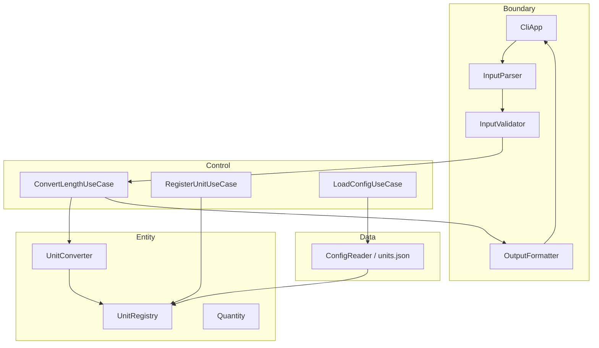

# UnitConverter_11

**meter 기준 길이 단위 변환 CLI**와 **계약 기반 테스트·BCE 레이어 분리**를 학습하기 위한 C++17 프로젝트 — C++·클린 아키텍처·TDD 학습자를 위해, 단일 파일 변환기를 확장 가능한 구조로 전환하는 것을 목표로 한다.

---

## 목차

- [개요 (Overview)](#개요-overview)
- [빠른 시작 (Quick Start)](#빠른-시작-quick-start)
- [지원 단위 및 비율](#지원-단위-및-비율)
- [입력 형식 계약](#입력-형식-계약)
- [아키텍처](#아키텍처)
- [테스트 실행](#테스트-실행)
- [RED 단계 To-Do 리스트](#red-단계-to-do-리스트)
- [Golden Master 회귀 안전장치](#golden-master-회귀-안전장치)
- [설정 파일 (JSON/YAML)](#설정-파일-jsonyaml)
- [출력 포맷](#출력-포맷)
- [기여 가이드 (Contributing)](#기여-가이드-contributing)
- [라이선스](#라이선스)
- [관련 문서](#관련-문서)

---

## 개요 (Overview)

### 이 프로젝트가 해결하는 문제

`unit:value` 한 줄 입력으로 길이를 여러 단위에 동시에 환산해야 한다. 초기 템플릿(`UnitConverter.cpp`)은 **파싱·환산·출력·에러 처리가 한 흐름**에 묶여 있고, 비율이 코드에 고정되어 있으며, 음수 검증·설정 파일·동적 단위·JSON/CSV 출력이 없다. 단위가 늘어날 때 if-else가 커지면 **회귀 없이 안전하게 확장**하기 어렵다.

### 주요 학습 목표

| 원칙 | 학습 내용 |
|------|-----------|
| **OCP** | 신규 단위는 Registry·설정·Formatter 추가로 확장; 환산 핵심 분기 확장 금지 |
| **SRP** | Entity(도메인)·Control(유스케이스)·Boundary(입출력) 책임 분리 |
| **BCE** | Boundary → Control → Entity 의존 방향; Entity는 I/O 없음 |
| **TDD** | Catch2 RED→GREEN→refactor; stderr·exit·비율 golden 고정 |

### PRD와의 연결

요구사항·인수 기준·회귀 규칙의 정본은 **[Product Requirements Document (`docs/PRD.md`)](docs/PRD.md)** 이다. 작업 목록은 [`docs/TODO.md`](docs/TODO.md), 초기 실습 요구는 [`docs/requirement.md`](docs/requirement.md)를 참고한다.

---

## 빠른 시작 (Quick Start)

### 사전 조건

| 항목 | 버전 |
|------|------|
| C++ 컴파일러 | **C++17** 이상 (g++, clang++, MSVC) |
| 빌드 (목표 구조) | **CMake** 3.16+ |
| 테스트 | **Catch2** v3.x |
| 포맷 (권장) | **clang-format** |

### 빌드 & 실행

**Baseline (현재 템플릿 — 단일 파일):**

```bash
g++ -std=c++17 -o UnitConverter UnitConverter.cpp
./UnitConverter
```

**목표 구조 (v1.0 — CMake 도입 후):**

```bash
cmake -B build -DCMAKE_BUILD_TYPE=Debug
cmake --build build
./build/unit_converter
```

프롬프트 예:

```text
Insert value for converting (ex: meter:2.5):
meter:5.0
```

### 예시 입출력 (`meter:5.0`)

입력:

```text
meter:5.0
```

출력 (table, **POL-OUT**: 좌측 입력 보존, 우측 **소수 4자리 half-up**):

```text
5.0 meter = 5.0 meter
5.0 meter = 16.4042 feet
5.0 meter = 5.4681 yard
```

| 항목 | 값 |
|------|-----|
| exit code | `0` |
| stderr | (비어 있음) |

> README 예시 `8.2` / `2.7`(2.5m 기준)은 반올림 표기 예시이다. **테스트·인수 기준은 PRD §6.1의 4자리 half-up**을 따른다.

---

## 지원 단위 및 비율

**기준 단위(hub):** meter  
**환산:** `meters = input_value × factor_to_meter(unit)` → `output = meters / factor_to_meter(target)`

| 단위명 | 식별자 | factor_to_meter (1 unit = k meter) | 출처 |
|--------|--------|-------------------------------------|------|
| meter | `meter` | 1.0 | PRD §5.1 기준 |
| feet | `feet` | 0.3048 (= 1 ÷ 3.28084) | `1 meter = 3.28084 feet` |
| yard | `yard` | 0.9144 (= 1 ÷ 1.09361) | `1 meter = 1.09361 yard` |

**검증 상수 (테스트):**

- `1 meter` → `3.28084 feet` (ε ≤ 1×10⁻⁴)
- `1 meter` → `1.09361 yard` (ε ≤ 1×10⁻⁴)
- feet ↔ yard는 **meter 경유만** (독립 비율 하드코딩 금지)

---

## 입력 형식 계약

### 정상 입력 (예시 3개)

| 입력 | 의미 |
|------|------|
| `meter:2.5` | 2.5 meter를 모든 등록 단위로 변환 |
| `feet:3.28084` | 3.28084 feet 입력; 좌측 출력에 `feet`·값 보존 |
| `yard:0` | 0 yard (음수 아님, **0 허용**) |

**형식 규칙:** `{unit}:{value}` — 콜론 1개, unit `[a-z][a-z0-9_]*` (1~32자).

### 비정상 입력 (예시 3개 + 에러 패턴)

| 입력 | exit | stderr 패턴 |
|------|------|-------------|
| `meter2.5` (콜론 없음) | 1 | `Invalid format. Use unit:value (ex: meter:2.5)` |
| `meter:abc` | 1 | `Invalid number: abc` |
| `yard:-3` | 1 | `Negative value not allowed: -3` |

**추가 실패 (계약 동일):**

| 조건 | stderr 패턴 |
|------|-------------|
| 미등록 단위 `lightyear:1` | `Unknown unit: lightyear` |
| stdout | **변환 줄 없음** (빈) |

### 음수 정책 (POL-NEG)

| 규칙 | 내용 |
|------|------|
| POL-NEG-01 | `value >= 0`; **0 허용** |
| POL-NEG-02 | 음수 거부 |
| POL-NEG-03 | 실패 시 exit `1`, stdout 변환 줄 없음 |
| POL-NEG-04 | `Negative value not allowed: {value}` |

---

## 아키텍처

### BCE 레이어 (Mermaid)



### 의존성 방향

```text
Boundary  →  Control  →  Entity
                ↓
              Data (config load only)
```

| 레이어 | 책임 | 금지 |
|--------|------|------|
| **Entity** | 환산, Registry, Quantity, DomainError | iostream, 파일, JSON, CLI |
| **Control** | 유스케이스 조율 | 파싱·포맷·환산식 재구현 |
| **Boundary** | stdin/stdout/stderr, exit code | 환산 상수·if-else 단위 분기 |
| **Data** | `units.json` 로드 | Domain 규칙 변경 |

### 새 단위 추가 방법 (코드 변경 최소화)

1. **설정 파일** `config/units.json`에 항목 추가  
   `{ "name": "cubit", "factor_to_meter": 0.4572 }`
2. **또는 런타임 등록** (한 줄):  
   `register:cubit:0.4572`
3. **Registry**에 등록되면 `convertAll`·출력 포맷이 자동으로 대상에 포함
4. **수정하지 않음:** `UnitConverter` meter 정규화 공식, ERR-* 메시지, POL-OUT 좌측 패턴
5. **필수:** 기존 builtin golden 테스트(`meter:2.5`, 3.28084, 1.09361) GREEN 유지

**목표 디렉터리:**

```text
src/boundary/   src/control/   src/entity/
tests/entity/   tests/boundary/   tests/integration/
config/units.json
```

---

## 테스트 실행

### 프레임워크

**Catch2** v3.x — Entity(순수), Boundary(Mock Entity), Integration(E2E).

### 명령

**CMake (목표):**

```bash
cmake --build build
ctest --test-dir build --output-on-failure
```

**또는 Catch2 직접:**

```bash
./build/tests/unit_converter_tests
```

**태그 예:**

```bash
./build/tests/unit_converter_tests "[entity]"
./build/tests/unit_converter_tests "[boundary][parsing]"
./build/tests/unit_converter_tests "[integration]"
```

### 커버리지 목표 (PRD §4.3)

| 레이어 | 라인 커버리지 | 비고 |
|--------|---------------|------|
| Entity | **≥ 95%** | 환산·Registry 불변식 |
| Boundary | **≥ 85%** | ERR-* 8종 각 ≥1 테스트 |
| Data | **≥ 90%** | config 성공/실패 |
| Control | **100%** | 유스케이스 메서드 각 호출 |

**인수:** Gherkin GH-01~08 매핑 테스트 전부 GREEN. [`docs/PRD.md` §7.1](docs/PRD.md) AC-01~08 참고.

---

## RED 단계 To-Do 리스트

> 이 체크리스트는 test_plan.md 기반으로 생성되었습니다.
> 각 항목은 RED(실패 테스트 작성) 완료 시 체크합니다.

### Track A — UI / Boundary 테스트
- [ ] TC-A-01: 정상 입력 "meter:2.5" → 변환 결과 반환 (Happy Path)
- [ ] TC-A-02: ":" 없는 입력 → std::invalid_argument 발생
- [ ] TC-A-03: 음수 입력 "meter:-1.0" → std::invalid_argument 발생
- [ ] TC-A-04: 없는 단위 "parsec:1.0" → std::invalid_argument 발생
- [ ] TC-A-05: 소수점 파싱 실패 "meter:abc" → std::invalid_argument 발생
- [ ] TC-A-06: 출력 포맷에 원 입력 단위·값 보존 ("2.5 meter = ...")
- [ ] TC-A-07: value=0 경계값 처리 확인

### Track B — Domain / Logic 테스트
- [ ] TC-B-01: convert("meter", 2.5, "feet") == 8.20210 (오차 1e-5)
- [ ] TC-B-02: convert("meter", 1.0, "yard") == 1.09361 (오차 1e-5)
- [ ] TC-B-03: convert("feet", 1.0, "meter") == 0.30480 (역변환)
- [ ] TC-B-04: convertAll("meter", 1.0) → 모든 등록 단위 변환 반환
- [ ] TC-B-05: registerUnit("cubit", 0.4572) 후 변환 가능
- [ ] TC-B-06: loadConfig(유효한 경로) → 비율 정상 로드
- [ ] TC-B-07: loadConfig(없는 경로) → 기본값(3.28084/1.09361) 유지

### 커버리지 목표
- [ ] Domain Logic: 95%+ (# gcov / lcov)
- [ ] Boundary Layer: 85%+
- [ ] 전체 TOTAL: 90%+

### 결함 목록 연결
- [x] [defect_list.md](docs/defect_list.md) 생성 및 발견 결함 기록
- [x] Catch2 회귀 테스트 통과 (36/36, Entity/Boundary 경로)
- [ ] legacy `UnitConverter.cpp` Open 결함 수정 (DEF-003·004·010·013, 목록 참고)

---

## Golden Master 회귀 안전장치

> Refactoring 시작 전 구축. GREEN 완료 후 즉시 적용.

### 기준 파일 생성
- [x] GM-01: golden_master_expected.txt 생성 (meter:2.5 기준 출력)
- [x] GM-02: feet:1.0 / yard:1.0 / meter:0.0 시나리오 추가
- [x] GM-03: git add tests/golden_master_expected.txt (버전 관리 포함)

### 테스트 코드
- [x] GM-04: test_golden_master.cpp + golden_master_expected.txt 작성
- [x] GM-05: approve 패턴 적용 (파일 없으면 생성, 있으면 비교)
- [x] GM-06: CMake: `add_test(NAME GoldenMaster …)` → `ctest -R GoldenMaster` PASS

### CI 연동
- [x] GM-07: `.github/workflows/golden_master.yml` 작성
- [ ] GM-08: PR 머지 차단 (required status check) 설정 — [설정 방법](#gm-08-github-required-check)
- [x] GM-09: Golden Master 재실행 → PASS 확인 (`ctest -R GoldenMaster`)

#### GM-08: GitHub required check

Repository **Settings → Branches → Branch protection rule** (대상: `main` / `C_11`):

1. **Require status checks to pass before merging** 활성화
2. Required checks에 **`Golden Master (REG-04)`** 추가 (workflow job 이름)
3. PR에서 Actions 탭에 Green 확인 후 머지

로컬 검증:

```bash
cmake --build build --target unit_converter_legacy unit_converter_tests
cd build && ctest -R GoldenMaster --output-on-failure
```

기준 파일 재생성:

```bash
./tests/scripts/generate_golden_master.sh build UnitConverter
git add tests/golden_master_expected.txt
```

---

## 설정 파일 (JSON/YAML)

### 위치 및 JSON 형식

**경로:** `config/units.json`

```json
{
  "base_unit": "meter",
  "units": [
    { "name": "meter", "factor_to_meter": 1.0 },
    { "name": "feet", "factor_to_meter": 0.3048 },
    { "name": "yard", "factor_to_meter": 0.9144 }
  ]
}
```

| 실패 조건 | 동작 |
|-----------|------|
| 파일 없음 / JSON 구문 오류 | exit `1`, `Config load failed: {reason}` |
| `factor_to_meter` ≤ 0 | 동일, stdout 변환 줄 없음 |

**YAML:** v2.0 후보(F-10). JSON GREEN 후 동일 스키마 매핑.

### 동적 단위 등록 (PRD §5.3)

**형식 (한 줄):**

```text
register:{unit_name}:{factor_to_meter}
```

**예시:**

```text
register:cubit:0.4572
```

| 결과 | 기대 |
|------|------|
| `cubit:1` | ≈ `1.0 meter` (0.4572 m) |
| `convertAll` | Registry 단위 수 +1 |
| builtin 테스트 | `meter:2.5` golden **불변** |

---

## 출력 포맷

공통: **POL-OUT** — 모든 줄·레코드에 **입력 unit·value 원문** 보존.  
수치: 우측/target **소수 4자리 half-up** (table·json·csv 동일).

### 콘솔 (table) — 기본

```text
{input_value} {input_unit} = {converted_value} {target_unit}
```

예 (`meter:2.5`):

```text
2.5 meter = 2.5 meter
2.5 meter = 8.2021 feet
2.5 meter = 2.7340 yard
```

- 줄 수 = Registry 단위 수  
- 순서 = 단위명 **사전순(lexicographic)**

### JSON (권장)

```json
{
  "input": { "unit": "meter", "value": 2.5 },
  "conversions": [
    { "unit": "feet", "value": 8.2021 },
    { "unit": "meter", "value": 2.5 },
    { "unit": "yard", "value": 2.7340 }
  ]
}
```

### CSV (권장)

```csv
source_unit,source_value,target_unit,target_value
meter,2.5,meter,2.5
meter,2.5,feet,8.2021
meter,2.5,yard,2.7340
```

| 포맷 | 선택 방법 (목표 CLI) |
|------|----------------------|
| table | 기본 (옵션 생략) |
| json | `--format json` |
| csv | `--format csv` |
| 미지원 | exit `1`, `Unknown output format: {format}` |

---

## 기여 가이드 (Contributing)

### 계약 변경 금지 원칙 (PRD §7.2)

| ID | 내용 |
|----|------|
| REG-01 | builtin 비율 `3.28084` / `1.09361` 변경 시 **테스트 먼저 RED** + 승인 |
| REG-02 | ERR-* **stderr 전문·exit code** 변경 금지 (golden diff 0) |
| REG-03 | POL-OUT **좌측 패턴** 변경 금지 |
| REG-04 | `meter:2.5` E2E golden 유지 |
| REG-05 | **refactor는 전 테스트 GREEN 이후만** |

### 테스트 없는 PR 거부 정책

- 동작·계약·비율·출력 변경 → **Catch2 테스트 동반 필수**
- 테스트 삭제·완화·스킵으로 GREEN 맞추기 **금지**
- Entity 변경 → `[entity]` 테스트; Boundary → Mock 분리 유지

### 커밋 메시지 컨벤션

```text
<type>(<scope>): <subject>

<body optional>
```

| type | 용도 |
|------|------|
| `feat` | 기능 (F-0x) |
| `fix` | 계약 버그 |
| `test` | RED/GREEN 테스트만 |
| `refactor` | 동작 불변 구조 변경 |
| `docs` | README, PRD, TODO |

**scope 예:** `entity`, `boundary`, `control`, `config`, `docs`

**예시:**

```text
test(entity): add ratio golden for 1 meter to feet
feat(boundary): reject negative input per POL-NEG-04
docs: align README output rounding with PRD 6.1
```

---

## 라이선스

**MIT License** — 학습·실습·포크 허용. 상업 사용 시 표준 MIT 조건 준수.

---

## 관련 문서

| 문서 | 설명 |
|------|------|
| [docs/PRD.md](docs/PRD.md) | Phase 5 제품 요구사항 정본 |
| [docs/TODO.md](docs/TODO.md) | v1.0 작업·마일스톤·회귀 체크리스트 |
| [docs/requirement.md](docs/requirement.md) | 초기 6시간 실습 요구 |
| [docs/test_plan.md](docs/test_plan.md) | 테스트 계획서 (RED 체크리스트 출처) |
| [docs/defect_list.md](docs/defect_list.md) | RED/QA 결함 목록 (DEF-001~) |
| [Report/02_RED.md](Report/02_RED.md) | RED 단계 보고서 (ctest 48/48 FAIL) |
| [docs/red_tests.md](docs/red_tests.md) | Dual-Track UI/Logic RED 명세 |
| [Prompting/02_RED.md](Prompting/02_RED.md) | RED/TDD 세션 대화 기록 (Turn 1~14) |

---

*문서만 포함. 구현 코드는 본 README 작성 범위에 추가하지 않는다.*
