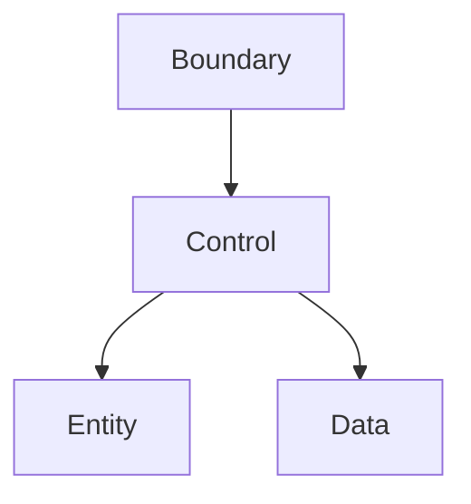

# UnitConverter_11 프로젝트 보고서

| 항목 | 내용 |
|------|------|
| **프로젝트** | UnitConverter_11 — 확장 가능한 C++ 길이 단위 변환 학습 시스템 |
| **작성일** | 2026-05-20 |
| **기준 브랜치** | `spec` (커밋 `2d18dfd`) |
| **원격 저장소** | https://github.com/wanedu88/UnitConverter_11.git |
| **문서 버전** | Phase 5 (PRD v1.0) |

---

## 1. 요약 (Executive Summary)

본 프로젝트는 `unit:value` 형식의 CLI 길이 변환기를 **단일 파일 템플릿**에서 **계약 기반·테스트 가능·BCE 레이어 분리** 구조로 발전시키는 **6시간 학습용** 저장소이다.  
현재 단계에서는 **구현 확장보다 요구사항·계약·문서 정본화**가 완료되었으며, 코드베이스는 baseline `UnitConverter.cpp`(meter/feet/yard) 상태를 유지한다.

**핵심 성과**

- Phase 4 산출물(Epic, User Stories, Gherkin 8시나리오, Level 5 체크리스트)을 **Phase 5 PRD**로 통합
- 사용자·기여자용 **README.md** 전면 개편 (Quick Start, 계약, 아키텍처, 출력 스키마)
- 실행 추적용 **docs/TODO.md** 및 **문서 간 정합성 검토** 수행
- Git 커밋 완료 (`spec` 브랜치); 원격 push는 인증·네트워크 환경에 따라 별도 확인 필요

---

## 2. 프로젝트 배경 및 목적

### 2.1 문제 인식

| 관찰 | 내용 |
|------|------|
| 구조 | 파싱·환산·출력·에러가 `main` 한 흐름에 결합 |
| 확장 | 단위 추가 시 if-else 분기 증가, OCP 위반 |
| 검증 | 눈 검산·그럴듯한 출력에 의존, 회귀 기준 없음 |
| 미구현 | 음수 검증, 설정 파일, 동적 등록, JSON/CSV 출력 |

### 2.2 목적 (PRD §1.1)

| What | Who | Why |
|------|-----|-----|
| meter 기준 변환 CLI + 계약·테스트·레이어 분리 | C++17·클린 아키텍처·TDD 학습자 | 단일 파일 → **측정 가능한 설계 역량** 습득 |

### 2.3 학습 목표

- **OCP / SRP** — Registry·Formatter·config로 확장, Converter 분기 고정
- **BCE** — Boundary → Control → Entity (+ Data)
- **TDD** — Catch2 RED→GREEN→refactor, golden stderr/비율/출력

---

## 3. 수행 작업 (Phase 4 → Phase 5)

### 3.1 요구사항·설계 문서 (코드 없음)

| 단계 | 산출물 | 상태 |
|------|--------|------|
| 문제 정의 | Observation, Why×3, Invariants, User Journey 스토리보드 | 완료 (대화 산출) |
| Mom Test | 인터뷰 질문 10 + 위험 가정 3 | 완료 |
| BCE 설계 | Entity/Boundary/Data 계약, Traceability Matrix | 완료 |
| Catch2 RED | 테스트 제목 38개 (6분류) | 완료 |
| Epic / Story / Gherkin | 8 시나리오, POL-NEG·POL-OUT | 완료 |
| Level 5 체크리스트 | Epic↔Journey↔Story↔Gherkin 검증 표 | 완료 |

### 3.2 Phase 5 문서 패키지 (저장소 반영)

| 파일 | 역할 |
|------|------|
| [docs/PRD.md](../docs/PRD.md) | 제품 요구사항 정본 (기능·NFR·인수·회귀) |
| [README.md](../README.md) | 오픈소스 진입 문서 (Quick Start, 계약, 아키텍처) |
| [docs/TODO.md](../docs/TODO.md) | v1.0 Must/Should 작업·마일스톤·회귀 체크 |
| [docs/requirement.md](../docs/requirement.md) | 초기 6시간 실습 요구 (레거시) |
| [Report/보고서.md](보고서.md) | 본 보고서 |

### 3.3 Git 이력

| 커밋 | 브랜치 | 설명 |
|------|--------|------|
| `2d18dfd` | `spec` | docs: PRD, TODO, requirement + README 확장 |
| `a237f13` | `main` | main 브랜치 초기화 (UnitConverter.cpp baseline) |

**원격:** `origin` → `https://github.com/wanedu88/UnitConverter_11.git`  
**로컬 상태:** working tree clean (`spec`)

---

## 4. 기능·계약 요약 (PRD 기준)

### 4.1 필수 (v1.0 Must) — F-01 ~ F-06

| ID | 기능 | 핵심 계약 |
|----|------|-----------|
| F-01 | 입력 파싱 | `unit:value`, 실패 시 FORMAT/VALUE/NEG stderr, exit 1 |
| F-02~03 | Registry 환산 | meter 허브, `Unknown unit: {unit}` |
| F-04 | table 출력 | POL-OUT 좌측 보존, 4자리 half-up, lex 순서 |
| F-05 | 음수 정책 | POL-NEG-01~04, 0 허용 |
| F-06 | Catch2 | Entity/Boundary/Integration, GH-01~08 |

### 4.2 권장 (Should) — F-07 ~ F-09

| ID | 기능 |
|----|------|
| F-07 | JSON / CSV 출력 + parity |
| F-08 | `config/units.json` 로드 |
| F-09 | `register:{unit}:{factor_to_meter}` 동적 등록 |

### 4.3 비율 상수 (meter 허브)

| 단위 | factor_to_meter | README 관계식 |
|------|-----------------|---------------|
| meter | 1.0 | 기준 |
| feet | 0.3048 | 1 m = 3.28084 ft |
| yard | 0.9144 | 1 m = 1.09361 yd |

### 4.4 인수 기준 (AC) 요약

| ID | 요지 | Gherkin |
|----|------|---------|
| AC-01 | `meter:2.5` 성공, POL-OUT, 비율 ε | GH-01 |
| AC-02 | 형식·숫자 오류 3종 | GH-02~04 |
| AC-03 | 음수 거부 | GH-05 |
| AC-04 | unknown unit | GH-07 |
| AC-05~07 | 등록·config·다중 포맷 | 권장(M5) |
| AC-08 | 커버리지·ERR 8종 | CI |

---

## 5. 아키텍처 (목표 구조)

| 레이어 | 책임 | 금지 |
|--------|------|------|
| Entity | Quantity, Registry, Converter | iostream, 파일 I/O |
| Control | ConvertLength, RegisterUnit, LoadConfig | 환산식·파싱 재구현 |
| Boundary | Parse, Validate, Format, exit | 환산 상수, if-else 단위 |
| Data | units.json | Domain 규칙 변경 |

**현재 구현:** `UnitConverter.cpp` 단일 파일 — 목표 구조 **미적용** (기술 부채).

---

## 6. 문서 정합성 검토 (README ↔ PRD ↔ TODO)

### 6.1 PRD에 있으나 README에 부족한 항목 (요지)

- 비목표 NG-01~03, G-01~G-05 목표 표, F-01~F-10 우선순위
- GH-04 (`feet:1.2.3`), ERR 8종 전체 catalog, F-09 실패 메시지
- §6.4 포맷 parity, §7.1 AC 체크리스트, Glossary, Gherkin 부록

### 6.2 README만의 확장 (범위 주의)

- MIT License, 커밋 컨벤션, `--format` CLI 플래그명
- Quick Start 예시 `meter:5.0` (PRD golden은 `meter:2.5`)
- Baseline `g++` 단일 파일 빌드 경로

### 6.3 계약 불일치 (조치 권장)

| 항목 | PRD | README | 권장 |
|------|-----|--------|------|
| 대표 예시 | `meter:2.5` | `meter:5.0` (Quick Start) | 테스트 golden은 2.5 유지, 5.0은 부록 예시로 명시 |
| cubit:1 결과 | 0.4572 m | “≈ 1.0 meter” 문구 | `0.4572 meter`로 수정 |
| 비정상 입력 | `feet:1.2.3` 포함 | 3건만 기재 | GH-04 행 추가 |

### 6.4 커버리지 목표 정렬

| 레이어 | PRD §4.3 | README | TODO Must |
|--------|----------|--------|-------------|
| Entity | ≥95% | ≥95% | ≥95% ✓ |
| Boundary | ≥85%, ERR 100% | ≥85% | ≥85% ✓ |
| Data | ≥90% | ≥90% | **권장만** (불일치) |
| Control | 100% | 100% | Must에 명시 없음 |

→ **TODO Must에 Data≥90%, Control 100% 추가** 또는 PRD AC-08과 G-05 문구 통일 권장.

---

## 7. 기술 부채 및 리스크

| ID | 부채 / 리스크 | 영향 | 완화 |
|----|---------------|------|------|
| TD-01 | 단일 `UnitConverter.cpp` | OCP·테스트 분리 불가 | M1~M3 마일스톤 (TODO) |
| TD-02 | `catch(...)` | 오류 계약 모호 | ERR-VALUE 명시 매핑 |
| TD-03 | 비율 main 하드코딩 | REG-01 위반 위험 | config + Registry |
| TD-04 | 음수 미구현 | AC-03·GH-05 실패 | F-05 RED 우선 |
| TD-05 | tests/·config/ 부재 | CI·인수 불가 | M1 골격 |
| R-01 | 문서·구현 괴리 | README는 v1.0 톤, 코드는 baseline | README에 “구현 상태” 배지 |
| R-02 | GitHub push 미완 | 원격 `spec` 미반영 가능 | `git push -u origin spec` 재시도 |

---

## 8. 마일스톤 및 진행률

| 마일스톤 | 범위 | 상태 |
|----------|------|------|
| M0 Baseline | UnitConverter.cpp, README 초안 | **Done** |
| M0.5 문서 | PRD, README, TODO, Report | **Done** |
| M1 계약·테스트 골격 | CMake, Catch2, ERR RED | Planned |
| M2 Entity v1 | F-02, F-03, G-01 | Planned |
| M3 Boundary v1 | F-01, F-04, F-05, GH-02~07 | Planned |
| M4 v1.0 릴리스 | F-01~06, AC-01~04·08 | Planned |
| M5 확장 | F-07~09, AC-05~07 | Planned |

**문서 단계 진행률:** 약 **35%** (요구·계약·README 완료, 구현·CI 0%)

---

## 9. 회귀 보호 (PRD §7.2)

배포·인수 전 필수 확인:

| REG | 내용 | 검증 |
|-----|------|------|
| REG-01 | 비율 3.28084 / 1.09361 | ratio golden |
| REG-02 | ERR-* stderr·exit | 스냅샷 diff 0 |
| REG-03 | POL-OUT 좌측 | GH-01, 06, 08 |
| REG-04 | `meter:2.5` E2E | T-INT-01 |
| REG-05 | refactor 전 전체 GREEN | PR 설명 |

---

## 10. 결론 및 권고 사항

### 10.1 결론

- **계약·요구사항·학습 프레임**은 PRD를 정본으로 정리되었고, README·TODO가 이를 사용자·실행 관점에서 보조한다.
- **실행 코드**는 baseline 수준이며, v1.0 인수(AC-01~08) 충족을 위해서는 TODO Must 13항목의 구현·테스트가 필요하다.
- 문서 간 **소수 불일치**(예시 입력, cubit 문구, TODO Data 커버리지)는 릴리스 전 **한 번의 문서 스프린트**로 해소 가능하다.

### 10.2 권고 (우선순위)

1. **GitHub** — `git push -u origin spec` 완료 후 `main` 머지 여부 결정  
2. **M1** — CMake + Catch2 + `tests/entity` RED 골격  
3. **README 정합** — `meter:2.5` golden, GH-04, cubit 문구, 구현 상태 섹션 추가  
4. **TODO** — Data 90% / Control 100%를 Must 또는 PRD AC-08에 명시 통일  
5. **Traceability 표** — Epic → Story → GH → Catch2 제목 1페이지 (학습자 제출물)

---

## 11. 참고 문서

| 문서 | 경로 |
|------|------|
| PRD | [docs/PRD.md](../docs/PRD.md) |
| TODO | [docs/TODO.md](../docs/TODO.md) |
| README | [README.md](../README.md) |
| 실습 요구 | [docs/requirement.md](../docs/requirement.md) |
| Baseline 코드 | [UnitConverter.cpp](../UnitConverter.cpp) |

---

*본 보고서는 Phase 5 문서화 단계의 결과 보고이며, 구현 상세·클래스 설계는 포함하지 않는다.*
