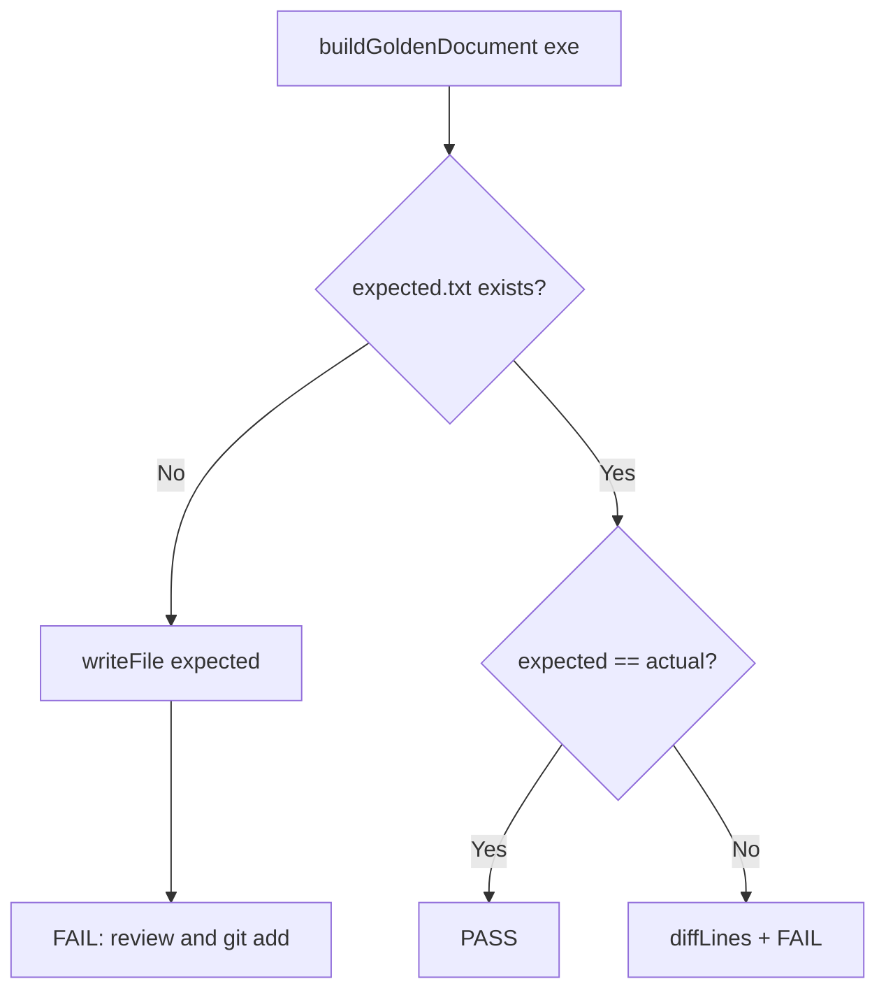

# UnitConverter_11 — Golden Master 회귀 안전장치 보고서

| 항목 | 내용 |
|------|------|
| **프로젝트** | UnitConverter_11 — Dual-Track UI + Logic TDD |
| **작성일** | 2026-05-21 |
| **단계** | **Golden Master** (REFACTOR 전 E2E stdout 회귀 고정) |
| **선행 보고서** | [03_GREEN.md](03_GREEN.md) (GREEN 71/71 PASS, 커버리지 게이트) |
| **관련 문서** | [docs/test_plan.md](../docs/test_plan.md) §9, [docs/PRD.md](../docs/PRD.md) REG-04, [README.md](../README.md) Golden Master 섹션 |
| **회귀 ID** | **REG-04** — `meter:2.5` E2E golden 유지 (T-INT-01 확장) |

---

## 1. 요약 (Executive Summary)

GREEN 완료 후 **REFACTOR 진입 전**, legacy CLI(`UnitConverter`)의 **stdout table 출력**을 Golden Master(Approval) 방식으로 고정했다. 네 가지 입력 시나리오에 대한 변환 줄을 기준 파일에 저장하고, Catch2·`ctest`·GitHub Actions로 **문자열 diff 0**을 강제한다.

| 지표 | 목표 | 실측 |
|------|------|------|
| **기준 시나리오** | 4종 | **4/4** (`meter:2.5`, `feet:1.0`, `yard:1.0`, `meter:0.0`) |
| **Approve 테스트** | PASS | **`golden_master_cli_stdout_approval` PASS** |
| **ctest `GoldenMaster`** | PASS | **PASS** (≈0.25s) |
| **GM 체크리스트 (README)** | GM-01~07, GM-09 | **완료** |
| **GM-08 (required check)** | GitHub 설정 | **수동** (저장소 Branch protection) |

**설계 원칙:**

- 캡처: `./UnitConverter < input.txt` → stdout (프롬프트 제거·동일 단위 줄 제외)
- 기준 없음 → 현재 출력으로 `golden_master_expected.txt` 생성 후 FAIL (검토·`git add` 유도)
- 기준 있음 → `expected` vs `actual` 전문 비교, 불일치 시 unified diff 후 FAIL

---

## 2. 배경 및 목표

### 2.1 문제

| 리스크 | Golden Master 대응 |
|--------|-------------------|
| REFACTOR 중 table 포맷·반올림 drift | stdout 스냅샷 byte-equal |
| `OutputFormatter` / `convertAll` 순서 변경 | 4 시나리오 동시 회귀 |
| REG-04 (`meter:2.5` E2E) 단일 케이스만으로 부족 | feet·yard·0 경계 확장 |
| CI 없이 로컬만 검증 | `golden_master.yml` workflow |

### 2.2 목표 (GM-01~09)

| ID | 목표 | 상태 |
|----|------|------|
| GM-01 | `golden_master_expected.txt` — `meter:2.5` | ✓ |
| GM-02 | `feet:1.0` / `yard:1.0` / `meter:0.0` 추가 | ✓ |
| GM-03 | `git add` 기준 파일 (버전 관리) | ✓ (스테이징 완료, 커밋 대기) |
| GM-04 | `test_golden_master.cpp` + 기준 파일 | ✓ |
| GM-05 | Approve 패턴 (없으면 생성 / 있으면 비교) | ✓ |
| GM-06 | CMake `add_test(NAME GoldenMaster …)` | ✓ |
| GM-07 | `.github/workflows/golden_master.yml` | ✓ |
| GM-08 | PR required status check | ☐ (GitHub UI) |
| GM-09 | 재실행 PASS | ✓ |

### 2.3 범위

| 포함 | 제외 |
|------|------|
| legacy CLI table stdout (builtin 3단위) | stderr ERR-* 스냅샷 (별도 REG-02) |
| POL-OUT 4자리 half-up 표시 | JSON/CSV 포맷 (T-INT-02, 별도 마일스톤) |
| identity 변환 줄 제외 규칙 | 동적 단위(cubit) E2E |

---

## 3. 기준 파일 (`tests/golden_master_expected.txt`)

### 3.1 구조

```text
[{scenario}]
{input_value} {input_unit} = {converted} {target_unit}
...
---
(next scenario)
```

### 3.2 확정 내용 (2026-05-21)

```text
[meter:2.5]
2.5 meter = 8.2021 feet
2.5 meter = 2.7340 yard
---
[feet:1.0]
1 feet = 0.3048 meter
1 feet = 0.3333 yard
---
[yard:1.0]
1 yard = 3.0000 feet
1 yard = 0.9144 meter
---
[meter:0.0]
0 meter = 0.0000 feet
0 meter = 0.0000 yard
```

### 3.3 캡처 규칙

| 규칙 | 설명 |
|------|------|
| **프롬프트 제거** | `Insert value for converting (ex: meter:2.5): ` 접두사 strip |
| **Identity 제외** | 좌·우 단위명 동일 줄 스킵 (예: `2.5 meter = 2.5000 meter`) |
| **정밀도** | `OutputFormatter::roundHalfUp4` + `setprecision(4)` (PRD REG-04) |
| **비율** | 3.28084 ft/m, 1.09361 yd/m (`ConversionConstants.hpp`) |

> RED 보고서의 6자리 예시(`8.202100`)는 내부 ε 검증용이며, **E2E golden은 POL-OUT 4자리**를 따른다.

---

## 4. 구현

### 4.1 산출물

| 산출물 | 경로 |
|--------|------|
| 기준 파일 | [tests/golden_master_expected.txt](../tests/golden_master_expected.txt) |
| Approve 테스트 | [tests/test_golden_master.cpp](../tests/test_golden_master.cpp) |
| 캡처·diff 헬퍼 | [tests/golden_master_helper.hpp](../tests/golden_master_helper.hpp) |
| 생성 스크립트 (Windows) | [tests/scripts/generate_golden_master.ps1](../tests/scripts/generate_golden_master.ps1) |
| 생성 스크립트 (Linux) | [tests/scripts/generate_golden_master.sh](../tests/scripts/generate_golden_master.sh) |
| CI workflow | [.github/workflows/golden_master.yml](../.github/workflows/golden_master.yml) |
| CMake `ctest` | [CMakeLists.txt](../CMakeLists.txt) — `GoldenMaster` |
| README 체크리스트 | [README.md](../README.md) — Golden Master 회귀 안전장치 |

### 4.2 실행 파일

```cmake
add_executable(unit_converter_legacy UnitConverter.cpp)
set_target_properties(unit_converter_legacy PROPERTIES OUTPUT_NAME UnitConverter)
```

- 빌드 타깃: `unit_converter_legacy`
- 산출물: `UnitConverter` / `UnitConverter.exe`
- 테스트 매크로: `UC11_LEGACY_EXE="$<TARGET_FILE:unit_converter_legacy>"`

### 4.3 Approve 흐름



### 4.4 Catch2 테스트

| 항목 | 값 |
|------|-----|
| **TEST_CASE** | `golden_master_cli_stdout_approval` |
| **태그** | `[integration][golden][REG-04]` |
| **GREEN 가드** | `uc11_require_green_phase()` |

### 4.5 CMake `ctest`

```cmake
add_test(
    NAME GoldenMaster
    COMMAND unit_converter_tests "golden_master_cli_stdout_approval"
)
set_tests_properties(GoldenMaster PROPERTIES LABELS "golden;REG-04;integration")
```

- Catch2 discover: `Test #1: golden_master_cli_stdout_approval`
- 명시 엔트리: `Test #73: GoldenMaster` (CI·README GM-06용)

---

## 5. 검증 결과

### 5.1 로컬 실행 (Windows, 2026-05-21)

```powershell
cmake -S . -B build -DUC11_GREEN_PHASE=ON
cmake --build build --target unit_converter_legacy unit_converter_tests
ctest --test-dir build -R GoldenMaster --output-on-failure
```

```text
Test #73: GoldenMaster .....................   Passed    0.25 sec
100% tests passed, 0 tests failed out of 1
```

| 명령 | 결과 |
|------|------|
| `unit_converter_tests.exe "golden_master_cli_stdout_approval"` | **PASS** |
| `ctest -R GoldenMaster` | **PASS** |
| `generate_golden_master.ps1 -BuildDir build` | 기준 파일 재생성, diff 0 |

### 5.2 `ctest` 전체 규모

| 항목 | GREEN (03_GREEN) | Golden Master 추가 후 |
|------|------------------|------------------------|
| discover 합계 | 71 | **72** (+`golden_master_cli_stdout_approval`) |
| 명시 `GoldenMaster` | — | **+1** |
| **표시 Total Tests** | 71 | **73** |

> `GoldenMaster`는 Catch2 케이스와 동일 assertion을 `ctest -R GoldenMaster`로 단독 실행하기 위한 별칭이다.

### 5.3 CI (GitHub Actions)

| 항목 | 내용 |
|------|------|
| **Workflow** | `Golden Master` |
| **Job name** | `Golden Master (REG-04)` ← GM-08 required check 이름 |
| **Runner** | `ubuntu-latest` |
| **트리거** | `push`/`pull_request` on `main`, `C_11`, `green` (경로 필터) |
| **실패 시** | `generate_golden_master.sh` + `git diff` 진단 로그 |

---

## 6. PRD·test_plan 매핑

| PRD / 계획 | Golden Master 구현 |
|------------|-------------------|
| **REG-04** | 4시나리오 stdout golden, `ctest`/`CI` |
| **T-INT-01** | `meter:2.5` 2줄 (feet·yard, identity 제외) |
| **I-01 / I-03** | table E2E, diff 0 |
| **POL-OUT** | 좌측 `2.5 meter` 보존, 우측 4자리 |
| **GH-01** | `meter:2.5` happy path 출력 고정 |
| **test_plan §9.2** | 3줄 예시 → identity 제외 2줄로 E2E 기준 정합 |

---

## 7. 운영 가이드

### 7.1 기준 파일 재생성

**Windows:**

```powershell
cmake --build build --target unit_converter_legacy
.\tests\scripts\generate_golden_master.ps1 -BuildDir build
git add tests/golden_master_expected.txt
```

**Linux:**

```bash
cmake --build build --target unit_converter_legacy
./tests/scripts/generate_golden_master.sh build UnitConverter
git add tests/golden_master_expected.txt
```

### 7.2 의도적 baseline 변경

1. POL-OUT·비율 변경은 **PRD REG-01~03** 및 TC 먼저 갱신
2. 스크립트로 `golden_master_expected.txt` 재생성
3. diff 리뷰 후 커밋 (단독 PR 권장)
4. `ctest -R GoldenMaster` PASS 확인

### 7.3 GM-08: Branch protection

1. GitHub **Settings → Branches**
2. `main` / `C_11` protection rule
3. **Require status checks** → **`Golden Master (REG-04)`** 선택

---

## 8. REFACTOR 진입 조건 갱신

[03_GREEN.md](03_GREEN.md) §11에 더해, REFACTOR PR 전 아래를 만족한다.

| # | 조건 | 상태 |
|---|------|------|
| 1 | `tests/golden_master_expected.txt` 저장소 추적 | ✓ (스테이징) |
| 2 | `ctest -R GoldenMaster` PASS | ✓ |
| 3 | CI workflow 푸시 후 Green | ☐ (원격 push 후) |
| 4 | GM-08 required check (선택·권장) | ☐ |
| 5 | REFACTOR 후 GM 재실행 PASS (REG-05) | REFACTOR 단계에서 수행 |

**금지:** golden 실패를 무시하고 baseline 삭제·`REQUIRE` 완화만으로 통과.

---

## 9. 산출물·체크리스트 (QA 서명용)

| # | 항목 | 기대 | 확인 |
|---|------|------|------|
| 1 | GM-01~02 기준 4시나리오 | 파일 존재 | ☐ |
| 2 | GM-05 approve (diff 0) | PASS | ☐ |
| 3 | GM-06 `ctest -R GoldenMaster` | PASS | ☐ |
| 4 | GM-07 workflow 파일 | `.github/workflows/golden_master.yml` | ☐ |
| 5 | GM-03 `git add` / 커밋 | 추적됨 | ☐ |
| 6 | GM-08 required check | GitHub 설정 | ☐ |
| 7 | REG-04 회귀 | 리팩터 후에도 PASS | ☐ |

---

## 10. 결론

- GREEN 이후 **legacy CLI stdout**을 Golden Master로 고정하여 **REG-04/T-INT-01** 회귀 안전장치를 구축했다.
- **Approve 패턴**, **생성 스크립트**, **`ctest GoldenMaster`**, **GitHub Actions**까지 연결했으며, **GM-08**만 저장소 설정으로 남는다.
- **REFACTOR** 단계에서는 구조 변경 후 반드시 `ctest -R GoldenMaster`를 재실행해 **REG-05(동작 불변)** 를 검증한다.

---

*본 문서는 Golden Master 도입·검증·운영을 기술한다. GREEN 배경은 [03_GREEN.md](03_GREEN.md)를 참조한다.*
