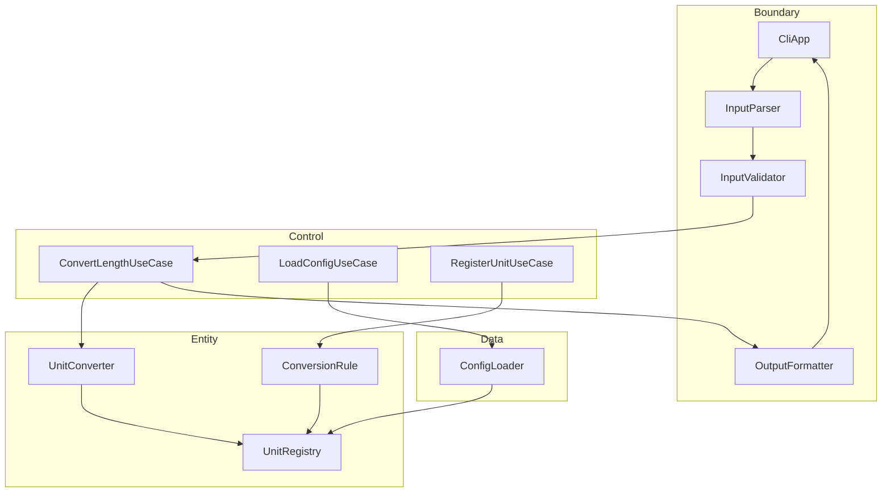

# UnitConverter_11 — REFACTOR 단계 보고서

| 항목 | 내용 |
|------|------|
| **프로젝트** | UnitConverter_11 — Dual-Track UI + Logic TDD |
| **작성일** | 2026-05-21 |
| **단계** | **REFACTOR** (구조 분리·Control/Data 레이어 도입, 동작 불변) |
| **선행 보고서** | [04_GOLDEN_MASTER.md](04_GOLDEN_MASTER.md) (GM REG-04), [03_GREEN.md](03_GREEN.md) (GREEN 71/71) |
| **관련 문서** | [docs/test_plan.md](../docs/test_plan.md), [docs/PRD.md](../docs/PRD.md), [docs/defect_list.md](../docs/defect_list.md), [README.md](../README.md) |
| **브랜치** | `refactoring` |
| **회귀 ID** | **REG-05** — REFACTOR 후 Golden Master·TC-A/B 불변 |

---

## 1. 요약 (Executive Summary)

Golden Master(REG-04) 고정 이후, **동작·외부 계약 변경 없이** BCE(Entity–Control–Boundary–Data) 구조로 리팩터링을 **4개 커밋**에 나누어 완료했다. 전 테스트 GREEN 유지, 커버리지 게이트 충족.

| 지표 | 목표 (GREEN/PRD) | REFACTOR 후 실측 |
|------|------------------|------------------|
| **ctest 전체** | 0 failures | **76/76 PASS** (+3 Control TC) |
| **TC-A-01~07** | PASS | **PASS** |
| **TC-B-01~07** | PASS | **PASS** |
| **Golden Master** | PASS (REG-04) | **PASS** (REG-05) |
| **Domain 커버리지** | ≥ 95% | **96.1%** (49/51 lines) |
| **Boundary 커버리지** | ≥ 85% | **86.8%** (66/76 lines, `src/boundary/`) |
| **비율 인라인** | `src/`·legacy 금지 | **없음** (`ConversionConstants.hpp`만) |
| **if-else 단위 분기** | Registry 허브 | **완료** (GREEN 계승) |
| **main() 변환 로직** | Boundary/Control 위임 | **`CliApp` + UseCase** |

**불변 계약 (변경 없음):**

- 입력: `단위:값` (예: `meter:2.5`)
- 출력: `값 단위 = 변환값 단위` (POL-OUT 4자리 half-up)
- 예외: `std::invalid_argument`, 메시지 문자열 동일 (상수화만)

---

## 2. 배경 및 목표

### 2.1 GREEN + Golden Master 이후 남은 구조 부채

| 문제 | REFACTOR 대응 |
|------|----------------|
| `main()`이 파싱·검증·환산·출력·Entity API를 직접 조율 | `CliApp` + `ConvertLengthUseCase` |
| Control 레이어 부재 (`src/control/` 없음) | `uc11_control` 라이브러리 3 UseCase |
| ERR 메시지 분산 | `ErrMsg` / `DomainErr` / `ConfigErr` |
| `ConfigLoader`가 Boundary에 위치 (Data 혼재) | `src/data/` + `LoadConfigUseCase` |
| `registerUnit(name, factor)`만 존재 | `ConversionRule` VO + `RegisterUnitUseCase` |

### 2.2 REFACTOR 원칙 (Dual-Track)

| Track | 책임 | 금지 |
|-------|------|------|
| **Boundary (UI)** | 파싱·검증·포맷·CLI I/O | 환산식·비율 하드코딩 |
| **Domain (Logic)** | `UnitRegistry`, meter 허브 `convert` | iostream, 파일, JSON |
| **Control** | 유스케이스 조율 | 파싱/포맷 재구현 |
| **Data** | 설정 파일 로드 | Domain 규칙 변경 |

**절대 규칙:** 새 기능 없음 · 테스트 삭제/완화 없음 · Golden Master diff 0.

### 2.3 범위

| 포함 | 제외 |
|------|------|
| Control/Data 레이어, CliApp, ERR 상수화 | DEF-013 단위명 trim/lower (계약 변경) |
| R-C1~C2, R-B1, R-U2, R-L1 | 기능 추가(JSON CLI, 신규 단위 E2E) |
| TC-C-01~03 보호 테스트 | Control 100% 커버리지 전용 스위트 (후속) |

---

## 3. 커밋 이력 (4건, 최소 단위)

| 순서 | ID | 커밋 메시지 | 해시 |
|------|-----|-------------|------|
| 1 | **R-C1** | `refactor(control): extract ConvertLengthUseCase from legacy main` | `e578d0d` |
| 2 | **R-B1** | `refactor(boundary): extract CliApp from legacy main` | `be0446f` |
| 3 | **R-U2** | `refactor(errors): centralize ERR message constants (R-U2)` | `2382c03` |
| 4 | **R-C2, R-L1** | `refactor(control): add LoadConfig and RegisterUnit use cases (R-C2, R-L1)` | `d43b3b3` |

### 3.1 커밋별 변경 요지

| 커밋 | 변경 | 테스트 |
|------|------|--------|
| R-C1 | `main()`의 `withBuiltins` + `convertAll` → `ConvertLengthUseCase::execute` | TC-C-01 추가, 74/74 |
| R-B1 | stdin/stdout/stderr → `CliApp::run()`, `main()` 1줄 | Golden Master PASS |
| R-U2 | `ErrorMessages.hpp`, `DomainErrors.hpp`, `ConfigErrors.hpp` | 메시지 문자열 동일, 74/74 |
| R-C2/L1 | `uc11_data`, `LoadConfigUseCase`, `RegisterUnitUseCase`, `ConversionRule` | TC-C-02/03, 76/76 |

---

## 4. 아키텍처 (REFACTOR 완료 시점)

### 4.1 의존 방향

```text
unit_converter_legacy (UnitConverter.cpp → CliApp::run())
  └── uc11_boundary
        ├── CliApp           — CLI I/O, parse → validate → use case → format
        ├── InputParser      — unit:value
        ├── InputValidator   — POL-NEG, NaN/Inf
        └── OutputFormatter  — table, JSON (half-up 4)
  └── uc11_control (via boundary link)
        ├── ConvertLengthUseCase  — builtin registry + convertAll
        ├── LoadConfigUseCase     — data::loadConfig
        └── RegisterUnitUseCase   — ConversionRule 등록
  └── uc11_data
        └── ConfigLoader     — JSON/YAML, missing → builtins
  └── uc11_entity
        ├── UnitRegistry     — map, factorToMeter
        ├── UnitConverter    — convert (hub), convertAll
        └── ConversionRule   — VO (name, factorToMeter)
```



### 4.2 legacy `main()` (최종)

```cpp
#include "boundary/CliApp.hpp"

int main() {
    return uc11::CliApp{}.run();
}
```

### 4.3 GREEN 대비 구조 변화

| 항목 | GREEN | REFACTOR |
|------|-------|----------|
| `src/control/` | 없음 | 3 UseCase + `uc11_control` |
| `src/data/` | 없음 (`ConfigLoader` in boundary) | `ConfigLoader` 이전 |
| `UnitConverter.cpp` | ~30줄 orchestration | **3줄** (CliApp 위임) |
| Control 테스트 | 없음 | TC-C-01~03 |

---

## 5. 리팩토링 후보 완료 매트릭스

| ID | 내용 | 상태 |
|----|------|------|
| R-U1 | `InputParser` 분리 | ✓ (GREEN) |
| R-U2 | 예외 메시지·코드 상수화 | ✓ (REFACTOR `2382c03`) |
| R-U3 | `OutputFormatter` 분리 | ✓ (GREEN) |
| R-L1 | `ConversionRule` VO | ✓ (REFACTOR `d43b3b3`) |
| R-L2 | if-else → `UnitRegistry` | ✓ (GREEN) |
| R-L3 | 매직 넘버 → 상수 | ✓ (GREEN, `ConversionConstants.hpp`) |
| R-L4 | `convert()` meter 허브 | ✓ (GREEN) |
| R-C1 | `ConvertLengthUseCase` | ✓ (`e578d0d`) |
| R-C2 | `LoadConfigUseCase` | ✓ (`d43b3b3`) |
| R-B1 | `CliApp` | ✓ (`be0446f`) |
| — | `RegisterUnitUseCase` | ✓ (`d43b3b3`) |

---

## 6. 검증 — 테스트

### 6.1 실행 명령

```powershell
cmake -S . -B build -DCMAKE_BUILD_TYPE=Debug
cmake --build build
ctest --test-dir build -C Debug --output-on-failure
ctest --test-dir build -C Debug -R GoldenMaster --output-on-failure
```

### 6.2 결과 요약 (2026-05-21)

| 구분 | 결과 |
|------|------|
| **전체** | **76/76 PASS**, 0 failed |
| **TC-A-01~07** | PASS (TC-A-03b, TC-A-05b/c 포함) |
| **TC-B-01~07** | PASS (TC-B-05b, TC-B-06b~f 포함) |
| **TC-C-01~03** | PASS (Control Track 신규) |
| **Golden Master** | PASS (`golden_master_cli_stdout_approval`, `GoldenMaster`) |

### 6.3 Control 보호 테스트

| Test ID | 파일 | 검증 |
|---------|------|------|
| TC-C-01 | [tests/test_control_convert_length.cpp](../tests/test_control_convert_length.cpp) | `meter:2.5` → 3건 변환, feet≈8.20210 |
| TC-C-02 | [tests/test_control_use_cases.cpp](../tests/test_control_use_cases.cpp) | missing config → builtins |
| TC-C-03 | 동일 | `RegisterUnitUseCase` + cubit |

---

## 7. 검증 — 구조·계약 체크리스트

| # | 확인 항목 | 결과 | 근거 |
|---|-----------|------|------|
| 1 | if-else 체인 제거, `UnitRegistry` 교체 | ✓ | `src/`에 `unit=="meter"` 분기 없음; `factorToMeter` 허브 |
| 2 | `3.28084` / `1.09361` 인라인 없음 | ✓ | `ConversionConstants.hpp` 단일 출처 |
| 3 | Domain / Boundary 분리 | ✓ | `entity/` vs `boundary/`; Domain에 iostream 없음 |
| 4 | Golden Master 출력 불변 | ✓ | REG-04/05 PASS |
| 5 | 예외 타입·메시지 계약 | ✓ | `invalid_argument` 유지; `ErrMsg`/`DomainErr` 문자열 동일 |
| 6 | 비율·환산식 변경 없음 | ✓ | TC-B-01~03, GM feet/yard 값 동일 |

---

## 8. 검증 — 커버리지 (gcov / lcov)

### 8.1 빌드·측정

```powershell
cmake -S . -B build -DUC11_COVERAGE=ON -DUC11_GREEN_PHASE=ON
cmake --build build
ctest --test-dir build -C Debug

lcov --capture --directory build --output-file build/coverage.info
lcov --remove build/coverage.info "*/catch2/*" "*/tests/*" "*/build/_deps/*" "/usr/*" "*/mingw64/*" `
     --output-file build/coverage.filtered.info
lcov --extract build/coverage.filtered.info "*/src/entity/*" --output-file build/entity.info
lcov --extract build/coverage.filtered.info "*/src/boundary/*" --output-file build/boundary.info
lcov --summary build/entity.info
lcov --summary build/boundary.info
```

> **주의:** REFACTOR 전 `src/boundary/ConfigLoader.cpp`의 stale `.gcno`가 남으면 Boundary 합계가 **84%대**로 under-report 될 수 있다. `ninja -t clean` 후 재측정 권장.

### 8.2 레이어별 결과 (clean 빌드 + ctest 후)

| 레이어 | 라인 | 함수 | 게이트 | 판정 |
|--------|------|------|--------|------|
| **Entity** (`src/entity/`) | **96.1%** (49/51) | 100% (12/12) | ≥ 95% | ✓ |
| **Boundary** (`src/boundary/`) | **86.8%** (66/76) | 100% (8/8) | ≥ 85% | ✓ |
| **Data** (`ConfigLoader.cpp`) | 81.8% (72/88) | — | 참고 | Boundary에서 분리 |
| **legacy `UnitConverter.cpp`** | 100% (2/2) | — | — | 위임만 |

### 8.3 파일별 Boundary

| 파일 | 라인 | 비고 |
|------|------|------|
| `InputParser.cpp` | 90.0% | |
| `InputValidator.cpp` | 100% | |
| `OutputFormatter.cpp` | 100% | |
| `CliApp.cpp` | 61.9% | stdin 실패 경로·대화형 I/O 미호출 |
| `ErrorMessages.hpp` | 100% | |

### 8.4 파일별 Entity

| 파일 | 라인 |
|------|------|
| `UnitConverter.cpp` | 100% |
| `UnitRegistry.cpp` | 94.3% |
| `DomainErrors.hpp` | 100% |

### 8.5 `gcov` legacy main

```text
File 'UnitConverter.cpp'  Lines executed: 100.00% of 2
```

환산 로직 커버리지는 `src/entity/UnitConverter.cpp` (100%, 12/12)에서 측정.

---

## 9. CMake 타깃 (REFACTOR 후)

| 타깃 | 소스 | 링크 |
|------|------|------|
| `uc11_entity` | `UnitRegistry`, `UnitConverter` | — |
| `uc11_data` | `ConfigLoader` | `uc11_entity` |
| `uc11_control` | 3× UseCase | `uc11_entity`, `uc11_data` |
| `uc11_boundary` | CliApp, Parser, Validator, Formatter | `uc11_entity`, `uc11_control` |
| `unit_converter_legacy` | `UnitConverter.cpp` | `uc11_boundary` |
| `unit_converter_tests` | GREEN + GM | entity, boundary, data |
| `unit_converter_red_tests` | RED + TC-C | entity, boundary, control, data |

---

## 10. 잔여·후속 (REFACTOR 범위 외)

| ID | 항목 | 상태 | 권장 |
|----|------|------|------|
| DEF-013 | 단위명 trim/lower (`meter `, `Meter`) | Open | PRD 정책 확정 후 별도 PR |
| GM-08 | GitHub required check `Golden Master (REG-04)` | ☐ | Branch protection 설정 |
| — | `CliApp` stdin 실패 경로 커버리지 | 61.9% | 통합 테스트 또는 mock stdin (선택) |
| — | `ConfigLoader` 오류 분기 | 81.8% | Boundary/Data lcov 90%+ (선택) |
| — | Control 레이어 100% 커버리지 | 미측정 | PRD §8 Control 게이트 (후속) |

---

## 11. REFACTOR 체크리스트 (QA 서명용)

| # | 항목 | 기대 | 확인 |
|---|------|------|------|
| 1 | 4 REFACTOR 커밋, 기능 추가 없음 | 동작 동일 | ☐ |
| 2 | TC-A-01~07, TC-B-01~07 | PASS | ☐ |
| 3 | TC-C-01~03 | PASS | ☐ |
| 4 | `ctest -R GoldenMaster` (REG-05) | PASS | ☐ |
| 5 | Entity ≥ 95%, Boundary ≥ 85% | lcov | ☐ |
| 6 | `src/` 비율 인라인 없음 | grep | ☐ |
| 7 | if-else 단위 분기 없음 | `src/` | ☐ |
| 8 | `main()` 3줄 CliApp 위임 | [UnitConverter.cpp](../UnitConverter.cpp) | ☐ |

---

## 12. 결론

- **Golden Master(REG-04)** 를 전제로 **4단계 REFACTOR**를 완료했으며, **76/76 테스트 PASS**·**Golden Master PASS**·**커버리지 게이트(Domain 96.1%, Boundary 86.8%)** 를 달성했다.
- **Control·Data 레이어** 도입으로 BCE 의존 방향(`Boundary → Control → Entity`, `Control → Data`)을 코드베이스에 반영했고, **외부 계약(입력 형식·출력 포맷·예외)** 은 유지했다.
- 후속은 **DEF-013** 정책, **GM-08** CI 필수 체크, (선택) Control 100%·`CliApp` I/O 경로 커버리지 보강이다.

---

*본 문서는 REFACTOR 단계 구현·검증·운영을 기술한다. Golden Master 배경은 [04_GOLDEN_MASTER.md](04_GOLDEN_MASTER.md), GREEN 배경은 [03_GREEN.md](03_GREEN.md)를 참조한다.*
